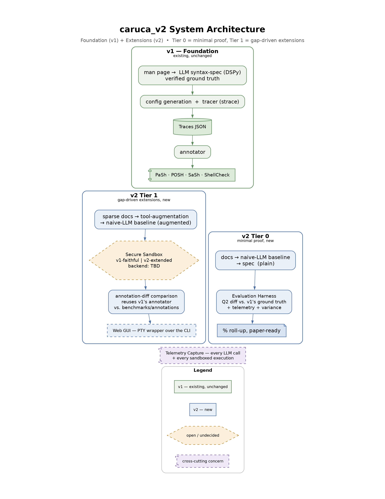

# caruca_v2 System Architecture Diagram

## Overview

This diagram is the rendered, presentation-quality version of the system architecture drafted in
`ai_docs/prep/system_architecture.md` (Step 2 of the `09_generate_system_design` planning pass). It shows
v1's existing pipeline (Foundation) alongside v2's new components (Extensions), staged into Tier 0
(minimal proof) and Tier 1 (gap-driven extensions) per the build-tiering decision in
`memory/caruca_v2_build_tiering.md`.

**Diagram type chosen:** GraphViz (DOT), not Mermaid or PlantUML. The content is fundamentally a set of
grouped, mostly-linear pipelines (v1's stages, Tier 0's stages, Tier 1's stages) plus one cross-cutting
concern and a legend — GraphViz's `subgraph cluster_*` gives clean, independently-colored grouping without
PlantUML's nested-inline-color restrictions, and `rankdir=TB` plus explicit invisible layout edges gave
full control over the portrait, single/dual-column shape a letter page needs. C4 (PlantUML), the
skill's default suggestion for "software architecture," was a poor fit here because the content is a
processing pipeline with tiers, not a system/container/component topology in the C4 sense.

## Diagram

Also available as scalable vector: `001_caruca_v2_system_architecture.svg`.

## Key Components

- **v1 — Foundation** (green, solid borders): the existing, unchanged pipeline — man page → LLM
  syntax-spec (DSPy, verified as genuine ground truth via git history) → config generation + tracer →
  Traces JSON (the explicit trace/annotate boundary, drawn as a data-store cylinder) → annotator →
  PaSh/POSH/SaSh/ShellCheck consumers.
- **v2 Tier 0** (blue, solid): the minimal-proof extension — naive-LLM baseline (plain docs) → spec →
  Evaluation Harness (Q2-style argument diff against v1's ground truth, plus telemetry and
  repeated-sampling variance) → a paper-ready percent-change roll-up. No sandbox required.
- **v2 Tier 1** (blue, with one open/amber element): the gap-driven extensions — sparse-doc commands
  routed through LLM tool-augmentation into a second (augmented) naive-LLM condition, both conditions
  feeding the Secure Sandbox (drawn as a dashed amber hexagon because the isolation backend is still an
  open decision), which reuses v1's annotator unmodified to produce an annotation-diff comparison, with a
  Web GUI (PTY wrapper over the CLI) as the outermost, most-deferred piece.
- **Telemetry Capture** (lavender, dashed): drawn as a standalone cross-cutting banner rather than wired
  to every source node individually, to keep the diagram from becoming a web of crossing dotted lines —
  the accompanying text names what it covers.
- **Legend**: four entries — existing/v1, new/v2, open/undecided, cross-cutting — deliberately reduced
  from an earlier 7-item draft (see Design Decisions) to keep the page uncluttered.

## Design Decisions

- **Layout, three iterations to get right.** The first draft (28 nodes, full detail, all relationships
  drawn as literal arrows) rendered landscape (1.44:1) even after forcing `size=`/`ratio=compress` —
  scaling a wide layout down just shrinks it, it doesn't reshape it. Fixing this required addressing the
  actual cause: cross-cluster edges anchored to *early* nodes in an upstream chain let Graphviz place
  whole clusters side-by-side rather than stacked. The final version removes literal long-distance arrows
  for relationships that don't need one (e.g. "ground truth", "reuses annotator", "spawns via PTY" are now
  short annotation text inside the relevant node's own label, not drawn lines), and uses purely invisible
  layout edges to control stacking: v1 sits above a two-column band (Tier 0 | Tier 1, side by side —
  architecturally honest, since they're independent extensions, not sequential to each other), converging
  into Telemetry and the Legend at the bottom. Natural aspect ended at 0.53 (portrait); scaled to
  `size="7.8,10.3"` and then centered on a true 8.5×11in canvas in post-processing (see below) rather than
  relying on GraphViz's `size` attribute alone, which only bounds a drawing, it doesn't pad/center it onto
  a fixed page.
- **Density, cut roughly in half.** The first draft had ~28 nodes and a 7-row legend; the final has 20
  nodes and a 4-row legend. Nodes that were architecturally real but not worth a dedicated box (e.g. the
  earlier "sweep/compare" orchestration function, the separate "real execution-based Q1" deferred task)
  were either folded into an existing node's label as a short annotation or dropped from the visual
  entirely in favor of this companion doc's prose — the diagram should communicate structure at a glance,
  not carry every implementation nuance already recorded in `component_functionality.md`.
- **Color, restrained and purposeful.** Three hues total (sage green = v1/existing, slate blue = v2/new,
  amber = open/undecided) plus one accent (lavender = cross-cutting), each used consistently for both fill
  and border, with muted/desaturated tones rather than saturated "candy" colors so the diagram reads as a
  professional reference figure rather than a slide graphic.
- **Shapes carry meaning**: rounded rectangles for process steps, a note shape for raw input, a cylinder
  for the one explicit data-store boundary (Traces JSON), a component shape for both consumer systems and
  the cross-cutting telemetry banner, and a hexagon reserved solely for the one genuinely undecided
  element (Secure Sandbox's backend).
- **300 DPI, true letter page.** GraphViz's `size` attribute only bounds a drawing's dimensions, it
  doesn't pad or center it onto a fixed canvas — so after rendering at `dpi=300`, both outputs were
  post-processed: the PNG via ImageMagick (`-gravity center -extent 2550x3300`, 8.5×11in at 300 DPI
  exactly), and the SVG by directly editing its XML (new page-sized `viewBox`, a white background rect,
  and the content group's `translate` adjusted by the centering offset *divided by* its `scale` factor,
  since SVG transform lists apply right-to-left — the offset has to be in pre-scale units, or it lands
  several times too far off-center, which is exactly what happened on the first attempt).

## Assumptions

- "The 3 charts" was read as the three tiers already drafted conversationally (v1 Foundation, v2 Tier 0,
  v2 Tier 1), combined into one cohesive diagram with cross-cutting telemetry and a legend, rather than
  three separate image files.
- Node text is deliberately abbreviated versus the full prose in `component_functionality.md` — this
  diagram is a map, not a replacement for that document.

## Recommendations & Ideas

- Once the Secure Sandbox backend decision resolves, redraw that one hexagon as a solid (non-dashed) blue
  box naming the chosen backend — everything else in the diagram should stay stable.
- If a future revision wants Tier 0 to render on the left and Tier 1 on the right (the more natural
  reading order), GraphViz's barycenter-based ordering didn't respect declaration order or edge-declaration
  order in testing here; forcing it would need an explicit same-rank ordering constraint
  (`{rank=same; ...}` with a real, visible ordering edge) rather than the invisible anchors used now — not
  done here since it's cosmetic only and every element is already labeled.
- This diagram is a good candidate to link directly from `ai_docs/prep/system_architecture.md` once that
  document's Step 4 (Final Blueprint) is confirmed and saved.

## Related Files

- `ai_docs/prep/component_functionality.md` — the fuller I/O/CLI detail this diagram summarizes visually
- `ai_docs/prep/data_telemetry_schema.md` — the telemetry/comparison schema referenced by the Evaluation
  Harness and Telemetry Capture nodes
- `memory/caruca_v2_build_tiering.md` — the Tier 0/Tier 1 decision this diagram's layout is structured
  around
- `~/stevens/caruca/caruca/src/caruca/tracer/data.py` — source for v1's `Traces` JSON / annotator shape
  drawn in the Foundation group
