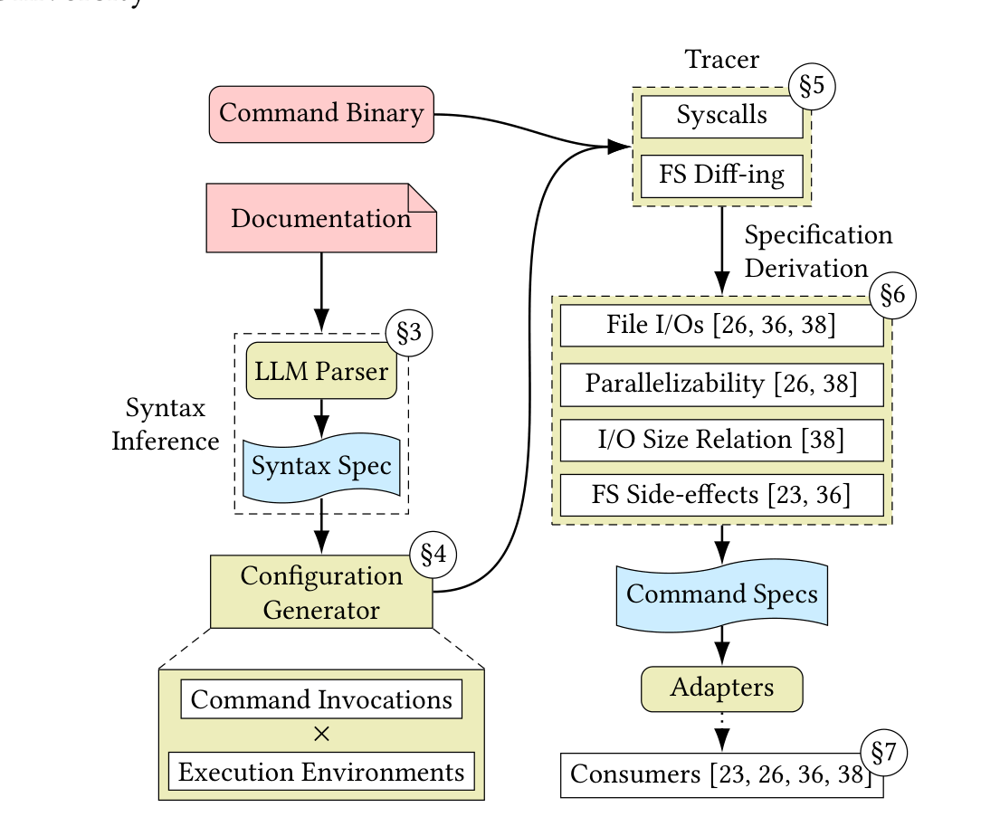
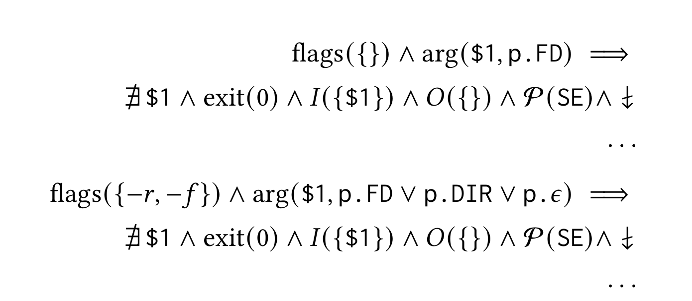
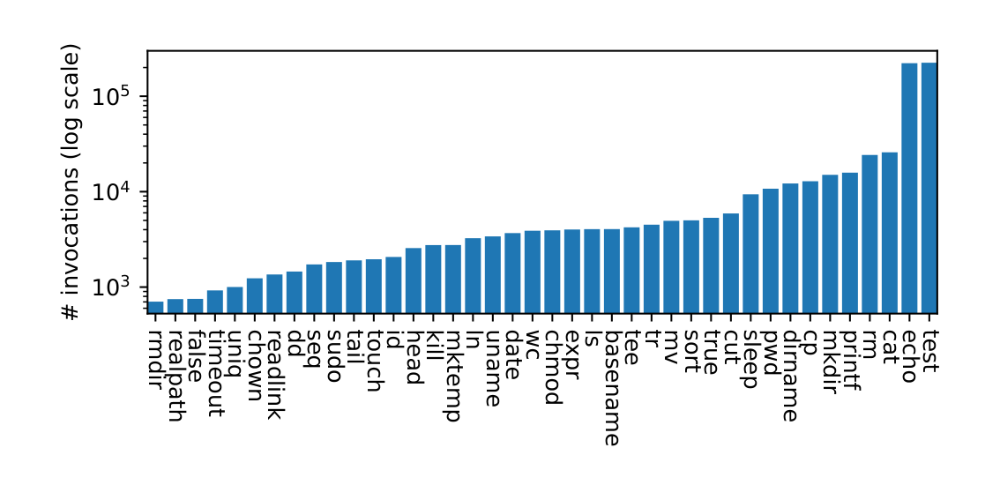
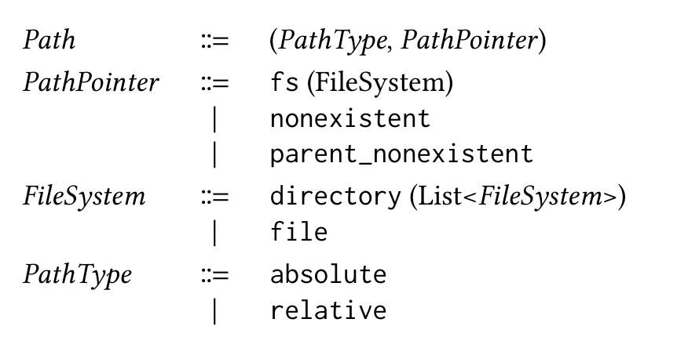
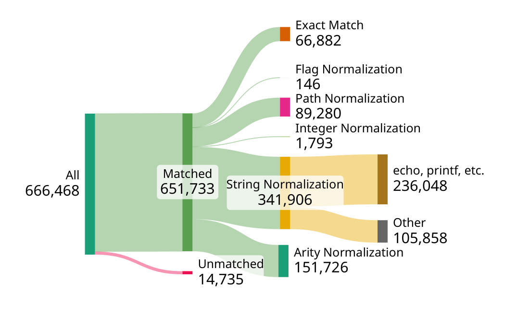
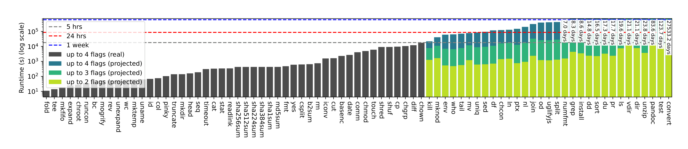

# Caruca: Effective and Efficient Specification Mining for Opaque Software Components

> *Converted to Markdown from `ai_docs/refs/caruca white paper.pdf` (arXiv:2510.14279v1 [cs.SE], 16 Oct 2025) for
> reference within the caruca_v2 project. Figures are extracted as images into `images/`; all other content —
> body text, tables, code listings, and the reference list — is transcribed directly. Page numbers from the
> original PDF are noted in section headers where useful for citing back to the source.*

**Evangelos Lamprou** ([vagos@lamprou.xyz](mailto:vagos@lamprou.xyz)) — Brown University
**Seong-Heon Jung** ([sj4963@nyu.edu](mailto:sj4963@nyu.edu)) — New York University
**Mayank Keoliya** ([mkeoliya@upenn.edu](mailto:mkeoliya@upenn.edu)) — University of Pennsylvania
**Lukas Lazarek** ([lukas_lazarek@brown.edu](mailto:lukas_lazarek@brown.edu)) — Brown University
**Konstantinos Kallas** ([kkallas@ucla.edu](mailto:kkallas@ucla.edu)) — UCLA
**Michael Greenberg** ([michael@greenberg.science](mailto:michael@greenberg.science)) — Stevens Institute of Technology
**Nikos Vasilakis** ([nikos@vasilak.is](mailto:nikos@vasilak.is)) — Brown University

*arXiv:2510.14279v1 [cs.SE] 16 Oct 2025*

## Table of Contents

- [Abstract](#abstract)
- [1. Introduction](#1-introduction)
- [2. Overview](#2-overview)
  - [2.1 Challenges](#21-challenges)
  - [2.2 System Overview](#22-system-overview)
- [3. Invocation Syntax Inference](#3-invocation-syntax-inference)
  - [3.1 Syntax Specification DSL Design](#31-syntax-specification-dsl-design)
  - [3.2 Documentation to Syntax Specification](#32-documentation-to-syntax-specification)
- [4. Configuration Generation](#4-configuration-generation)
  - [4.1 Flag and Option Study](#41-flag-and-option-study)
  - [4.2 Command Invocations](#42-command-invocations)
  - [4.3 Execution Environments](#43-execution-environments)
- [5. Isolated Tracing](#5-isolated-tracing)
- [6. Command Specification Derivation](#6-command-specification-derivation)
  - [6.1 Performance Optimization Systems](#61-performance-optimization-systems)
  - [6.2 Bug Finding Systems](#62-bug-finding-systems)
  - [6.3 Specification Derivation](#63-specification-derivation)
  - [6.4 Adapters](#64-adapters)
- [7. Evaluation](#7-evaluation)
  - [7.1 Specification Correctness](#71-specification-correctness)
  - [7.2 Syntax Specification Correctness](#72-syntax-specification-correctness)
  - [7.3 Comprehensiveness](#73-comprehensiveness)
  - [7.4 Computational Cost](#74-computational-cost)
- [8. Related Work](#8-related-work)
- [9. Conclusion](#9-conclusion)
- [Acknowledgments](#acknowledgments)
- [References](#references)

---

## Abstract

A wealth of state-of-the-art systems demonstrate impressive improvements in performance, security, and
reliability on programs composed of opaque components, such as Unix shell commands. To reason about
commands, these systems require partial specifications. However, creating such specifications is a manual,
laborious, and error-prone process, limiting the practicality of these systems. This paper presents **Caruca**, a
system for automatic specification mining for opaque commands. To overcome the challenge of language diversity
across commands, Caruca first instruments a large language model to translate a command's user-facing
documentation into a structured invocation syntax. Using this representation, Caruca explores the space of
syntactically valid command invocations and execution environments. Caruca concretely executes each
command-environment pair, interposing at the system-call and filesystem level to extract key command properties
such as parallelizability and filesystem pre- and post-conditions. These properties can be exported in multiple
specification formats and are immediately usable by existing systems. Applying Caruca across 60 GNU Coreutils,
POSIX, and third-party commands across several specification-dependent systems shows that Caruca generates
correct specifications for all but one case — completely eliminating manual effort from the process and
currently powering the full specifications for a state-of-the-art static analysis tool.

**Keywords:** specification mining, dynamic analysis, large language models

---

## 1. Introduction

Command-line utilities (or commands in short) are an integral part of Unix [37] and other environments [4, 28].
The key characteristic of commands is that they allow for abstraction and composition — they are written in a
variety of programming languages, are often distributed as opaque binaries, and enclose versatile, well-tested,
and extensively documented functionality that can be easily interfaced with. Take as an example the script shown
in Fig. 2 — the script's entire functionality involves the composition of four commands: `rm`, `cp`, `uglifyjs`,
and `gzip`.

Due to the popularity and importance of such scripts, there has been a wealth of state-of-the-art systems
focusing on improving their performance [26, 35, 38], security [34], and reliability [2, 36]. These systems must
reason about both a script's execution and the commands it composes. However, these commands could be written in
arbitrary languages and their source code might not be available, making it infeasible to use any type of static
source-code analysis. So far, the solution to this has been handwritten annotations — partial specifications
that are painstakingly written by the system authors to capture important aspects of command behavior. Examples
of such specifications include parallelizability properties [26, 38], monotonicity semantics [38], and
Hoare-style filesystem pre- and post-conditions [2, 36]. Transferring these benefits beyond these systems'
limited evaluation sets requires scaling this specification effort — these papers suggest crowd-sourcing
hundreds of thousands of command instances — a number further exacerbated by differences across command versions
on Linux, macOS, BSD, etc., as well as initiatives to rewrite classic utilities in safer languages [10]. This
effort faces severe human-effort, scalability, and correctness concerns — and hence has not materialized.

To address this issue, this paper presents Caruca, a system for generating specifications for opaque software
components, focusing on shell commands. Caruca supports components written in any language, making no
assumptions or requirements about source code availability, and produces a variety of different specifications —
targeting performance optimizations, correctness checks, and other systems. Caruca leverages the extensive
documentation provided with these components and their observable interactions they have with the broader
environment as the only common denominators.

Caruca begins (Fig. 1) with its invocation syntax inference engine, which infers a structured specification of a
command's invocation syntax from its natural language documentation — e.g., man pages, markdown files, and other
sources of documentation. Using the syntax specification, Caruca's configuration generator creates a large
number of test invocations and environments, sweeping through the possible flags, options, arguments, and
filesystem states. Caruca's tracer then instantiates concrete environments and executes each command
configuration with appropriate interposition recording all of the command's interactions within its environment.
Finally, Caruca's command specification derivation subsystem examines the traces extracted by the concrete
executions and applies a series of transformation rules to produce command specifications. All but the last of
these components are common across all different command specification types and downstream systems.



**Fig. 1. Caruca architecture overview.** Caruca takes as input a command binary and its documentation, and
first creates a syntax specification (§3). From this, its configuration generator (§4) creates diverse
invocations and environments. These are executed in a traced sandbox (§5), recording all system-level
interactions. Finally, the specification derivation subsystem (§6) analyzes the collected traces to produce
specifications for downstream systems (§7). Colors indicate component roles: red — static inputs; green —
subsystems; blue — runtime and analysis outputs.

Caruca is evaluated — with particular emphasis on its components that depend on LLMs — on 60 GNU Coreutils,
POSIX, and third-party commands for which ground-truth specifications exist in prior work [23, 36, 38, 43] and an
extended set of 120 commands with manually derived syntax specifications. Caruca successfully generates correct
specifications for 59/60 commands, discovering additional constraints missed by the original handwritten
specifications. Caruca produces partial specifications within 1 hour for 103 out of 120 commands and within 24
hours for all but one command. These results place Caruca as the first fully automated and generally applicable
specification miner for opaque components. Caruca already powers the full specifications for Shseer [29], a
state-of-the-art static analysis tool [36].

**Outline and contributions:** The paper starts with an example outlining key challenges in automated
specification inference (§2). It then proceeds with Caruca's contributions:

- **Invocation syntax specification and inference (§3):** Caruca encodes an inferred model of a command's
  interface in a syntax specification, using a domain specific language (DSL) designed to eliminate ambiguity and
  enable effective configuration generation.
- **Environment model and generation (§4):** Caruca models key aspects of the filesystem and uses this model to
  generate diverse command invocations that combine explicit command arguments and implicit system state.
- **Tracing (§5) and specification derivation (§6):** Caruca executes commands with system-level instrumentation
  and introduces rules for summarizing and translating the extracted traces to command specifications.

The paper then presents an evaluation of Caruca (§7) and concludes with a discussion of related work (§8).

**Availability:** Caruca will be available as an MIT-licensed open source artifact available for download at:
[https://github.com/binpash/caruca](https://github.com/binpash/caruca)

---

## 2. Overview

Fig. 2 shows a script excerpt from the htmx front-end library [41]. The script prepares the library's source
code for download: it first cleans the destination directory, copies inside the program's source code using
`cp`, minifies the program using `uglifyjs`, and finally compresses the minified program using `gzip`. As this
script directly affects the performance and reliability of client-facing JavaScript code, organizations that use
htmx may seek to reduce the script's execution time and ensure its reliability. Systems such as PaSh [26], POSH
[38], Shellcheck [23], and Shseer [29] achieve this goal: PaSh can parallelize the script on a multicore
computer, POSH can scale it out across multiple computers, Shellcheck can identify dubious code patterns, and
Shseer exposes subtle filesystem bugs. To analyze arbitrary opaque commands and utilities that could be written
in different languages, these systems rely on the use of manually written command specifications that describe
aspects of their behavior, e.g., their parallelizability, system dependencies, and filesystem effects.
Unfortunately, all these systems currently lack annotations for at least one of the commands in this script
(`uglifyjs`, `gzip`, `rm`, and `cp`) and therefore are not able to analyze it. Right now, a user would have to
manually write the missing specifications. This missing piece limits the practical applications of all these
systems.

```sh
# Clean the destination directory
rm -rf dist/*
# Copy source file to dist
cp src/htmx.js dist/htmx.js
# Minify script
uglifyjs -m eval -o dist/htmx.min.js dist/htmx.js
# Compress minified script
gzip -9 -k -f dist/htmx.min.js > dist/htmx.min.js.gz
```

**Fig. 2. Example shell script from the htmx project [41].** The script prepares the htmx library for download.
It copies htmx's source code inside a directory, minifies it, and compresses it.

Caruca addresses this problem and frees developers from having to manually write command specifications by
automating this process.

### 2.1 Challenges

Automatically inferring command specifications, however, involves several challenges that Caruca needs to
address:

**(C1) Commands lack structured, typed interfaces:** In order to adequately explore a command's execution
space, Caruca needs to generate a wide range of arguments to invoke the command with. However, in contrast to
typed languages, where type information constrains the space of valid inputs (e.g., `5` is an int and `"foo"` is
not), the interface of commands is untyped: arguments are represented as an array of strings. Each command
dynamically parses and checks the validity of its arguments, with no standard way for a command to inform that
its arguments were invalid, e.g., via an exit status or an error message. This makes it extremely challenging to
generate valid invocations for commands: using arbitrary strings is extremely unlikely to lead to valid
executions and it is generally impossible to distinguish between executions that return an error exit code due to
failed argument parsing or other reasons.

**(C2) Command behavior combinatorial explosion:** In order to generate a complete specification of a
command's behavior, Caruca needs to explore all possible execution modes of a command by invoking it with
different combinations of flags and options. Even a simple command invocation like `rm -rf` demonstrates how
flags and options lead to a combinatorial explosion of command behaviors. The basic `rm path` invocation deletes a
file at the specified path but fails if the path is not a file or does not exist. Using the `-r` flag, `rm -r
path` deletes directories and their contents recursively, failing only if the path does not exist. With the `-f`
flag, `rm -f path` forces deletion, ignoring errors such as an nonexistent path. Combining both flags, `rm -rf
path` performs a forceful, recursive deletion of the specified path. Therefore, each possible flag combination
demands a new corresponding specification. This variation means that a command has potentially an exponential
number of behaviors relative to the number of flags, making the problem of specification inference through
command execution intractable.

**(C3) Implicit command dependencies:** In addition to flags, options, and arguments, a command's behavior
also implicitly depends on the state of the filesystem. For instance, `rm path` changes behavior depending on the
state of path: if it does not exist or is a directory, `rm` takes no action and exits with code 1; if the path
exists and is a file it removes it and exits with code 0. To explore a command's behavior, Caruca must identify
relevant filesystem states and generate corresponding invocations to run against them.

**(C4) Command execution isolation and monitoring:** Finally, Caruca needs to execute and monitor a large set
of command invocations in order to be able to later infer their specifications. These invocations need to run in
a custom environment so that Caruca can test their behavior, but at the same time they must be isolated so that
their execution does not affect the surrounding system or other — under exploration — invocations. Not only that,
but since the number of invocations is very large, this isolation and monitoring needs to add minimal overhead on
the command execution.

### 2.2 System Overview

Caruca tackles these challenges through four components: (C1) a syntax specification language and inference
engine that extracts argument structure from documentation; (C2) a configuration generator that heavily prunes
the invocation space; (C3) a filesystem model that pairs invocations with environments to form configurations;
and (C4) a tracer that interposes on command execution using lightweight sandboxing and tracing. This section
illustrates these components with the `rm` command.

**Invocation Syntax Inference (§3):** Caruca starts by generating a syntax specification for the command, which
describes all of its flags, options, and positional arguments, as well as the types of all arguments (option and
positional). In the case of `rm`, `-r` and `-f` are marked as `Flag`s, while the positional arguments that will be
used in the invocation after globbing, i.e., `*` resolution, are assigned the `Path` type. The specification is
expressed as a language embedded in Python and describes the syntactically correct ways to invoke the command.
Caruca generates the specification by using `rm`'s documentation, i.e., its man page or `--help` output, and
passing it to a large language model prompted to generate syntax specifications. The LLM solely generates the
syntax specification — it is not involved in any remaining components that observe command execution and derive
command specifications. Given as input `rm`'s man page, Caruca arrives at the following syntax specification
(truncated).

```python
rm_s=[[Flag("-r"), Flag("-f")],[Path(arity='1+')]]
```

**Configuration Generator (§4):** Guided by the type and argument information from the syntax specification,
Caruca's generator produces command invocations that are syntactically valid and well-typed. A study on a very
large set of shell scripts from GitHub determines that 99.998% of all the invocations found in this set only have
up to 4 flags and options (§4.2). Caruca uses this insight to prune the invocation space to up to 4 flags and
options, but can be configured to either (1) generate invocations with more flags, or (2) generate specific
invocations to infer targeted specifications for them. In addition, Caruca pairs each invocation string with a
set of diverse filesystem states to adequately explore implicit filesystem dependencies for command behavior. The
invocation string and the system state jointly form an invocation configuration. For `rm`, Caruca generates
8,749,056 invocation configurations, taking into consideration type-specific variations such as alternative
argument strings, path arguments pointing to a file, directory, nothing, etc.

**Tracing (§5):** Caruca then executes and traces each invocation configuration. The executions take place
inside a custom, lightweight sandbox. Traces include a command's system calls and its modifications to the
filesystem. The simplified trace corresponding to the `rm path` invocation under an execution environment where
path points to a regular file is `{read path, delete path}`.

**Command Specification Derivation (§6):** The collected traces contain all of the information about the
command's interactions with the surrounding system and can therefore completely describe the behavior of each
tested invocation. Caruca collects these traces and performs a lightweight analysis on them to infer a complete
command specification, capturing properties that are important for all downstream systems, including the
command's inputs, outputs, filesystem effects, and parallelizability. Concretely, Fig. 3 illustrates the
specification for `rm` generated by Caruca (truncated for presentation). This universal specification is then
exported to downstream systems, enabling them to analyze, optimize, and find bugs in the target script.



**Fig. 3. Specification for `rm`.** Excerpt from the `rm` specification produced by Caruca. The specification
encodes per-invocation pre- and post-conditions related to the command's filesystem effects, the way it interacts
with its input (*I*) and output (*O*) streams, alongside summaries of its parallelizability (*P*) and
monotonicity (↓) properties (§6).

**Usage:** Caruca is invoked to generate the required specifications for each command (given that they are
executable and available in the `PATH`) as follows:

```sh
$ man rm | caruca > rm.spec
$ man cp | caruca > cp.spec
$ uglifyjs --help | caruca > uglifyjs.spec
$ man gzip | caruca > gzip.spec
```

Caruca has two expected application scenarios. Caruca can be invoked once per command after its creation,
producing a specification that can be versioned and subsequently reused across target scripts and downstream
systems. Caruca can also be invoked in a targeted mode, generating a specification for a specific invocation,
with some of the flags, options, arguments, and environment given concrete values. This could be useful if a user
just wants to do a one-off analysis or optimization of a single script with a single instance of a command that
they are not going to use in other setups.

**Limitations:** Caruca currently has the following limitations and threats to validity. First, even though it
carefully generates relevant command invocations, through its command usage study, filesystem model, and
argument types, it still only generates a *finite* number of invocation configurations, which means that there
could be cases, e.g., if a command is invoked with more flags than what Caruca explores, that a specification is
incomplete. To assess this probability, the evaluation includes a comprehensive study of the coverage of
Caruca's generated invocations on real-world scripts (§7.3). Furthermore, as described above, users can use
Caruca in a targeted mode to generate a specification for a specific invocation, e.g., using all the command
flags, if they expect those invocations to be important. Second, the syntax specification generator uses a
statistical component (LLM) and therefore even though the task is simple, i.e., determine type information about
the flags, options, and arguments from a command's documentation, it does not come with formal correctness
guarantees. We assess the correctness of Caruca's syntax generator for 120 commands from various suites (§7.2)
and show that it is correct across 99.7% of all flags, options, and arguments, with mistakes being
non-catastrophic. Finally, Caruca does not generate environment variables in its invocation configurations, so
it is agnostic to command behavior changes based on the values of environment variables.

---

## 3. Invocation Syntax Inference

Commands lack a well-typed invocation interface (C1, §2.1); without knowing valid flags, options, argument
types, or arity, exploring their invocation space reduces to generating arbitrary strings that mostly yield
errors. To address this, Caruca defines a DSL that captures a command's syntax — flags, options, positional
arguments, and type constraints — which serves as an effective grammar for invocation generation. Since source
code is unavailable, Caruca instead leverages natural language documentation (e.g., `man` or `--help` pages) and
iteratively prompts an LLM to extract the corresponding syntax specification.

### 3.1 Syntax Specification DSL Design

Caruca's syntax specification DSL captures the following information about a command: (1) its flags, (2) its
options and the types of their option arguments, (3) its positional arguments together with their type and
arity.

**Grammar:** Caruca tackles this by storing information about the valid ways of using commands as a DSL. At the
top level, the `Command` element contains the name of the command and a set of possible grammars for using the
command, represented by `Usage`. A `Usage` is an ordered sequence of `Position`s, which represent the positions
where arguments can be located. A `Position` contains a set of `Argument`s which can appear in that position.
Note that the ordering of Positions is significant, while the ordering of `Arg`s in a single Position is not. For
a command like `mv`, the first Position holds flags such as `-v` and `-f`, while the second and third Positions
hold the source and destination paths, which are treated differently (e.g., `mv -v -f src dst`). The `Arg`
element contains an `Arity` value and a `Type`. The Arity of an argument can be `zero_one`, `zero_plus`,
`one_plus`. The `zero_one` corresponds to an optional argument, while `zero_plus` and `one_plus` represent
arguments that can appear at least zero times or at least one time respectively. Alternatively, if an argument
must appear a fixed number of times, it will have arity *n*, where *n* is some concrete positive natural number.
In addition to these core elements, the Arg element accept the options `flag_followed_by_equals` (the command
expects the option's values to be preceded by an equals sign), `dash_as_stdin` (the command interprets a dash as
`/dev/din`), and `max_repetition` (the command accepts multiple instances of this flag/option), which reflect
nuances in how the command parses that flag/argument. Each argument also takes a set of aliases, which are
alternative strings that can be used to refer to the same argument.

**Argument types:** Lastly, `Type` expresses the valid formats for the argument. While all arguments can be
represented as `string`, in practice a lot of them are not actually arbitrary but can be constrained in various
ways, e.g., only representing an integer, path, or values from a range. To arrive at a set of ubiquitous argument
types useful across a variety of commands, two domain experts studied the documentation of 120 command from
various sets, including GNU coreutils and commands currently supported by PaSh, POSH, Shellcheck, and Shseer.
This process took over 200 person-hours. The resulting set of types are `path`, which represents a string that is
a valid POSIX path, absolute or relative; `selection`, an enumeration type where the valid values are a finite
set of strings; `integer` and `char`, which represent integers and single characters respectively, `string`, an
arbitrary string, and `other` as a fallback type for when Caruca's LLM component is not able to infer a more
suitable type. If not specified otherwise, arguments of type `other` are assumed to be of type `string`.
Caruca's library is easily extensible to support more types. This paper leaves an extensive characterization of
all argument types for future work.

### 3.2 Documentation to Syntax Specification

To generate command syntax specifications, Caruca relies on command documentation (`man` or `--help` pages).
These specifications capture only argument structure, which is typically unambiguous, unlike usage examples or
behavioral descriptions. Caruca prompts an LLM — prompted to be positioned as a syntax expert and constrained to
the DSL's argument types — with three examples (`rm`, `mv`, `touch`) alongside the available documentation, to
produce the specification. After the LLM generates the syntax specification, Caruca loads the generated
specification as a Python module and validates it for syntactic and type correctness. If the specification is
invalid, Caruca retries the transformation, provides the previous output as context and includes the error
message in the prompt. After three failed attempts, Caruca will issue an error message and abort the
transformation. The number of retries is configurable, but in practice three attempts have been sufficient for
all commands that Caruca has been applied to. Caruca uses the GPT-4o model for this task, but the process itself
is model-agnostic.

---

## 4. Configuration Generation

Given a command syntax specification, Caruca generates an extensive set of command invocations with varying
arguments and environments to explore the command behaviors. These invocations are executed and traced in an
isolated environment to determine the behavior and specification of a command. This section describes how
Caruca generates the set of invocations and environments for each command and how it prunes that space to keep
generation and later execution tractable.

### 4.1 Flag and Option Study

Caruca's pruning strategies are informed by a study on real-world shell scripts collected from GitHub. These
script come from repositories with more than 10 stars that use the shell as their primary language. The study
includes over 49K shell scripts, totaling 19 million lines of code. Each of the scripts is parsed and all its
command invocations are extracted, totaling over 665K invocations. For each invocation, its number of flags and
options is counted. The results of the study are that out of all the invocations there are: 430,680 (64.7%)
invocations with no flags or options, 193,380 (29.0%) invocations with 1 flag or option, 39,616 (5.9%)
invocations with 2 flags or options, 1,647 (0.2%) invocations with 3 flags or options, 282 (0.04%) invocations
with 4 flags or options, and 9 (0.00135%) invocations with 5+ flags or options. These results mean that by just
exploring invocations with at most 2 flags, Caruca covers 99.6% of the total invocations. Therefore, it can
prune invocations with more flags if their exploration is intractable. By default Caruca only explores a
command's invocations with up to 4 flags and options, but this number is configurable. Fig. 4 shows the
distribution of the number of invocations per command in the invocation dataset for the top 40 most invoked
commands.



**Fig. 4. Histogram of command invocation counts.** Histogram of the number of invocations per command in the
collected dataset for the top 40 most invoked commands.

### 4.2 Command Invocations

Caruca generates a wide variety of command invocations to explore each command's behaviors being guided by the
syntax specification. Caruca creates invocations exploring (1) combinations of flags and options and (2) several
possible values for each positional and option argument.

A key challenge that Caruca needs to address is that there is an exponential number of possible invocations for
a command (C2, §2.1) and this could make generation and later execution intractable. Caruca addresses this
challenge by constraining the set of inputs in two ways: (1) it uses the argument type information provided in
the syntax specification to only generate well-typed argument instances, and (2) it limits the number of flags
and options in each invocation based on a study of real-world command usage.

**Typed argument generators:** Caruca balances exploration completeness and tractability by using the type
information described in the syntax specification DSL (§3). Each type is accompanied by an input generator that
generates a sample of valid and well-typed values for that type. For example, for the `selection` type, Caruca
generates a value for all its possible values. For `integer`, it generates the numbers -1, 0, 1. For `path`, it
generates any of the possible path types included in Caruca's filesystem model (§4.3).

### 4.3 Execution Environments

Another challenge is that command behavior depends not only on arguments but also on filesystem state (C3). For
instance, `cp src target` succeeds only if `src` exists, requiring executions under both conditions. For this,
Caruca pairs each invocation with environments generated from a filesystem model; these invocation
configurations specify both filesystem topology and file/stream contents.



**Fig. 5. Caruca's filesystem model.** Caruca's filesystem model describes the possible filesystem states that
Caruca considers relevant to command behavior. The model captures the filesystem at the path and object level. A
filesystem object can be a file or a directory, and a filesystem path can either point to a filesystem object or
be non-existent.

**Filesystem topology:** The behavior of many commands depends on the state of the filesystem at the time of
execution. For example, commands like `mkdir` or `rm` behave differently depending on whether the target path
exists, whether it is a file or directory, and whether its parent directory exists. An invocation like `mkdir
dir1/dir2` fails if the parent path `dir1` does not exist. Providing the `-p` flag makes the command succeed in
either case. Similarly, `rm p` succeeds if `p` is a file, but fails if it is a directory unless the `-r` flag is
provided. Using the `-f` flag makes the command succeed even if the target path does not exist. Caruca defines
and uses a rich filesystem model that can describe relevant filesystem configurations that trigger different
command behaviors.

Caruca generates filesystem states using the model in Fig. 5, which operates at the path-string and
filesystem-object levels. Generation is done by exploring all combinations of the model's components. At the
string level, paths may be absolute or relative, and at the filesystem level, either nonexistent or mapped to
objects. For nonexistent paths, Caruca creates both a missing child and a missing grandchild (with a nonexistent
parent) to capture cases like `mkdir`, which succeeds on the former but fails on the latter. When creating
existing paths, Caruca generates environments where the path is a file, or a directory (empty or containing one
child). This model suffices for useful specifications (§7), though it can be extended (e.g., with symbolic links
or pipes) to capture richer preconditions and effects.

**File/Stream content:** When populating files or stdin with content, Caruca also applies variations to help
explore a broader space of behaviors, since some commands' behavior is dependent on their input. For instance,
running `grep "pattern"` on an input without the string pattern fails to reveal grep's primary purpose. Caruca
provides four types of content: text, math formulas, JSON, and image data. Each content is constructed
automatically by Caruca, given a corresponding oracle. For text, it is the corpus of Project Gutenberg, for math
calculations, it is a set of simple arithmetic expressions generated from a grammar that includes the four basic
arithmetic operations and parentheses, for JSON it is a set of JSON objects with varying structures sourced from
a public dataset [9], and for images it is a set of PNG images ranging from 2kb to 4MB from the public domain.
Caruca also generates partial variants of the content.

---

## 5. Isolated Tracing

After Caruca generates pairs of command invocations and accompanying execution environments, it iterates over
each invocation configuration, dynamically creates the state described by it, and executes the concrete command
invocation under said environment. For this, Caruca uses two key techniques: filesystem sandboxing and
system-call tracing.

**Filesystem sandboxing:** First, Caruca executes commands inside a lightweight isolation layer using OverlayFS
[12] that prevents filesystem side-effects from leaking into the host, and between different command executions.
Caruca mounts each top-level directory (`/*`) into the sandbox with a writable upperdir and the original
directory as a read-only lowerdir. Any modifications made by the command are redirected to the upperdir without
affecting the original directory. In addition, Caruca mounts the tty, null, zero, full, random, and urandom
devices and remounts `/proc` freshly. Caruca leverages process isolation by entering a fresh Linux namespace
[11], with mount, user, and pid isolation enabled. After entering the namespace, Caruca enters the sandbox using
`chroot` — changing the root directory to the sandbox's root — and finally executes the command. After the
command finishes, Caruca determines its filesystem effects by comparing the sandbox's upperdir (containing only
modifications) against the host's original filesystem. Hence, only the upperdir needs to be traversed, which is
typically small, making this an efficient operation. During traversal, Caruca classifies every difference based
on the filesystem model (§4.3) as file created, file modified, file removed, file replaced with directory,
directory created, directory removed, or directory replaced with file. Finally, Caruca deletes the sandbox
environment before moving to the next invocation configuration.

**System-call tracing:** To observe more fine-grained and ordered command behavior, useful for inferring
certain command properties, Caruca attaches a system-call tracer to the command, recording all system calls made
during its execution using `strace` [18]. To reduce tracing overhead, Caruca traces only a narrow set of system
calls relevant to filesystem activity and location probing, avoiding the cost of recording all calls. In
addition, it uses seccomp-BPF [13] to filter out irrelevant system calls in-kernel, preventing them from crossing
into user space and being recorded by strace. After tracing is complete, Caruca converts the system-call traces
into a structured format, recording the system-call name, its arguments, and its return value, alongside
assigning a classification for each system call as read (e.g., `open` with `O_RDONLY`, `stat`, `statfs`, etc.) or
write (e.g., `open` with `O_CREAT`, `write`, `unlink`, etc.). This translation makes Caruca's specification
derivation subsystem (§6) agnostic to the specific tracing technique, allowing traces from other tools.

The system-calls Caruca traces depend on the specifications it targets (§6), making tracing configurable. Other
specification types can be supported by extending the traced call set.

---

## 6. Command Specification Derivation

From execution traces of all invocation configurations, Caruca generates behavior specifications for four
downstream systems: performance optimizers PaSh [26] and POSH [38], and bug-finders Shellcheck [23] and Shseer
[29]. This section details their specification needs and how Caruca derives them from traces.

### 6.1 Performance Optimization Systems

We first describe the performance optimization systems, describing the semantics of their specifications and
how they are used by the systems for optimization.

**PaSh:** PaSh [26] is a parallelizing script-to-script compiler. It relies on command specifications[^1] to (1)
understand the degree to which commands can be parallelized (if at all) and (2) correctly transform shell
pipelines into data-flow graphs using the command's input and output streams.

**Parallelizability:** Determined by the way a command processes its input and output streams, a command can be
classified into one of four parallelizability classes [22]: stateless, parallelizable pure, non-parallelizable
pure, and side-effectful. Side-effectful commands mutate the filesystem state or depend on some state unrelated
to their input (e.g., `rm` and `pwd`). The remaining three classes have no side effects and operate on
well-defined input and output files, differing only in parallelizability. Stateless commands process input line
by line without maintaining state and pure commands preserve state across lines. Optimization systems such as
PaSh and POSH [24, 35] use these distinctions to determine when a command can be safely parallelized across input
chunks. Some pure commands can be parallelized using an aggregator and are therefore considered parallelizable
pure (e.g., `wc`) while others cannot (e.g., `sha256sum`). Caruca can determine if a command is stateless, pure,
or side-effectful, but cannot distinguish between non-parallelizable pure and pure commands, since that amounts
to being able to synthesize an aggregator, which is out of scope for Caruca but covered in prior work [15–17].

[^1]: The original paper calls them annotations.

**Inputs and outputs:** A command invocation's input and output streams are derived from the its arguments or
are specific file descriptors (e.g., stdin and stdout). For example, the `cat` invocation has stdin as input and
stdout as output, while `grep "foo" f1` has the file `f1` as input and stdout as output. Using the information
from the system-call traces for each invocation, together with the input and output arguments, Caruca is able to
generate a specification of each command's inputs and outputs. This information is used by shell optimization
systems [26, 35], to determine inter-command data dependencies within shell pipelines.

**POSH:** POSH [38] is a system that accelerates I/O-heavy shell scripts by optimizing data movement. Command
specifications allow POSH to split a single command invocation to multiple distributed invocations across its
input and arguments, and minimize data movement.

**Splittable input:** A single command invocation with *n* arguments may be equivalent to concatenating *k*
invocations with *n*/*k* arguments. For instance, `cat`'s positional arguments are labeled splittable because
`cat A B` is equivalent to `cat A` and `cat B`. POSH uses this information to split an invocation into multiple
ones that can be executed in parallel on different nodes, reducing data movement.

**Input filtering:** Some commands are likely to produce outputs smaller than their inputs; for example, `grep`
typically filters its input. This property does not affect correctness but serves as a performance hint,
allowing a system like POSH to avoid moving data across nodes before filtering occurs.

**Location dependence:** Commands like `ls`, `git`, and `pwd` implicitly change their behavior based on the
current working directory, irrespective of their arguments. A system like POSH needs to be aware of this, in
order to avoid offloading a command execution to a remote node where this implicit dependency is not satisfied.

### 6.2 Bug Finding Systems

This section describes two bug finding systems, Shellcheck and Shseer, and how Caruca generates their
specifications.

**Shellcheck:** Shellcheck is a static analysis tool for shell scripts that finds common bugs and
anti-patterns.

**Command-specific checks:** Correctness checks that fall within scope are (1) checks related to incorrect
usage of commands in terms of their arguments and (2) checks about negative command invocation effects, e.g.,
invoking a command that deletes its arguments with a system directory. The first category can be captured by
Caruca's syntax specification, i.e., if a command is invoked with types that are incompatible to the
specification, and the second can be captured by determining a command's postconditions, i.e., marking the
arguments of a command that might be deleted by the command invocation.

**Shseer:** Shseer [29] is a fully automated, semantics-driven, static-analysis system for finding bugs in
shell scripts. Its main focus is to detect bugs related to filesystem state, i.e., cases where a script might
accidentally delete a system directory. In contrast to Shellcheck, Shseer does not perform a syntactic analysis
but instead symbolically reasons about the execution of a script and its effects to the shell and filesystem
state. Given that all modifications to the filesystem state in a shell script happen through commands, Shseer
critically depends on knowing a complete specification for each command invocation, i.e., knowing exactly what
its effects (postconditions) on the surrounding filesystem would be given some requirements on the starting
filesystem (preconditions).

**Pre- and post-conditions:** A command's behavior can be described in terms of its pre- and post-conditions.
For example, an invocation like `rm ARG` can only succeed if `ARG` points to a simple file in the filesystem; if
`ARG` points to a nonexistent path or a directory, the command invocation will fail with a non-zero exit code.
Shseer uses annotations that describe these preconditions and postconditions to symbolically reason about the
effects of commands on the filesystem state. Command preconditions are the minimal requirements on argument
types (Fig. 5) that must hold for a command to run. Its postconditions then describe the actions the command
performs on the filesystem and the command's exit status. Caruca derives these pre- and postconditions from the
system-call traces and the filesystem state before and after command execution.

### 6.3 Specification Derivation

With execution traces in hand, Caruca infers specifications using a set of rules and heuristics that are
tailored to the target specifications. This section describes the procedure with which Caruca infers the
specifications for each downstream system using the recorded system-call traces.

**Parallelizability:** Caruca can assign to each command a parallelizability class *P*: stateless, pure, or
side-effectful. Let *C* be a command invocation. Let *C*<sub>*i*</sub> be a configuration of this invocation that
reads from an input file *i*: either a regular file or stdin. Let *i*<sub>1</sub>, ..., *i*<sub>*n*</sub> be *n*
partitions of *i*, split over lines. If the command has side-effects (i.e., writes to a path not named in its
arguments), it is side-effectful. If the command has no side-effects and if the output of invoking
*C*<sub>*i*</sub> is identical to concatenating the outputs of invoking *C*<sub>*i*1</sub>, ...,
*C*<sub>*i n*</sub>, the command is stateless. Otherwise, it is pure.

**Argument splittability:** Let *C* be a command invocation with arguments *a*<sub>0</sub>, ..., *a*<sub>*n*</sub>
where *n* ≥ 2, and let *C*<sub>*i*</sub> be an invocation identical to *C* except only using *a*<sub>*i*</sub> as
its argument. If, after invoking *C*<sub>*i*</sub> for all 0 ≤ *i* < *n*, and concatenating their outputs, the
result is identical to invoking *C* with all arguments, then *C* in terms of *a* is considered splittable.

**Input and output files:** Given a command invocation *C* which has successfully executed under environment
*E* and *T* is the set of traces extracted, if system call *r* ∈ *T*, where *r*<sub>*name*</sub> ∈ *R* (*R* being
the set of read system calls), then *file*(*r*) is considered an input file. If system call *w* ∈ *T*, where
*w*<sub>*name*</sub> ∈ *W* (*W* being the set of write system calls), *file*(*w*) is considered an output file.
Caruca produces sets *I* and *O* which denote all of the invocation's input and output files.

**Output filtering:** Given a command invocation *C*, after Caruca identifies sets *I* and *O* corresponding to
the invocation's input and output files, *i*<sub>*c*</sub> is the content of an input file *i* ∈ *I*,
|*i*<sub>*c*</sub>| is the size of *i*<sub>*c*</sub>, and *o*<sub>*c*</sub> is the content of an output file *o* ∈
*O*, |*o*<sub>*c*</sub>| is the size of *o*<sub>*c*</sub>. If ∀*i* ∈ *I* ∀*o* ∈ *O* : |*o*<sub>*c*</sub>| <
|*i*<sub>*c*</sub>|, the command invocation filters its input, and is marked as monotonically decreasing (↓).

**Current directory dependence:** Given a command invocation *C* and the resulting set of traces *T*, if the
system call `getcwd` ∈ *T*, this command invocation's behavior is dependent on the current directory.

**Path-oriented pre- and post-conditions:** Given a command execution *C*, an accompanying execution environment
*E*, and the resulting set of traces *T*, Caruca infers that the effects of running the command under
environment *E* will result in the set of traces *T*. Specifically, Caruca iterates over the predicates *E* and
sets their conjunction as the command pre-condition *P*. Caruca then constructs the command's post-condition *Q*
as the disjunction of all filesystem modifications in *T* that were observed after its execution.

### 6.4 Adapters

Partial command specifications generated by Caruca are not immediately pluggable to downstream systems. As a
final step, Caruca converts its intermediate specification format to each consumer system's required format. For
PaSh and Shseer is a JSON-based language that encodes a command's properties related to its suitability to be
converted to a DFG node and its filesystem side-effects, for POSH is a YAML-based language that encodes the
relevant information, and for Shellcheck is a Haskell function that encodes a command's syntactic preconditions
for a specific check.

---

## 7. Evaluation

To evaluate Caruca's correctness and usefulness, we apply it on a suite of real-world commands to answer the
following:

- **Q1** What is the quality of specifications generated by Caruca for each consumer system? (§7.1)
- **Q2** What is the accuracy of the syntax specifications generated by Caruca's LLM-based parser? (§7.2)
- **Q3** How comprehensive is Caruca's invocation generation in terms of real-world command usage? (§7.3)
- **Q4** How much time does Caruca need to generate a specification for a command? (§7.4)

**Implementation:** Caruca is implemented in 6,520 lines of Python code, using OpenAI's GPT-4o [25] model as
the default LLM. The system also uses `strace` [18] to record system-call traces, and OverlayFS to provide an
isolated filesystem environment for command execution.

**Evaluation suite:** The first half of the suite consists of 88 specification ground truths from PaSh (52),
POSH (17), Shellcheck (6), and Shseer (12), covering 60 unique commands (with overlap between the systems). These
commands span a broad range of domains such as text transformation, media encoding, and filesystem manipulation.
Among the original ground-truth specifications, the evaluation has excluded specifications for (a) custom
runtime-supporting commands without accompanying documentation (e.g., PaSh's `eager` command) as Caruca relies
on documentation to explore a command's invocation space, (b) shell builtins that do not have standalone binaries
(e.g., `history`, `read`), and (c) the `hdfs` [21] command, as its filesystem model diverges significantly from
Caruca's. Furthermore, we also apply Caruca on an additional 60 commands from GNU coreutils for which we don't
have access to ground-truth specifications to evaluate the robustness of the LLM Parser (Q3) and Caruca's
performance (Q4).

### 7.1 Specification Correctness

This section evaluates the correctness of specifications that Caruca generates. We evaluate the specifications
that Caruca generates on two classes of systems: two performance optimization systems (PaSh and POSH) and two
bug-finding systems (Shellcheck and Shseer). Correctness is defined differently for each class of systems. For
the performance optimization systems, divergence from the ground truth could lead to (1) incorrect results,
e.g., if a non-parallelizable command was specified as parallelizable, or (2) missing an optimization
opportunity, e.g., if a command was parallelizable but was not marked as such. For the bug-finding systems
divergence from the ground truth specification could lead to (1) false negatives, i.e., missing a bug, or (2)
false positives, i.e., erroneously reporting something as a bug. We use the existing command specifications
offered by PaSh, POSH, Shellcheck, and Shseer to evaluate Caruca's generated specifications. Tab. 1 shows all
the results.

**Methodology: Performance optimization systems:** For the performance optimization systems we manually
compare the command specifications generated by Caruca to the ground truth ones that were handwritten for each
system. For PaSh, we also replace its built-in specifications with the ones generated by Caruca and run its
benchmark suite [26] to check that the optimized scripts produce the same output as the original ones. For POSH,
as we were unable to run it, we directly compare the complete specification that Caruca generates with the ones
POSH comes with. PaSh's specifications are more expressive than POSH since they describe command
parallelizability for all possible flag and option invocations. However, the specifications provided with the
original system do not always generalize outside of their evaluation benchmark suite; for example, `grep` is
marked as always stateless in the original specifications, but in reality it is not if invoked with the `-c` flag
(no invocation with `-c` exists in its benchmark suite). Similar issues affect the ground-truth specifications
provided alongside PaSh for the commands `ps` (marked as stateless, but in reality being side-effectful) and `cp`
(marked as side-effectful, but in reality being pure). Given this lack of generalization, the original PaSh
specifications can only be considered ground-truths for the invocations that appear in its evaluation suite.
Thus, we compare Caruca's generated specifications for those invocations only.

**Results:** Caruca successfully generates specifications for 68 out of 69 commands with ground truths in PaSh
and POSH. For PaSh, Caruca correctly identifies a command's input and output streams (e.g., stdin, stdout) and
its parallelizability class. Executing its benchmark suite with Caruca's specifications also produces identical
results (confirmed by hash comparison). Note that as mentioned in §6, Caruca does not synthesize command
aggregators so we consider it correct if Caruca can determine that a command is pure without requiring that it
distinguishes between parallelizable and non-parallelizable pure. For POSH, specifications have a boolean field
that specifies if the command is splittable across its input stream. This flag is semantically equivalent to a
flag indicating whether the command invocation is stateless (as stateless is defined in PaSh's specifications) or
not, and Caruca successfully generates it. Caruca also captures the output of a command is shorter than its
input, corresponding to POSH's `filters_input` annotation. For POSH, Caruca is unable to generate any
specifications for the `git` command, as its filesystem pre-conditions (e.g., running inside a folder with a
populated `.git` directory) is outside Caruca's current filesystem model. Finally, Caruca covers thousands of
command invocations absent from the built-in ground-truth specifications.

**Methodology: Bug-finding Systems:** To evaluate Caruca in the context of the bug-finding systems, we manually
compare specifications against ground truths and test the systems using the generated specifications. For manual
comparison, we check equivalence of the generated specifications against the original ones (6 and 18
specifications for Shellcheck and Shseer respectively). Furthermore, to demonstrate their practical value, we
check that running the systems on a set of tests with and without the specifications generated by Caruca
produces the same results. Shellcheck originally includes 47 command-specific checks, out of which: (1) 22 are
related to subjective programming practices, e.g., using the deprecated `egrep` command, which Caruca cannot
determine without hints from the users; (2) 10 are related to quoting and escaping issues, e.g., not quoting the
arguments of the `ssh` command, which are independent from the exact command syntax and specifications; and (3) 9
are related to built-in commands, e.g., the `exit` command accepts values in the 0–255 range, which cannot be
analyzed by Caruca. The remaining 6 checks are in scope and Caruca can generate specifications that can be used
to directly generate the checks. Since Shellcheck defines checks as Haskell functions, Caruca first evaluates
whether an invocation meets the check's conditions and the corresponding Caruca adapter (§6.4) uses a check
template which Caruca then instantiates with the command name and arguments. Caruca also discovers new checks;
e.g., a catastrophic remove check for `rmdir`, and checks for commands that take two mandatory arguments like
`chcon`, `comm` and `diff`.

For Shseer [29], we execute the system using Caruca-generated specifications on a set of 12 test scripts written
by its authors and verify that Shseer correctly identifies the bug in each script.

**Results:** For Shellcheck, Caruca generates 6 of the supported command checks, which we manually insert into
Shellcheck's source. The shellcheck test suite comprises over 2.2K tests (many of which are property tests,
generating over 49K concrete checks in total), out of which 34 are related to the six checks that are generated
by Caruca. While using the checks generated by Caruca, Shellcheck produces the same output as when using the
original checks, correctly passing all tests. Lastly, Caruca generates Shseer specifications by producing
filesystem precondition and postcondition pairs, containing information the required filesystem state for a
command to execute successfully (or not) and the effects of executing the command on the filesystem. Shseer
correctly reports all 12 bugs when used with the specifications generated by Caruca.

**Tab. 1. Correctness results.** Summary of correctness results of applying Caruca to four state-of-the-art
systems.

| System | Benchmark Suite | Correct |
|---|---|---|
| PaSh [26] | PaSh hand-made specifications | 52/52 (100%) |
| POSH [38] | POSH hand-made specifications | 16/17 (94%) |
| Shellcheck [23] | Shellcheck hand-made checks | 6/6 (100%) |
| Shseer [29] | Shseer hand-made specifications | 18/18 (100%) |

### 7.2 Syntax Specification Correctness

To generate command syntax specifications Caruca uses an LLM, which is not guaranteed to provide correct
results. In this section, we evaluate the correctness of the syntax specification generator across all 120
commands in the suite.

**Ground-truth:** We created a ground-truth syntax specification for all 120 commands. Two graduate students
spent 80 person-hours independently annotating man pages with argument types, then reconciled their results. They
found 16 discrepancies (4 arity errors, 12 overly general String types), which were resolved by re-examining the
documentation, arriving at the final ground-truth set.

**Methodology:** We compare the generated and ground-truth syntax specifications on an argument-by-argument
basis.

**Results:** Evaluating Caruca's LLM parser component on 120 commands resulted in 116 perfect matches, with the
rest of the four commands showing at least one discrepancy. Caruca's LLM component produced two classes of
mistakes when translating documentation into syntax specifications: type missclasifications (1 instance), and
missing or spurious options (3 instances). Type missclasifications included typing the `--delimiter` option in
`cut` as `String` instead of `Char`. Missing or spurious options include omitting an argument related to
dereferencing command-line symlinks to directories for the `dir` command, missing three flags related batch size,
compression program, and sorting key for the `sort` command, and missing a flag related to printing pandoc's
highlighting style for `pandoc`.

### 7.3 Comprehensiveness

To assess the comprehensiveness of Caruca's invocation exploration and testing strategy, we use the set of
command invocations that appear in the command invocation study (§4.1). The distribution of the number of
invocations per command is shown in Fig. 4. Command usage follows a power-law, since the top 10 commands amount
to more than 85.95% of all usages.

**Methodology:** For each concrete invocation, we check and evaluate if Caruca has tested against it during its
invocation exploration. Beyond literal syntactic equivalence, we compare invocations with some simple
normalization rules, e.g., flag normalization considers that `rm -rf` and `rm -fr` are equivalent, even though
they are syntactically distinct.

**Results:** Fig. 6 shows the number of exactly matched invocations, together with the invocations that match
given a specific normalization. Using all the normalization criteria, Caruca matches 651,733 out of 666,468
invocations (97.78%). Out of all the 666,468 invocations, 66,882 (10%) are exact matches — Caruca executed the
exact same invocation during its exploration. Including flag normalization pushes this to a total of 64,542
matches.



**Fig. 6. Diagram of matched invocations.** Breakdown of the number of invocations found against the ones
supported by Caruca.

The next normalization criteria refer to the types of arguments, and the generality of Caruca's input generators
(§4.2). Path normalization describes that even though the invocations that Caruca explored have different paths
from the invocations found in the wild, they can still be considered equivalent since a command behavior depends
not on a specific path name, but rather the identified location type (e.g., file, directory, empty). Similarly,
integer normalization describes that even though Caruca didn't explore all integer values for a command, it
still accurately explored its behavior. With path and integer normalization, the number of matched invocations
goes to 122,816 (18%).

String normalization refers to the rest of the arguments for which Caruca only has a string type. Including
string normalization, Caruca's matches increase to 632,780 (94%) out of all invocations. Importantly, this is
not a valid normalization for commands whose semantics depend heavily on the input argument content (e.g.,
higher order commands like `xargs` and `nohup`), e.g., `xargs` will execute an arbitrary command depending on its
string arguments, so running it with a subset of all strings doesn't adequately cover its behavior. However, many
of the commands in the dataset only use string arguments for printing and filtering, e.g., `echo`, `printf`,
`grep`, `tr`. Including just these command invocations, Caruca still matches 236,048 instances.

Finally, commands have arguments with variable arity, e.g., `rm` can be applied to an arbitrary number of
pathnames. Arity normalization assumes that a command does not change its behavior if given different numbers of
variable arity arguments; note that Caruca is still able to extrapolate that `rm f1 f2 f3 f4` will delete `f1`,
`f2`, `f3`, and `f4` even if it has not invoked it with 4 arguments. However, if a command changes behavior
depending on arity, e.g., if `rm f1 f2 f3 f4 f5` also wrote to a file called `deleted-5-files.txt`, then Caruca
wouldn't be able to determine that. With all normalizations applied, Caruca covers 651,733, or 97.78% of all
collected command invocations.

### 7.4 Computational Cost

This section evaluates the time required for Caruca to generate complete specifications. We use the findings of
the command invocation study (§4.1) to only explore command invocations using up to four flags, since this
captures more than 99.998% of all invocations in our GitHub study. We ran Caruca on all 120 commands with a
timeout of five hours per command. For the commands that didn't finish in the five hour mark, we extrapolate how
long they would take to run for up to two, three, and four flags and options. To give a sense of an upper bound,
we use the 95th percentile of the time Caruca takes per configuration for the projections based on the partial
run, and report the number of configurations Caruca would need to explore for each command times this time. The
experiments were run on an Intel Xeon E5-2667 v2 running Ubuntu 22.07 with Python 3.11.



**Fig. 7. Real and projected Caruca execution time.** Bars in black are the real execution times of Caruca with
a maximum number of 4 flags or options. Colored bars represent projected execution times with decreasing
combination limits (up to 4, 3, and 2 flags). Omitted are 41 commands that took less than 10 seconds to apply
Caruca on.

**Results:** Fig. 7 shows the results: with combination limit of four flags, Caruca successfully generates
specifications for 80 commands within an hour and 96 within a day, while 24 take more than a day. Limiting the
combination limit to two flags, which still captures over 99% of all invocations in the study (§4.1), 103
commands finish within an hour, and all but one commands finish within a day. The sole outlier is `convert`, with
a projected runtime of 98.72 hours for two flags. This result is not particularly concerning: `convert` is a
command that has a simple specification, i.e., it just reads a single file which it converts and writes to a
different output file, but has a very complex interface, i.e., many flags and options that slightly modify the
conversion that happens without affecting its specification. Since its semantics remain essentially the same,
the exhaustive flag combinations exaggerate its complexity without revealing meaningful behavioral variation.

Caruca's runtime can be further reduced, as it can be trivially parallelized, as each configuration exploration
is independent of the others. Currently, Caruca uses all available CPU cores to parallelize configuration tracing
within a single machine.

---

## 8. Related Work

**Test generation & fuzzing:** Test generation and fuzzing systems [5, 19, 20, 33, 44] use various techniques to
generate test cases with the end goal of identifying program misbehavior. Notably, KLEE [5] acts on LLVM bytecode
and uses concolic execution to explore most possible execution paths, attempting to generate inputs that will
reach each path and has shown success in testing projects like GNU coreutils. Caruca differs from these systems
as it does not make assumptions about the language a component is written in, but rather leverages documentation
to guide generation of typical-usage tests. That said, this insight is related to black-box test generation
systems that leverage design documentation and specifications [42] or keywords [8] to generate tests without
source-code knowledge, and could inform initial test generation strategies even for systems that do leverage
source/coverage knowledge. Caruca also differs in intent: it does not attempt to identify edge cases or test
correctness, but rather treats commands as correct and generates specifications based on observed behavior.

**Specification mining:** Specification mining [1, 30–32, 40] is the process of converting traces to
higher-level representations that identify temporal and functional properties of a given program in an abstract
form. Caruca differs from prior work in two key ways. First, it traces observable events produced opaque,
unmodified command binaries rather than instrumenting conventional APIs or code, and targets properties that
matter for systems-level reasoning (e.g., side effects, dependencies, monotonicity, etc.). Second, unlike most
earlier systems that rely on user-provided inputs or execution traces, Caruca automatically generates command
invocations from documentation, allowing it to explore and mine specifications without requiring test cases or
nominal executions. Hence, Caruca's approach for generating execution traces could be useful for other
specification settings and systems more broadly.

**Invariant inference:** Invariant inference systems [7, 14] use static and/or dynamic analysis to analyze
source code and extract program invariants on a program statement level. These systems often convert source code
into an intermediate form which they then analyze to extract invariants. Caruca differs from these systems as it
is language agnostic, using documentation to identify valid invocations and operating-system-level tracing to
extract behavior traces, and operates at a command-invocation granularity. That said, Caruca's approach of
extracting unknown information from documentation could be leveraged in the contexts of invariant inference
systems to extract hypothesis invariants to be analyzed/checked.

**Program analysis:** Program analysis techniques, such as predicate mining [39] and automata-based abstractions
[40], have been employed to extract formal specifications from source code. These methods typically operate on
statically analyzable programs written in specific languages (e.g., Java) and infer behavioral properties like
valid API usage patterns or invariants. In contrast, Caruca adopts a language-agnostic approach, treating
commands as black boxes without relying on their implementation details. Caruca extracts high-level,
human-interpretable specifications that capture functional properties of commands.

**Unix Synthesis:** Prior work on synthesis for Unix shell commands and pipelines [3, 6] extracts partial
specifications from natural-language documentation. Instead of automatically generating parallel or distributed
versions of an existing command or pipeline, Caruca's goal is to infer command specifications for all of a
command's flags and options, usable by downstream systems.

**Documentation mining:** Many prior attempts at automatically extracting structured information from natural
language have used manually-written rules and heuristics. The most widely used example is Explainshell [27], a
popular open source library which dissects a given command invocation and maps its parts into flags and options
from its man page using a combination of string processing and a classification model. This approach, however,
is limited cannot always track and reason about nuances in a command's syntax and the type of its arguments.
Caruca instead applies an LLM to transform the documentation into a structured representation which encodes the
syntactically and semantically valid ways to invoke a command.

---

## 9. Conclusion

This paper presents Caruca, a fully automatic system for generating partial specifications of opaque software
components and focuses on its application to shell commands. Caruca's evaluation demonstrates that it is
possible to automatically generate reusable and accurate specifications for opaque commands, addressing a key
bottleneck in systems requiring extensive annotations.

---

## Acknowledgments

We'd like to thank Anirudh Narsipur, Julian Dai, and Grigoris Ntousakis for early discussions on some of the
ideas in this paper. Material is based upon research supported by NSF awards CNS-2247687 and CNS-2312346, DARPA
contract no. HR001124C0486, an Amazon Research Award (Fall 2024), a Google ML-and-Systems Junior Faculty Award, a
seed grant from Brown University's Data Science Institute, and a BrownCS Faculty Innovation Award.

---

## References

[1] Glenn Ammons, Rastislav Bodík, and James R Larus. Mining specifications. *ACM Sigplan Notices*, 37(1):4–16,
2002.

[2] Benedikt Becker, Nicolas Jeannerod, Claude Marché, Yann Régis-Gianas, Mihaela Sighireanu, and Ralf Treinen.
The CoLiS Platform for the Analysis of Maintainer Scripts in Debian Software Packages. *International Journal on
Software Tools for Technology Transfer*, 2022.

[3] Sanjay Bhansali and Mehdi T Harandi. Synthesis of unix programs using derivational analogy. *Machine
Learning*, 10(1):7–55, 1993.

[4] Brooks. No silver bullet essence and accidents of software engineering. *Computer*, 20(4):10–19, 1987.

[5] Cristian Cadar, Daniel Dunbar, and Dawson Engler. Klee: unassisted and automatic generation of high-coverage
tests for complex systems programs. In *Proceedings of the 8th USENIX Conference on Operating Systems Design and
Implementation*, OSDI'08, page 209–224, USA, 2008. USENIX Association.

[6] Anthony Cozzie, Murph Finnicum, and Samuel T King. Macho: Programming with man pages. In *13th Workshop on
Hot Topics in Operating Systems*, Napa, CA, United States, May 2011. USENIX Association.

[7] Christoph Csallner, Nikolai Tillmann, and Yannis Smaragdakis. Dysy: dynamic symbolic execution for invariant
inference. In *Proceedings of the 30th International Conference on Software Engineering*, ICSE '08, page
281–290, New York, NY, USA, 2008. Association for Computing Machinery.

[8] Mohammad Ali Darvish Darab and Carl K. Chang. Black-box test data generation for gui testing. In *2014 14th
International Conference on Quality Software*, pages 133–138, 2014.

[9] Microsoft Edge DevRel. Json dummy data generator, 2024.

[10] Ubuntu Discourse. Carefully but purposefully oxidising ubuntu, 2024. Accessed: 2024-12-10.

[11] Linux Kernel Documentation. Linux namespaces, 2024. Available at
https://man7.org/linux/man-pages/man7/namespaces.7.html.

[12] Linux Kernel Documentation. Overlayfs - linux kernel documentation, 2024. Available at
https://www.kernel.org/doc/html/latest/filesystems/overlayfs.html.

[13] Linux Kernel Documentation. Seccomp - linux kernel documentation, 2024. Available at
https://docs.kernel.org/userspace-api/seccomp_filter.html.

[14] Michael D Ernst, Jeff H Perkins, Philip J Guo, Stephen McCamant, Carlos Pacheco, Matthew S Tschantz, and
Chen Xiao. The daikon system for dynamic detection of likely invariants. *Science of computer programming*,
69(1-3):35–45, 2007.

[15] Azadeh Farzan and Victor Nicolet. Synthesis of divide and conquer parallelism for loops. In *Proceedings of
the 38th ACM SIGPLAN Conference on Programming Language Design and Implementation*, PLDI 2017, page 540–555, New
York, NY, USA, 2017. Association for Computing Machinery.

[16] Azadeh Farzan and Victor Nicolet. Modular divide-and-conquer parallelization of nested loops. In
*Proceedings of the 40th ACM SIGPLAN Conference on Programming Language Design and Implementation*, PLDI 2019,
page 610–624, New York, NY, USA, 2019. Association for Computing Machinery.

[17] Azadeh Farzan and Victor Nicolet. Phased synthesis of divide and conquer programs. In *Proceedings of the
42nd ACM SIGPLAN International Conference on Programming Language Design and Implementation*, PLDI 2021, page
974–986, New York, NY, USA, 2021. Association for Computing Machinery.

[18] Paul Floyd et al. strace - the linux syscall tracer, 2023. Accessed: 2024-06-20.

[19] Patrice Godefroid, Michael Y Levin, and David Molnar. Sage: Whitebox fuzzing for security testing: Sage has
had a remarkable impact at microsoft. *Queue*, 10(1):20–27, 2012.

[20] Abhilash Gupta, Rahul Gopinath, and Andreas Zeller. Clifuzzer: mining grammars for command-line
invocations. In *Proceedings of the 30th ACM Joint European Software Engineering Conference and Symposium on the
Foundations of Software Engineering*, ESEC/FSE 2022, page 1667–1671, New York, NY, USA, 2022. Association for
Computing Machinery.

[21] Hadoop Project. Hadoop Distributed File System. Apache Software Foundation, 2024. Accessed: 2024-12-07.

[22] Shivam Handa, Konstantinos Kallas, Nikos Vasilakis, and Martin C. Rinard. An order-aware dataflow model for
parallel unix pipelines. *Proc. ACM Program. Lang.*, 5(ICFP), August 2021.

[23] Vidar Holen and contributors. Shellcheck, a static analysis tool for shell scripts, 2024. Accessed:
2024-06-19.

[24] Zhicheng Huang, Ramiz Dundar, Yizheng Xie, Konstantinos Kallas, and Nikos Vasilakis. Fractal: Fault-tolerant
shell-script distribution. In *23rd USENIX Symposium on Networked Systems Design and Implementation (NSDI 26)*,
Renton, WA, May 2026. USENIX Association.

[25] Aaron Hurst, Adam Lerer, Adam P Goucher, Adam Perelman, Aditya Ramesh, Aidan Clark, AJ Ostrow, Akila
Welihinda, Alan Hayes, Alec Radford, et al. Gpt-4o system card. *arXiv preprint arXiv:2410.21276*, 2024.

[26] Konstantinos Kallas, Tammam Mustafa, Jan Bielak, Dimitris Karnikis, Thurston H.Y. Dang, Michael Greenberg,
and Nikos Vasilakis. Practically correct, Just-in-Time shell script parallelization. In *16th USENIX Symposium on
Operating Systems Design and Implementation (OSDI 22)*, pages 769–785, Carlsbad, CA, July 2022. USENIX
Association.

[27] Idan Kamara and contributors. explainshell.com - match command-line arguments to their help text, 2024.
Accessed: 2024-10-25.

[28] Butler Lampson. *Software Components: Only The Giants Survive*, pages 137–146. Springer Verlag, January
2004. This paper was written for a symposium in honor of Roger Needham, February 2003. It is based on a keynote
address at the 21st International Conference on Software Engineering, Los Angeles, California, 16-22 May 1999.

[29] Lukas Lazarek, Seong-Heon Jung, Evangelos Lamprou, Zekai Li, Anirudh Narsipur, Eric Zhao, Michael Greenberg,
Konstantinos Kallas, Konstantinos Mamouras, and Nikos Vasilakis. From ahead-of- to just-in-time and back again:
Static analysis for unix shell programs. In *Proceedings of the 2025 Workshop on Hot Topics in Operating
Systems*, HotOS '25, page 88–95, New York, NY, USA, 2025. Association for Computing Machinery.

[30] Choonghwan Lee, Feng Chen, and Grigore Roşu. Mining parametric specifications. In *Proceedings of the 33rd
International Conference on Software Engineering*, ICSE '11, page 591–600, New York, NY, USA, 2011. Association
for Computing Machinery.

[31] Caroline Lemieux, Dennis Park, and Ivan Beschastnikh. General ltl specification mining (t). In *2015 30th
IEEE/ACM International Conference on Automated Software Engineering (ASE)*, pages 81–92. IEEE, 2015.

[32] Wenchao Li, Alessandro Forin, and Sanjit A Seshia. Scalable specification mining for verification and
diagnosis. In *Proceedings of the 47th design automation conference*, pages 755–760, 2010.

[33] LLVM Project. libFuzzer – a library for coverage-guided fuzz testing. Web page, 2018. Accessed 2025-09-25.

[34] Karl Mazurak and Steve Zdancewic. Abash: finding bugs in bash scripts. In *Proceedings of the 2007 Workshop
on Programming Languages and Analysis for Security*, PLAS '07, page 105–114, New York, NY, USA, 2007.
Association for Computing Machinery.

[35] Tammam Mustafa, Konstantinos Kallas, Pratyush Das, and Nikos Vasilakis. DiSh: Dynamic Shell-Script
distribution. In *20th USENIX Symposium on Networked Systems Design and Implementation (NSDI 23)*, pages
341–356, Boston, MA, April 2023. USENIX Association.

[36] Anirudh Narsipur. Towards automated reasoning for shell programs. Technical report, Brown University, 2024.

[37] R. Pike and B. W. Kernighan. The unix system: Program design in the unix environment. *AT&T Bell
Laboratories Technical Journal*, 63(8):1595–1605, 1984.

[38] Deepti Raghavan, Sadjad Fouladi, Philip Levis, and Matei Zaharia. POSH: A Data-Aware shell. In *2020 USENIX
Annual Technical Conference (USENIX ATC 20)*, pages 617–631. USENIX Association, July 2020.

[39] Murali Krishna Ramanathan, Ananth Grama, and Suresh Jagannathan. Static specification inference using
predicate mining. *ACM SIGPLAN Notices*, 42(6):123–134, 2007.

[40] Sharon Shoham, Eran Yahav, Stephen Fink, and Marco Pistoia. Static specification mining using automata-based
abstractions. In *Proceedings of the 2007 International Symposium on Software Testing and Analysis*, pages
174–184, 2007.

[41] Big Sky Software. Htmx, 10 2024.

[42] L.H. Tahat, B. Vaysburg, B. Korel, and A.J. Bader. Requirement-based automated black-box test generation. In
*25th Annual International Computer Software and Applications Conference (COMPSAC) 2001*, pages 489–495, 2001.

[43] Nikos Vasilakis, Konstantinos Kallas, Konstantinos Mamouras, Achilles Benetopoulos, and Lazar Cvetković.
Pash: light-touch data-parallel shell processing. In *Proceedings of the Sixteenth European Conference on
Computer Systems*, EuroSys '21, page 49–66, New York, NY, USA, 2021. Association for Computing Machinery.

[44] Michal Zalewski. American fuzzy lop (afl). Whitepaper, 2013. Accessed 2025-09-25.
