# Quantitative Access Control Policy Analysis and Repair Using Model Counting

**William Eiers**

A dissertation submitted in partial satisfaction of the requirements for the degree Doctor of Philosophy in Computer Science, University of California, Santa Barbara, September 2023.

Committee: Professor Tevfik Bultan (Chair), Professor Giovanni Vigna, Professor Yu Feng

Copyright © 2023 by William Eiers

> *To my Mom. For without her this journey would have not been possible.*

> *Converted to Markdown from `ai_docs/refs/eiers_dissertation.pdf` for reference within the caruca_v2
> project. This is William Eiers' PhD dissertation, "Quantitative Access Control Policy Analysis and
> Repair Using Model Counting" (UC Santa Barbara, September 2023, advised by Prof. Tevfik Bultan) — see
> `memory/project_key_people.md` for why it's here: Eiers is Tiran's second PhD advisor, uninvolved in
> Caruca, whose Aug 2026 guidance on caruca_v2 scope is analyzed there. Figures, tables, and algorithm
> pseudocode listings are extracted as images into `images/` (filenames `eiers-fig*`, `eiers-tab*`,
> `eiers-algo*`); all other content — body text, section structure, and the reference list — is
> transcribed directly from the PDF. The one-page ProQuest submission notice at the end of the PDF is
> administrative boilerplate, not dissertation content, and is omitted.*

## Table of Contents

- [Acknowledgements](#acknowledgements)
- [Curriculum Vitae](#curriculum-vitae)
- [Abstract](#abstract)
- [1. Introduction](#introduction)
  - [1.1 Security in the Cloud](#security-in-the-cloud)
  - [1.2 Formal Verification in Access Control Policies](#formal-verification-in-access-control-policies)
  - [1.3 Contributions](#contributions)
  - [1.4 Dissertation Outline](#dissertation-outline)
- [2. Access Control Policies and Analysis](#access-control-policies-and-analysis)
  - [2.1 Access Control Policies for the Cloud](#access-control-policies-for-the-cloud)
  - [2.2 Policy Analysis using Constraint Solving](#policy-analysis-using-constraint-solving)
  - [2.3 Model Counting](#model-counting)
- [3. Parameterized Model Counting for String and Numeric Constraints](#parameterized-model-counting-for-string-and-numeric-constraints)
  - [3.1 Constraint Language](#constraint-language)
  - [3.2 Constraint Solving via Automata](#constraint-solving-via-automata)
  - [3.3 Model Counting](#model-counting-1)
  - [3.4 Implementation and Experiments](#implementation-and-experiments)
  - [3.5 Chapter Summary](#chapter-summary)
- [4. Subformula Caching for Quantitative Program Analysis](#subformula-caching-for-quantitative-program-analysis)
  - [4.1 Caching for Model-Counting](#caching-for-model-counting)
  - [4.2 Applications of Model Counting](#applications-of-model-counting)
  - [4.3 Implementation and Experiments](#implementation-and-experiments-1)
  - [4.4 Chapter Summary](#chapter-summary-1)
- [5. ABC2: Precise Model Counting and Efficient Satisfiability Checking for Strings](#abc2-precise-model-counting-and-efficient-satisfiability-checking-for-strings)
  - [5.1 ABC2 Algorithms and Extensions](#abc2-algorithms-and-extensions)
  - [5.2 Projected Model Counting](#projected-model-counting)
  - [5.3 Regression Analysis](#regression-analysis)
  - [5.4 Experiments](#experiments)
  - [5.5 Chapter Summary](#chapter-summary-2)
- [6. Quantifying Permissiveness of Access Control Policies](#quantifying-permissiveness-of-access-control-policies)
  - [6.1 Policy Model](#policy-model)
  - [6.2 Permissiveness Analysis](#permissiveness-analysis)
  - [6.3 Quantifying Permissiveness](#quantifying-permissiveness-1)
  - [6.4 Constraint Transformation](#constraint-transformation)
  - [6.5 Analyzing AWS and Azure Policies](#analyzing-aws-and-azure-policies)
  - [6.6 Experimental Evaluation](#experimental-evaluation)
  - [6.7 Chapter Summary](#chapter-summary-3)
- [7. Quacky: Quantitative Permissiveness Analyzer for Access Control Policies](#quacky-quantitative-permissiveness-analyzer-for-access-control-policies)
  - [7.1 quacky](#quacky)
  - [7.2 Evaluation](#evaluation)
  - [7.3 Chapter Summary](#chapter-summary-4)
- [8. Quantitative Policy Repair for Access Control on the Cloud](#quantitative-policy-repair-for-access-control-on-the-cloud)
  - [8.1 Motivation and Overview](#motivation-and-overview)
  - [8.2 Quantitative Policy Repair](#quantitative-policy-repair-1)
  - [8.3 Policy Repair for the Cloud](#policy-repair-for-the-cloud)
  - [8.4 Experiments](#experiments-1)
  - [8.5 Chapter Summary](#chapter-summary-5)
- [9. Related Work](#related-work)
  - [9.1 String and Integer Model Counting](#string-and-integer-model-counting)
  - [9.2 Formula Caching](#formula-caching)
  - [9.3 Policy Analysis and Repair](#policy-analysis-and-repair)
- [10. Conclusions](#conclusions)
- [Bibliography](#bibliography)

---

## Acknowledgements

First and foremost, I thank my Ph.D. research advisor Tevfik Bultan. From the very beginning, since I first joined the Verification Lab and started doing undergraduate research with him, Tevfik has been a pillar of guidance, understanding, encouragement, and feedback in my academic journey. He has been an amazing mentor and advisor and has always been enthusiastic and willing to share his wealth of knowledge. His charismatic personality and love of teaching and research infects all of his students and ensures that all of them succeed in their academic journey. Thank you to Giovanni Vigna and Yu Feng for being on my committee and giving constant feedback and guidance during my Ph.D. Their comments, questions, and suggestions during my graduate program milestone presentations were an integral part of pushing my research further and helped me immensely in my steps towards completing my Ph.D. I have met so many wonderful people and have had the pleasure of being friends with so many fellow researchers at UCSB. Lucas, Tegan, Baki, Seemanta, Burak, Ganesh, Mara, Md, Laboni, Albert, Nicolas, Isaac, Nestan, Miroslav, and so many others. Being able to share our experiences and research with each other was an integral part of my journey. I am grateful to the undergraduate students in our lab during the Early Research Scholars Program, particularly Ganesh Sankaran, Albert Li, Emily O’Mahoney, and Ben Prince. You all were wonderful students to mentor and I could not be more proud of your success and achievements. My family has always been there for me, especially my mother Terri and sister Evelyn. I could not have done this without their constant love and support. Lastly but certainly not least, I want to thank my two cats Momo and Mia, for always being by my side.

## Curriculum Vitae

William Eiers

Education 2023 Ph.D. in Computer Science, University of California, Santa Barbara 2017 B.S. in Computer Science, University of California, Santa Barbara 2014 A.S. in Computer Science, American River College, Sacramento Publications

William Eiers, Ganesh Sankaran, Tevfik Bultan. Quantitative Policy Repair for Access Control Policies on the Cloud. Proceedings of the 32nd ACM SIGSOFT International Symposium on Software Testing and Analysis (ISSTA 2023).

William Eiers, Ganesh Sankaran, Albert Li, Emily O’Mahoney, Ben Prince, Tevfik Bultan. Quacky: Quantitative Access Control Permissiveness Analyzer. Tool Paper. Proceedings of the 37th IEEE/ACM International Conference on Automated Software Engineering (ASE 2022).

William Eiers, Ganesh Sankaran, Albert Li, Emily O’Mahoney, Ben Prince, Tevfik Bultan. Quantifying Permissiveness of Access Control Policies. Proceedings of the 44th International Conference on Software Engineering (ICSE 2022).

William Eiers, Seemanta Saha, Tegan Brennan, Tevfik Bultan. Subformula Caching for Model Counting and Quantitative Program Analysis. Proceedings of the 34th IEEE/ACM International Conference on Automated Software Engineering (ASE 2019).

Seemanta Saha, William Eiers, Ismet Burak Kadron, Lucas Bang, Tevfik Bultan. Incremental Attack Synthesis. Proceedings of 2019 Java PathFinder Workshop (JPF 2019).

Abdulbaki Aydin, William Eiers, Lucas Bang, Tegan Brennan, Miroslav Gavrilov, Tevfik Bultan, Fang Yu. Parameterized Model Counting for String and Numeric Constraints. Proceedings of the 26th ACM SIGSOFT International Symposium on the Foundations of Software Engineering (FSE 2018).

Seemanta Saha, Ismet Burak Kadron, William Eiers, Lucas Bang, Tevfik Bultan. Attack Synthesis for Strings using Meta-Heuristics. Proceedings of 2018 Java PathFinder Workshop (JPF 2018).

## Abstract

Due to ubiquitous use of software services, protecting the confidentiality of private information stored in compute clouds is becoming an increasingly critical problem. Although access control specification languages and libraries provide mechanisms for protecting confidentiality of information, without verification and validation techniques that can assist users in writing policies, complex policy specifications are likely to have errors that can lead to unintended and unauthorized access to data, possibly with disastrous consequences. Current state-of-the art approaches focus on either assertion checking which requires manual specification of assertions (which may not be available or difficult to write) or compare existing policies and report binary results (such as policy 1 is more permissive than policy 2). These techniques however cannot perform quantitative analysis on policies (how much more permissive is policy 1 than policy 2?). It is crucial to develop automated approaches for quantitatively assessing properties of access control policies. Model counting is an emerging area with applications in quantitative analysis. A model counting constraint solver computes the number of solutions for a given constraint within a given bound. Recently, model counting constraint solvers have also been applied to automating quantitative software verification, analysis and security tasks. The goal in quantitative program analysis is not to just give a “yes” or “no” answer, but to also quantify the result. For example, rather than answering if there is information leakage in a program with a “yes” or “no” answer, quantitative analysis techniques can compute the amount of information leaked. In this dissertation, we first discuss state-of-the-art techniques for model counting using automata-theoretic techniques and its applications in quantitative program analysis. We then introduce the revamped model counting constraint solver ABC2. Next, we discuss how model counting techniques can be combined with traditional policy analysis approaches to perform quantitative analysis of access control policies, culminating in the open-source policy analysis tool quacky. At the end, we introduce a quantitative symbolic analysis approach for automated policy repair for fixing overly permissive policies.

## Introduction

Modern software services run on compute clouds. Among the most popular cloud service providers are Amazon Web Services (AWS), Microsoft Azure, and Google Cloud Platform (GCP), each of which lets customers secure their services by writing access control policies. Access control policies specify rules that allow authorized access while denying unauthorized access to cloud data. Policies can be written using many access control specification languages, like the AWS Identity and Access Management (IAM) [1] language or the eXtensible Access Control Markup Language (XACML) [2]. In contrast, libraries such as CanCan [3] and Pundit [4] provide support for specification of policies at the implementation level. By themselves, these are useful languages and libraries; however, without verification and validation techniques that can assist in writing policies, policy specifications are likely to have errors that can lead to unintended and unauthorized access to data. In fact, incorrect specification of access control policies in cloud storage services has resulted in the exposure of millions of customers’ data to the public. For example, it was reported that [5] data records for more than 2 million Dow Jones & Co. customers were exposed due to an access control error. Exposed data included names, addresses, account information, email addresses, and last four digits of credit card numbers of subscribers. The exposed data was in a publicly accessible AWS Simple Storage Service (s3) bucket. This is a disastrous error in the policy specification for cloud storage buckets. A similar error resulted data exposure of 50 thousand Australian employees that included full names, passwords, salaries, IDs, phone numbers, and credit card data [6]. Yet another error exposed the account records of 14 million Verizon customers [7]. A vulnerability in Microsoft’s Azure Cosmos DB service [8] allowed public access to accounts and databases of thousands of customers. These examples highlight the urgent need to develop techniques to protect cloud data. Automatically finding access control issues would prevent exposure of private data, protecting the privacy of millions of people. Hence, it is necessary to develop automated verification techniques that can analyze access control policies for compute clouds.

### Security in the Cloud

As compute clouds store the majority of data used by modern software services, the security both in these compute clouds and of these compute clouds is of utmost importance. In this dissertation, we focus on security in the cloud - i.e., protecting the privacy of data stored in the cloud. Securing how data is accessed is done through the concept of access control. Access control involves determining how data is accessed by specifying who can access what data under which conditions, often through access control policies. Access control policies consist of a set of rules which govern access. When a request is made by an entity to access data within the cloud, an access control policy determines if the request is allowed or denied. The request is allowed if and only if the access control policy specifies that the request is specifically allowed and not denied through any of its rules. Modern compute clouds such as Amazon Web Services, Google Cloud Platform, and Microsoft Azure use specific policy languages for their access control

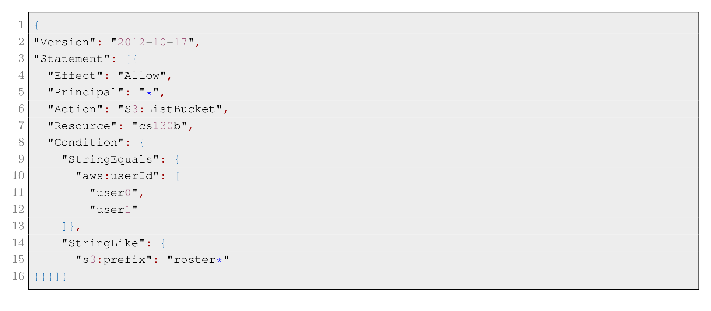

**Figure 1.1:** AWS policy specifying access to the cs130b S3 bucket

policies, and in Chapter 2 we detail how these policies are formed. In this dissertation, we specifically address how access control policies can be quantitatively analyzed and repaired using model counting techniques. For example, in Chapter 6 we show how to quantitatively assess the permissiveness of real world Amazon Web Services access control policies. We extend this work to the popular Google Cloud Platform (GCP) and Microsoft Azure access control policies. Together with AWS, GCP and Microsoft Azure account for a large majority of the cloud computing services currently used. Automated analysis approaches such as the ones we introduce in this disseration are essential to the privacy and security of the cloud and data within the cloud.

### Formal Verification in Access Control Policies

Access control policies specify who can do what under which conditions. Figure 1.1 shows an example AWS policy. AWS policies contain lists of statements, each specifying whether access is allowed or denied. Within each statement, the policy specifies who access is being granted or denied through the principal field. In this case, the principal field is the wildcard character "*", which is a shorthand for specifying anyone. The action field specifies what action is being done, which in this policy is the S3:ListBucket action, a common S3 action for listing the contents S3 buckets. The resource field specifies what is being accessed, in this case being the "cs130b" bucket. Lastly, this policy features additional conditions, which further restrict access through the environmental attributes "aws:userid" and "s3:prefix". While the exact fields of an access control policy varies throughout policy languages and platforms (Azure, GCP), they all adhere to a similar structure: specifying who can access what under which conditions. When a request is made to a resource or service, the request context is checked against the policy. An example request for the policy in Figure 1.1 is:

This request specifies that "John" is trying to perform the S3:ListBucket action on the "cs130b" resource with the environmental attributes "aws:userId: user0", and "s3:prefix: rosterSummer2020". The request is checked against the policy to see if it is allowed by the policy, and in this case the request is allowed by the policy since the statement in the policy explicitly allows this request. We can translate the policy semantics into a Satisfiability Modulo Theories (SMT) formula representing the requests allowed by the policy:

match(principal, (.*)) ∧action = "S3:ListBucket" ∧resource = "cs130b" ∧aws: userIdExists ∧(aws: userId = "user0" ∨aws: userId = "user1") ∧s3: prefixExists ∧match(s3: prefix, roster.*)

Given a request, the request context gets input into the above formula. If the formula is satisfiable, then the request is allowed. By translating the semantics of the policy into a logical formula, we can analyze the permissiveness of a policy: that is, reasoning over what is allowed by a policy. In order to check for correctness of a policy, it is necessary to have a specification of correctness properties, but writing correctness properties manually can be challenging and time consuming. Moreover, writing expected properties of the policy is error-prone. Hence, when an inconsistency between a property specification and a policy is identified, it does not necessarily mean that the policy has an error; the property specification itself could be erroneous. Instead, one could reason about correctness of the policy by reasoning over the requests allowed by the policy. To do so, one can specify what is allowed by the policy by translating the policy semantics into a logic formula. The satisfiability of that formula then corresponds correctness of that property. A differential policy analysis approach removes the need to manually specify policy properties; instead, it compares different policies and identifies inconsistencies among them. Basic policies can be compared to a complex policy to verify that the latter does not have unintended consequences. For example, we may want to verify that a complex policy specification is not more permissive than a simple policy that specifies common sense access rules. Moreover, differential policy analysis techniques can identify differences between different versions of a policy. When a policy specification is modified, it would be worthwhile to know how the permissiveness of the policy has changed. Consider the policies in Figure 1.2. Both policies consist of two statements. The first statement of each policy is the same: it specifies that any sns action is allowed on any resources. Note that this policy does not specify a principal - policies such as these are attached to roles or entity, so specifying the principal is not required. On first glance, the second statement for each policy seems to be the same. However, they are

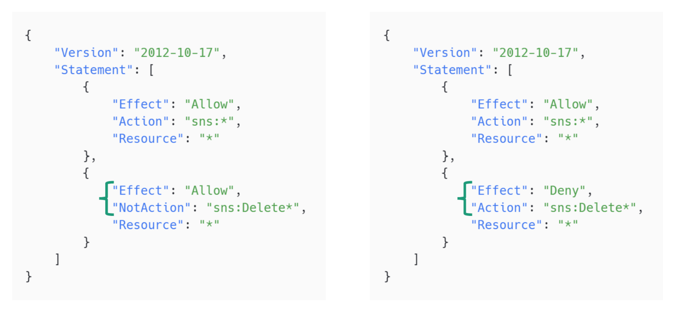

**Figure 1.2:** Two AWS policies showing a common misconception that NotAction and Allow/Deny are equivalent

vastly different. The semantics of the second statement in the first policy specify that the attached role or entity is allowed to access any resource with any action that does NOT begin with sns:Delete. However, the second statement in the second policy specifically denies access to any resource if the action begins with sns:Delete. A differential policy analysis can be used to compare both policies to determine which is more permissive or if both adhere to some specified property. However, a binary answer to a question that compares two policies may be insufficient. For example, it may not suffice that we know if one policy is more permissive than another. We may want to know how much more permissive a policy is than another, i.e., we may want to quantify the relative permissiveness of different policies. To illustrate the importance of quantifying the permissiveness, let us consider a real world example. Amazon Web Services Support has automated systems which routinely modiy policies for various reasons. One such policy is the AWSSupportServiceRolePolicy. In December 2021, this policy was inadvertently modified to allow the action s3:getobject [9], which can greatly increase the requests allowed by the policy. The

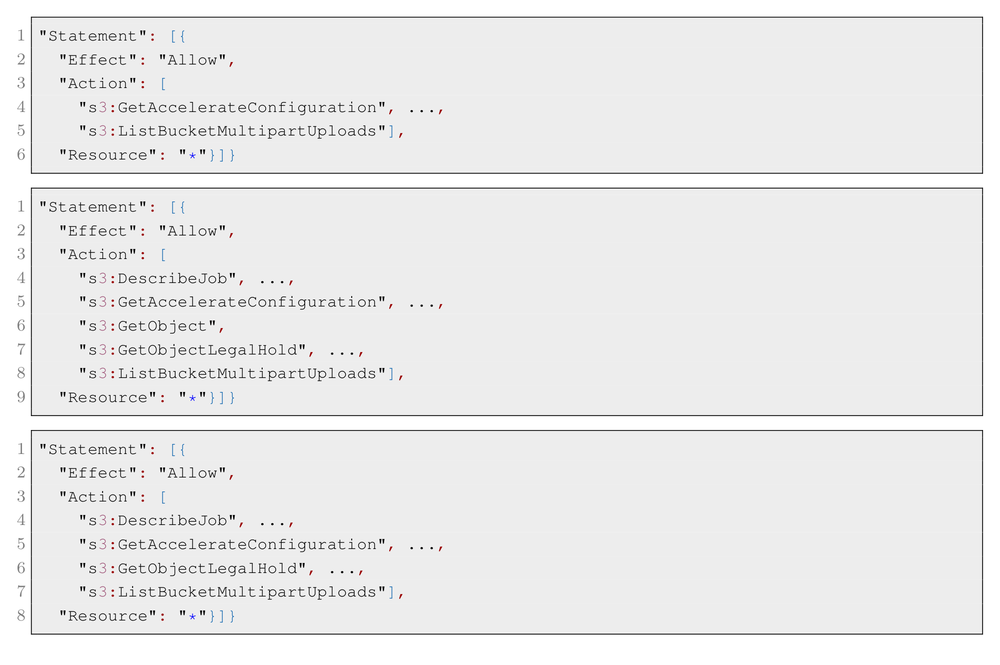

**Figure 1.3:** Initial (topmost, (a)), modified (middle, (b)), and fixed (bottom, (c)), versions of a policy used by AWS Support

change was only noticed when a bot detected a change and posted a file diff to github, where users noticed the change and raised concerns about getobject [10]. Normally such policy modifications are unimportant, but in this case humans who had substantial AWS knowledge were able to notice that this modification should not have been made. Typical binary differential analysis would be insufficient to automatically determine the modification was excessive, as changing a policy to add more actions would clearly increase permissiveness, regardless of if getobject was one of those actions. In this case, a more sophisticated analysis such as quantitative approaches introduced in this dissertation are necessary. AWS eventually fixed the policy, removing getobject. Initial, modified, and fixed policies adapted from AWSSupportServiceRolePolicy are shown in Fig 1.3. Note that the fixed policy does not allow getobject. In Chapter 7, we introduce the quacky tool which implements the quantitative permissiveness approach for access control policies from Chapter 6. Using quacky we can quantify the permissiveness of the policy in Figure 1.3(a) in terms of how many actions and requests are allowed by the policy. In this case, assume that resources are no more than 100 characters long. quacky reports that 24 actions and 4.09×10138 requests are allowed by the policy. This result is with respect to the set of valid AWS s3 actions and all possible resources, not the set of resources in the user’s organization. If the set of resources is known, they can be added as a constraint and then our approach would count the requests allowed by the policy with respect to the set of known requests. Using quacky, We can also quantify the permissiveness of policies in Figure 1.3(b) and Figure 1.3(c). quacky reports that 47 actions and 2.22 × 10205 requests are allowed by the policy Figure 1.3(b). By removing getobject from the policy in Figure 1.3(b), quacky reports that 46 actions and 1.78 × 10205 requests are allowed by the policy in

Figure 1.3(c). Note that both policies are identical except that the policy in Figure 1.3(c)
does not contain getobject. If the action (s3:describejob) was removed from the policy in Figure 1.3(b) instead of getobject, then quacky reports that 46 actions and 2.22 × 10205 requests (as opposed to 1.78 × 10205 requests) are allowed by the resulting policy. This is a significant change and highlights the importance quantitative permissiveness techniques in automated verification approaches.

### Contributions

The quantitative techniques we use within this dissertation depend on constraint solving and model counting in order to quantify properties such as permissiveness. Both the constraint solving and model counting approaches are automata-based and use automata to represent the solutions for constraint formula. By casting the model counting problem to a path counting problem in graphs, we can answer the model counting problem by counting the number of accepting paths in the automata. This allows us to perform quantitative analysis of access control policies by formulating quantitative questions into model counting queries. By developing a state-of-the-art constraint solver and model counter for strings, we can perform quantitative analysis and repair of access control policies in a precise and efficient manner. We make the following claims about as novel research contributions contained in this dissertation:

1. Multi-track automata-based constraint solving and model counting. We developed and implemented multi-track automata for more efficient and precise constraint solving and model counting. Constraint solving and model counting techniques are used in a variety of verification and quantitative analysis approaches. My contributions enable these approaches to handle a wider set of programs by being able to handle an expressive set of constraints.

2. Subformula and automata caching. Constraint solving and model counting queries are expensive. Formula caching is one method for speeding up analysis times by reusing results from prior queries. We introduce novel sub-formula and automata caching techniques which allow subformulas and intermediate automata to be reused throughout the solving and counting process.

3. Quantitative analysis of access control policies. Automated policy analysis techniques cannot quantify properties of access control policies. We developed a sound policy analysis framework for quantifying properties, such as permissiveness, of access control policies by utilizing model counting techniques. Being able to accurately determine the permissiveness of a policy is an essential part of determining the vulnerability and risk assessment of the policy.

4. Quantitative policy repair for access control policies. Using quantitative analysis techniques, one can quantify the permissiveness of access control policies. We developed an automated approach for repairing overly permissive policies. By using model counting techniques to localize the faults in the policy and a regular expression generalization technique for generating a repair, our approach is the first quantitative policy repair algorithm for access control policies in the cloud.

### Dissertation Outline

In Chapter 2, we provide background information on access control policies for the cloud, discuss modern policy analysis techniques, and introduce the concept of model counting constraint solving. We introduce access control policies using the Amazon Web Services policy language, and detail how constraint solving has been used for policy analysis.

In Chapter 3 we present an automata-based model counting constraint solving approach for both constraint solving and model counting formulas containing mixed string and numeric constraints. Automata-based model counting and constraint solving lies at the core of the quantitative analysis techniques we discuss in this dissertation. In Chapter 4 we discuss how model counting techniques can be improved using subformula and automata-based caching techniques. Leveraging caching techniques allows for reusing results from prior satisfiability and counting queries. In Chapter 5 we introduce the ABC2 tool, a precise model counter and efficient satisfiability checker for string constraints. The ABC2 tool builds off of its predecessor ABC (discussed in Chapter 3). In Chapter 6 we discuss quantifying the permissiveness of access control policies using model counting techniques. Prior policy analysis approaches aim to answer binary yes/no analysis queries, such as “does a Policy allow this request”. In the quantitative analysis introduced in this Chapter, we aim to answer the questions such as “how much is allowed by a Policy”, “how permissive is a Policy” or “how much more permissive is Policy 1 than Policy 2”. In Chapter 7 we introduce the quacky tool for analyzing the permissiveness of access control policies in the cloud. quacky implements the quantitative policy techniques previously discussed into an open-source policy analysis tool. In Chapter 8 we introduce the policy repair problem and discuss methods for automatically repairing overly permissive access control policies. Similar to program repair, policy repair aims to repair incorrect or erroneous policies. However, in the context of permissiveness, the definition of incorrectness is different for access control policies than it is for programs. The repair problem and automated repair approach focuses on policies which work but allow too many requests, i.e., policies which are overly permissive. In Chapter 9 we discuss the related work for policy analysis and model counting techniques. Finally, in Chapter 10 we conclude the dissertation.

## Access Control Policies and Analysis

In this chapter we first introduce access control policies for the cloud and discuss existing policy analysis techniques based on constraint solving which can be used to verify the correctness of a policy specification. We then discuss model counting and its application to quantitative program analysis techniques such as quantitative information flow analysis.

### Access Control Policies for the Cloud

Modern software services run on compute clouds. Among the most popular cloud service providers are Amazon Web Services (AWS), Microsoft Azure, and Google Cloud Platform (GCP), each of which lets customers secure their services by writing access control policies. Access control policies specify rules that allow authorized access while denying unauthorized access to cloud data. Policies can be written using many access control specification languages.

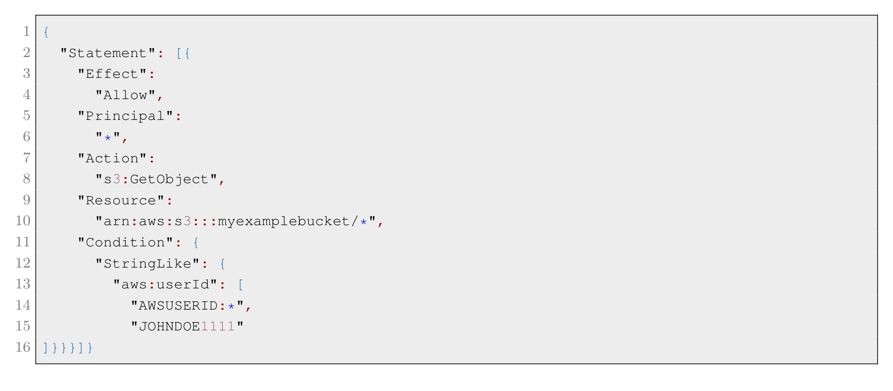

**Figure 2.1:** Example of an AWS policy

Amazon Web Services Policies Amazon Web Services (AWS) uses a shared responsibility security model where AWS guarantees security of the cloud, but users are responsible for security in the cloud. AWS lets users control who has access to their resources with access control policies written in the AWS policy language. Access requests are evaluated against policies and a dynamic environment context within a policy evaluation engine that either allows or denies access. AWS defines a policy language where policies either allow or deny access through declarative statements. A statement is a 5-tuple (Principal, Effect, Action, Resource, Condition) where

• Principal specifies a list of users, entities, or services

• Effect = {Allow, Deny} specifies whether the statement allows or denies access

• Action specifies a list of actions

• Resource specifies a list of resources

• Condition is an optional list of conditions further constraining how access is allowed or denied

Figure 2.1 shows an example AWS policy. Each condition consists of a condition operator, condition key, and condition value on elements of the request context. Full details of the language can be found in [11]. Note that while most of the elements of a policy are strings, certain condition keys specify other types of constraints (e.g., s3:max-keys expects an integral number). Additionally, the AWS policy language allows the use of two special characters within strings: ‘*’, or wildcard, represents any string, and ‘?’ which represents any single character. Given an access request and associated policy, permission is granted if and only if, for the given principal, action, resource, and condition key values in the request context, a statement in the policy allows access and no statement in the policy explicitly denies access.
Microsoft Azure Policies Like AWS, Azure uses a shared responsibility security model, where security in the cloud is achieved by role-based access control (RBAC). Azure RBAC defines a policy language consisting of role definitions and role assignments. A role definition is a set of allowed actions

(Actions ∪DataActions) \ (NotActions ∪NotDataActions)

where

• Actions is a list of allowed management actions

• DataActions is a list of allowed data actions

• NotActions ⊆Actions is a list of denied management actions

• NotDataActions ⊆NotActions is a list of denied data actions.

A role assignment is a tuple (principalId, roleDefId, scope, condition) where

• principalId identifies a Principal granted access

• roleDefId identifies the role definition

• scope identifies a set of Resources granted access

• condition is an optional expression for granting access

The scope is a path in Azure’s resource hierarchy, rooted at ‘/’. Resources rooted at the path are granted access. Unlike in AWS, the Azure condition is an infix logical expression. Azure has logical operators and relational operators on strings and integral numbers, but it also supports cross product relational operators on sets, like ForAnyofAllValues:StringEquals. Like AWS, Azure allows wildcards in strings (except scope). Given an access request, role definition, and role assignment, permission is granted if and only if, both the role definition and role assignment explicitly allow the principal and action under the scope and condition.

### Policy Analysis using Constraint Solving

Given an IAM policy, we can semantically represent the policy as a set of tuples ⟨P, A, R, C⟩which denote that the principles/users P can execute the actions A on the resources R if the condition C holds. For simplicity of the presentation, let us assume that all the actions that are not allowed are denied by default. It is easy to extend this semantic model to also capture explicit deny rules. In order to conduct differential policy analysis [12], we need to compare two policy specifications S1 = ⟨P1, A1, R1, C1⟩S2 = ⟨P2, A2, R2, C2⟩. We can define an ordering for each field of a policy, where

P1 ⪯P2 if and only if the set of users in P1 is a subset of the set of users in P2 A1 ⪯A2 if and only if the set of actions in A1 is a subset of the set of actions in A2 R1 ⪯R2 if and only if the set of resources in R1 is a subset of the set of resources in R2 C1 ⪯C2 if and only if the condition C1 implies the condition C2, i.e., C1 ⇒C2. Now, we can define an ordering among policy specifications using these definitions. Given S1 = ⟨P1, A1, R1, C1⟩and S2 = ⟨P2, A2, R2, C2⟩

S1 ⪯S2 if and only if P1 ⪯P2 ∧A1 ⪯A2 ∧R1 ⪯R2 ∧C1 ⪯C2

If S1 ⪯S2, then S2 is at least as permissive as S1, i.e., S1 is not more permissive than S2 and any action denied by S2 is also denied by S1. Note that S1 ⪯S2 ∧S2 ⪯S1 means that S1 and S2 are equivalent policies. And, it is also possible for two policies to be incomparable with each other with respect to this order. The order defined by ⪯is a partial order and it defines the permissiveness order among policies, where S1 ⪯S2 means that policy S2 is at least as permissive as policy S1. We can use the permissiveness order for differential policy analysis. For example, we can write a general policy SG that can specify access restrictions that all other policies should obey, and then we can check, if for any given policy S ⪯SG. As another example, assume that a policy S1 is modified with the goal of restricting the access condition for a user. Let us assume that the new version of the policy is S2. Then, we can check if S2 ⪯S1 holds. If not, there must be an error either in the original policy S1 or in the modified policy S2.

Policy Analysis via Constraint Solving: The question is, given two policies S1 and S2, can we automatically check if S1 ⪯S2 or S2 ⪯S1? Given two policy specifications S1 and S2 we can automatically generate two logical formulas F1 and F2, such that S1 ⪯S2 if and only if F1 ⇒F2. With a constraint solver, we can automatically check if F1 ∧¬F2 is satisfiable. If it is, then we know that S1̸ ⪯S2 and this may point to a bug in one of the policies. The developments in the area of Satisfiability-Modulo-Theories (SMT) [13] and the implementation of powerful SMT solvers [14] that solve expressive constraints involving multiple theories, have resulted in effective constraint-based software analysis and testing techniques [15]. The key concept in constraint-based software analysis is to reduce a software verification query to a query about a constraint and then to use constraint solvers. Let us give a policy example to demonstrate how constraint-based analysis can be applied to policy analysis. Consider the policy statement below: 1

2

3 4

5

6 7

8

9

This policy allows any principle (using the wild-card symbol "*") to execute the S3:GetObject action on a resources in "arn:aws:s3:::mybucket/*" as long as its under the path "home/buckets/". Let us call this policy specification S1 Now, assume that someone modified this policy and changed the condition field as follows:

Let us call this modified policy S2. If the goal of the modification was to have a more permissible policy, then we should check if S1 ⪯S2. If the goal of this modification was to have a less permissible policy, then we should check if S2 ⪯S1. Both of these queries can be converted to satisfiability checking for constraints. Below we give the query for checking if S2 ⪯S1 which corresponds to a formula F2 ∧¬F1:

1 (declare-variable s3 String) 2 (declare-variable f1 Bool) 3 (declare-variable f2 Bool) 4 (assert (= f1 (begins s3 "home/buckets/"))) 5 (assert (= f2 (begins s3 "home/"))) 6 (assert (and f2 (not f1))) 7 (check-sat) 8 (get-model)

We used the Satisfiability-Modula-Theories (SMT) syntax for specifying the resulting formula. Note that since S1 and S2 only differed in their conditions, the generated formula is only checking the condition field. If this formula is satisfiable, then we know that S2̸ ⪯S1. I.e., if the developer was not intending to make the policy more permissible, then there is an error in the policy specification. For this simple example, it is easy to see that the modified policy uses a more permissive condition, however, this is not at all easy to check manually for complex policies that consist of many statements and with multiple conditions.

### Model Counting

Recall the classic boolean SAT problem: Given a formula ϕ from propositional logic, is it possible to assign the variables T (true) or F (false) so that the formula is true? For example, consider the following formula:

ϕ ≡(x ∨y) ∧(¬x ∨z) ∧(z ∨w) ∧x ∧(y ∨v)

ϕ is satisfied by setting

(x, y, z, w, v) = (T, F, T, F, T)

A satisfying assignment is called a model for ϕ. Let us now discuss the model counting problem: Given a formula ϕ over some theory (Boolean, Linear Integer Arithmetic, Strings, etc...), how many models are there for ϕ? For example, consider the following formula:

ϕ ≡(x > 5) ∧(x < 10)

ϕ can be satisfied by setting x = 6, x = 7, x = 8, or x = 9. Thus, ϕ has 4 models, or satisfying assignments. Note that model counting is at least as hard as a satisfiability check:

|ϕ| > 0 ↔ϕ is satisfiable

Model counting constraint solvers have previously been used for quantitative program analysis. To demonstrate how model counting can be used in quantitative information flow analysis, consider the following example based on a security vulnerability known as “Compression Ratio Info-leak Made Easy” (CRIME) [16, 17]. Many web server requests are compressed and encrypted for efficiency and security before transmission as a network packet. Despite the encryption, a malicious attacker who can observe network packet sizes can use the compression size to learn secret web-session information. Assume an attacker can inject and concatenate his own text with the secret text prior to compression. The smaller the resulting packet, the more compression must have occurred prior to encryption, and so the attacker-controlled input must contain substrings which match substrings of the secret text. In the CRIME attack, encryption does not significantly change the size of the packet, as many encryption protocols are size-preserving. Thus, by carefully crafting injected inputs, an attacker can incrementally reveal the secret text. For instance, suppose the secret is the text: “sessionkey:21620” If the attacker is able to inject the text string: “sessionkey:12345” he will observe less compression than if he injects: “sessionkey:21600” because there is a longer prefix match between the attacker string and the secret string. In this way, the attacker is able to make repeated guesses and incrementally learn more information about prefixes of the secret. Consider a simple method for compressing the concatenation of two strings. For strings s and t, we compress their concatenation, s·t, by checking if t is a prefix of s, and if so, encoding their concatenation as s; [k] where k is the length of t. If t is not a prefix of s they are simply concatenated. The notation s; [k] is interpreted as a pointer which indexes into s, indicating how many characters of s to expand in order to recover t. For example, if s is the string “Hello, World!” and t is the string “Hello”, s · t is encoded as “Hello, World!;[5]”. The following is a simple Java function for performing this combined concatenation and compression:

This function results in an exploitable vulnerability similar to the CRIME attack. Suppose that s is a secret string of 5 numeric characters, and a malicious adversary has control over t. If the adversary is able to observe the size of the resulting compression, he can learn information about s by varying t. We will assume that the alphabet for s and t is the set of numeric characters: ‘1’,..., ‘9’. By performing symbolic execution of compress(s,t), we can determine path constraints which lead to different possible observations on the size of the result. For example, (using the constraint language we define in Section 2) we can see that if (length(s) = 5) ∧(begins(s, t) ∨length(t) = 4) then the length of the resulting string is 9. One may verify that there are 10, 005 possible pairs of strings (s, t) that satisfy this constraint. If ¬begins(s, t)∧length(s) = 5∧length(t) = 5 then the resulting string will have length 10, and there are 99, 999 possible (s, t) which satisfy this constraint. Assuming that s is uniformly distributed, we can compute the probability of each observation by dividing the number of solutions by the total domain size. Prior work in quantitative information flow has proposed using entropy as a measure of information leakage [18, 19, 20, 21, 22]. Given a probability distribution over program observables, the Shannon entropy of the distribution is defined as H(p) = −Pn i=1 pi log pi. Applying this to the probabilities computed using a model counting constraint solver, we can quantify the amount of information leaked for our example as 0.52 bits. Note that, in addition to a standard symbolic execution tool, all we need in order to be able to perform this kind of quantitative information flow analysis is a model counting constraint solver, and for this particular example, we need a model counting constraint solver that can handle string constraints and numeric constraints together.

## Parameterized Model Counting for String and Numeric Constraints

#### String and Numeric Constraints

In this chapter, we present a model counting constraint solver that can handle both numeric and string constraints and their combinations. Given a constraint, we construct a multi-track deterministic finite automaton (DFA) that accepts tuples of values that correspond to the solutions of the given constraint. For numeric constraints, we focus on linear integer arithmetic constraints, and the constructed automaton accepts a binary encoding of the numbers that satisfy the given numeric constraint. Since some string constraints can have non-regular solution sets, our automata construction approach overapproximates the solution set in such cases. Hence, our model counting constraint solver provides a sound upper-bound for the number of solutions for a given constraint. Since we use multi-track DFA, we can represent relational constraints that specify relationships among variables. Moreover, our approach handles interactions between numeric and string constraints in the presence of operations such as string length which can be used together with numeric variables in a constraint. Automata-based constraint solving reduces the model counting problem to path counting. To count the number of values that satisfy the given constraint within a given domain bound, we count the number of accepting paths in the automaton within the path length bound that corresponds to said domain bound. We use techniques from algebraic graph theory to solve the path counting problem. We implemented the techniques we present in this chapter in a tool called MultiTrack Automata Based model Counter (MT-ABC). We experimented on a large set of constraints generated during symbolic execution of Java and JavaScript programs and compared MT-ABC with five existing model counting constraint solvers [23, 24, 25, 26, 27]. Our experiments demonstrate that MT-ABC is as efficient and as or more precise than existing tools. More importantly, MT-ABC is the only tool can handle the union of all constraints that existing tools can handle, and MT-ABC is the only tool that can handle mixed numeric and string constraints that contain both string and integer variables.

### Constraint Language

We define our constraint language using the grammar shown in Fig. 3.1, where φ denotes a formula, β denotes a numeric term, γ denotes a string term, φZ denotes a numeric constraint (an atomic formula) constructed from terms and expressions, φS denotes a string constraint (an atomic formula) constructed from terms and expressions, ρ denotes a constant regular expression, n denotes an integer constant, ⊤and ⊥denote constants true and false, and vi and vs denote integer and string variables, respectively. We use α to denote φ, φZ, φS, β, or γ. Given alphabet Σ, s ∈Σ∗denotes a string value and ε denotes the empty string. A character is a string that has length one. The string operations “·", “p", and “∗" correspond to regular expression operations concatenation, alternation, and Kleene closure,

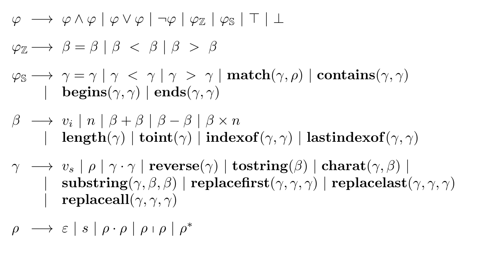

**Figure 3.1:** Constraint language grammar respectively. Comparators “<” and “>” on string terms correspond to lexicographical comparisons. An atomic constraint refers to a formula without any boolean connectives. Notice that an integer term produced from the production rule β may contain string terms γ and vice versa; a constraint produced in this way is called a mixed constraint. The constraint language from Fig. 3.1 is rich enough to capture common constraints that appear in Java and PHP programs. Formal semantics of this constraint language is described in [28]. The set of variables present in φ is given by V(φ). A model for φ is an assignment of all variables in V(φ) where φ evaluates to true. The truth set of a formula φ, denoted

JφK, is the set of all models of φ. The goal of model counting is to determine the size of JφK.

### Constraint Solving via Automata

A multi-track DFA A is a 5-tuple (Q,⃗Σ, δ, q0, F), where Q is the set of states,⃗Σ = (Σ ∪{λ})k is the k-track input alphabet where Σ is the set of alphabet symbols for one track, λ /∈Σ is a padding symbol that appears only at the end of a string in each track, δ: Q ×⃗Σ →Q is the transition relation, q0 ∈Q is the initial state, and F ⊆Q is the set of accepting states. Multi-track DFA are closed under intersection, union and complement [29]. With each track of A, we associate a unique identifier vi, which we refer to as the variable for track i. The set of track variables for A is denoted V(A). The language of all strings recognized by A is denoted L(A) where L(A) ⊆⃗Σ∗. Given a word w ∈L(A), we use w[vi] ∈Σ∗to denote the value of track i. Hence, w ∈L(A) denotes a tuple of values (w[v1], w[v2],..., w[vk]), one value for each variable in V(A). Given a formula φ, our goal is to construct an automaton A, such that L(A) = JφK, where the tracks of A correspond to the variables of φ. We call this DFA the solution automaton for φ. Some mixed constraints and some pure string constraints have nonregular truth sets [29]. For such constraints we provide a sound over approximation by constructing an automaton A such that JφK ⊆L(A). During our construction, in addition to having one track for each variable of the formula in the multi-track automaton, we also create one track for each string term (shown as γ in Figure 3.1) and one track for each numeric term (shown as β in Figure 3.1). Actually, for the terms that correspond to addition, subtraction and multiplication with a constant we do not create separate tracks as we discuss in Section 3.2.3. Given a term γ or β, we use t(γ) and t(β) to denote the tracks that those terms are associated with. We define a projection operation π such that, given an automaton A and a variable set V, π(A, V) is an automaton A′ where V(A′) = V. Let x1,..., xn ∈V \ V(A) be the variables in V but not in V(A) and y1,..., ym ∈V(A) \ V be the variables in V(A) but not in V. That is, we wish to add new unconstrained xi tracks to A and remove yj tracks from A. Then, we define π(A, V) to be a multi-track DFA A′ with V(A′) = V such that: w′ ∈L(A′) ⇔∃w ∈L(A), ∀v ∈V(A′) ∩V(A), w[v] = w′[v].

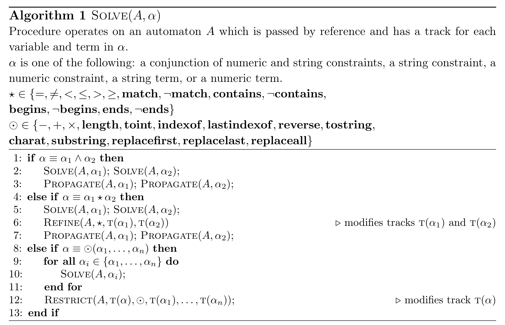

**Algorithm 1**

#### 3.2.1 Automata Construction

Since the negation operator is non-monotonic and since we sometimes over-approximate the solution sets of subformulas, before the automata construction, we convert the input formula to negation normal form by pushing negations to atomic formulas. We first describe our automata construction algorithm for constraints which are conjunctions of numeric and string constraints (i.e., φZ and φS in Fig. 3.1, respectively). We describe how we handle combinations of conjunctions and disjunctions later. Let φ be a formula which is a conjunction of numeric and string constraints. The automata construction procedure Solve (Algorithm 1) recursively constructs a multitrack automaton A such that, when A is projected to the variables of φ (i.e., V(φ)), it accepts an over approximation of φ solutions set, i.e., JφK ⊆L(π(A, V(φ))). Procedure Solve passes the automaton A by reference, so there is a single automaton

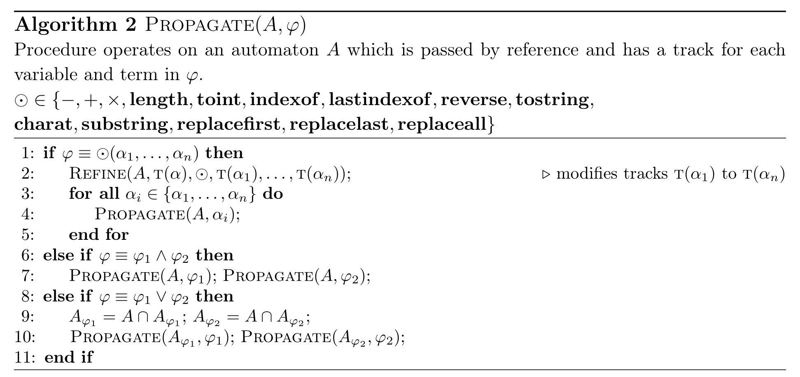

**Algorithm 2**

A that is being modified. Before the first call to the Solve procedure, A is initialized so that all tracks accept all strings, i.e., initially, L(A) =⃗Σ∗. The procedure Solve uses three other procedures during the construction of automaton A: Restrict, Refine and Propagate. Again, the automaton A is passed by reference, so all these procedures modify the same automaton A during construction. The procedure Restrict is used to compute the result of a string or numeric operator. Note that, there is a track in A for each term in φ, so the result of each string or numeric operator has a track reserved for the corresponding term. Let us denote the string or numeric operator with the symbol ⊙, where α ≡⊙(α1,..., αn). Then, Restrict(A, t(α), ⊙, t(α1),..., t(αn)) restricts the track in A that corresponds to the term ⊙(α1,..., αn) based on the tracks of the arguments α1,..., αn in A. For this to work, we need to make sure that the arguments’ tracks are processed first, and this is done in the for loop before Restrict is called. Consider the term charat(v, i). Restrict(A, t(charat(v, i)), charat, t(v), t(i)) restricts track t(charat(v, i)) in A to string values that correspond to characters that can appear at location i of string v, where possible values for v and i are specified by the values recognized by tracks t(v) and t(i), respectively. The procedure Refine is used to reflect the constraint imposed by a string or numeric predicate or its negation to its arguments. Let us denote the string or numeric predicate with the symbol ⋆, where α1 ⋆α2 and α1 and α2 are string or numeric terms. Then, Refine(A, ⋆, t(α1), t(α2)) reflects the constraint imposed by the predicate α1 ⋆α2 to the tracks t(α1) and t(α2). Before Refine is called arguments of the predicate ⋆are processed. Consider the predicate charat(v, i) = "a", Refine(A, =, t(charat(v, i)), t("a")) restricts the set of values for track t(charat(v, i)), to the string "a". Note that, since let us assume that constants are also assigned a track which accept just the value that corresponds to the constant. After Refine is called, the set of strings recognized by the arguments’ tracks may have changed and must be propagated to the other tracks (as arguments can be terms constructed from other arguments). This is done using the Propagate procedure. For example, once we refine the set of values for track charat(v, i) based on the predicate charat(v, i) = "a" we have to propagate this change to the arguments of the operator charat and refine the values for t(v) and t(i). We call Propagate(A, charat(v, i)) to do this. In general, we use the Propagate procedure when the result of a string or numeric operator is refined due to a string or numeric predicate, and this refinement has to be propagated to the arguments of the operator. As shown in Algorithm 2, Propagate(A, ⊙(α1,..., αn)) first calls Refine(A, t(α), ⊙, t(α1),... t(αn)) which refines the tracks for the arguments of the operator ⊙based on the track for the ⊙term. After this refinement, it recursively calls the procedure Propagate on the arguments of the ⊙term to further propagate the refinement.

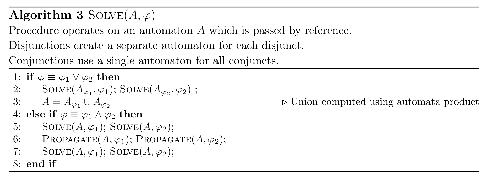

**Algorithm 3**

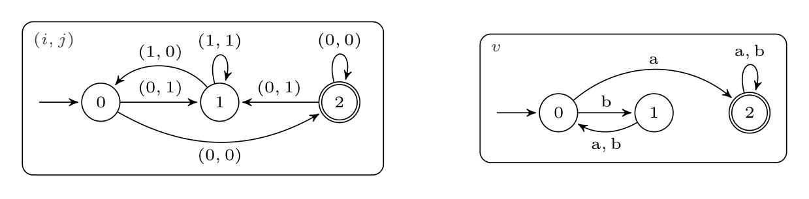

**Figure 3.2:** Automata constructed for Example 3.1 As shown in Algorithm 3, we extend the Solve procedure to combinations of conjunctions and disjunctions. For conjunctions we use a single automaton. After a conjunction is solved, it is necessary to propagate the result to the children of the conjunction. After propagation, the conjunction is solved again so that the final automaton captures all the refinements. For disjunctions, each disjunct has its own automaton. Then, the automaton for the disjunction corresponds to the automaton that accepts the union of sets accepted by each disjunct automaton. We compute the union automaton using automata product. Let us consider the following example constraint:

(3.1) charat(v, i) = "a" ∧i = 2 × j

We show the resulting automata in Figure 3.2. Note that, to make the example more readable, we split the automaton to two, one for string variables and one for integer variables. In fact, in our implementation we also split the automata to multiple automata based on the dependencies among variables, which we discuss later with other heuristics.

#### 3.2.2 String Constraint Solving

We now discuss how Algorithm 1 handles atomic constraints α ≡α1 ⋆α2, when α is a φS term, ⋆is a string predicate, and α1 and α2 are string terms (γ). In particular, we will focus on the Restrict and Refine procedures on string terms and string predicates, and discuss a representative subset of string terms and string predicates. Let us use the notation introduced in Figure 3.1 where β denotes integer terms, γ denotes string terms, and ρ denotes regular expression terms. Given an automaton A, function t(α) represents the possible values of the term α that is encoded as a track in the given automaton. Let t′(α) represent the result of a Restrict or Refine procedure call on the corresponding track. The prefixes: Σ∗→Σ∗function computes the set of prefixes for a given set of strings and the suffixes: Σ∗→Σ∗function computes the set of suffixes for a given set of strings. Both functions can be implemented using projection, determinization, and minimization operations on DFAs. Let us consider the operations length, indexof, substring, charat, and “·” (string concatenation) operations. Restrict(A, t(length(γ)), length, t(γ)):

t′(length(γ)) = {i | ∃s ∈t(γ): i = |s| ∧i ∈t(length(γ))}

Restrict(A, t(indexof(γ1, γ2)), indexof, t(γ1), t(γ2)):

t′(indexof(γ1, γ2)) = {i | ∃s ∈prefixes(t(γ1)), u ∈t(γ2), v ∈Σ∗: suv ∈t(γ1) ∧∄s1 ∈suffixes(prefixes(s)): s1 = u ∧i = |s| ∧i ∈t(indexof(γ1, γ2))}

Restrict(A, t(substring(γ, β1, β2)), substring, t(γ), t(β1), t(β1)):

t′(substring(γ, β1, β2)) = {s | ∃t ∈t(γ): ∃t1 ∈prefixes(t), t2 ∈Σ∗: t = t1t2 ∧|t1| ∈t(β1) ∧∃v ∈prefixes(t2): |v| ∈t(β2) ∧s = v ∧s ∈t(substring(γ, β1, β2))}

Restrict(A, t(γ1 · γ2), ·, γ1, γ2):

t′(γ1 · γ2) = {s | ∃s1 ∈t(γ1), s2 ∈t(γ2): s = s1s2 ∧s ∈t(γ1 · γ2)}

Note that charat operation can be rewritten as substring(γ, β, 1) where the last parameter is the length of the substring, hence the Restrict and Refine for charat can be computed using corresponding operations for substring. Let us now discuss the Refine procedure. Consider the string predicates =, match, and contains. Predicate operations create a boolean relation between the input tracks. We define the relation with tuples of strings that correspond to values from input tracks. Refine(A, =, t(γ1), t(γ2)): {(s, t) | s ∈t(γ1) ∧t ∈t(γ2) ∧s = t} We can implement the semantics of the equality predicate using the multi-track DFAs precisely. Procedure Propagate must be called when tracks represent terms that include string term operations. Refine(A, match, t(γ), t(ρ)): {s | s ∈t(γ) ∧s ∈t(ρ)} Note that match operation takes a constant regular expression as an argument. We do not need to create a relation between a string term and a constant regular expression constant. Hence, we only refine the string term in the match predicate. Refine(A, contains, t(γ1), t(γ2)): {(s, t) | s ∈t(γ1) ∧t ∈t(γ2) ∧s ∈Σ∗t(φ2)Σ∗∧t ∈ suffixes(prefixes(t(γ1))}

Here, semantics of the contains operation does not enforce the relation between the input tracks’ values. In other words, if one of the tracks is updated by another operation, we need to propagate that update back to the contains operation. The Propagate procedure calls after conjunctions make sure that refinement for the contains operation is executed again once there is an update. Next, we define the Refine semantics for the string term operations. Let us consider the operations length, indexof, substring, charat, and “·” again. Refine(A, t(length(γ)), length, t(γ)):

t′(γ) = {s | ∃t ∈t(length(γ)): |s| = t ∧s ∈t(γ)}

Refine(A, t(indexof(γ1, γ2)), indexof, t(γ1), t(γ2)):

t′(γ1) = {s | ∃t, u, v ∈Σ∗: |t| ∈t(indexof(γ1, γ2)) ∧ u ∈t(γ2) ∧s = tuv ∧s ∈t(γ1)} ∧ t′(γ2) = {s | ∃t, v ∈Σ∗: t ∈t(indexof(γ1, γ2)) ∧ tsv ∈t(γ1) ∧s ∈t(γ2)}

Refine(A, t(substring(γ, β1, β2)), substring, t(γ), t(β1), t(β1)):

t′(γ) = {s | ∃t, u ∈Σ∗, v ∈t(substring(γ, β1, β2)): |t| ∈t(β1) ∧|v| ∈t(β2) ∧s = tvu ∧s ∈t(γ)} ∧ t′(β1) = {i | ∃t, u ∈Σ∗, s ∈t(γ), v ∈t(substring(γ, β1, β2)): |v| ∈t(β2) ∧s = tvu ∧i = |t| ∧i ∈t(β1)} ∧ t′(β2) = {i | ∃t, u ∈Σ∗, s ∈t(γ), v ∈t(substring(γ, β1, β2)): |t| ∈t(β1) ∧s = tvu ∧i = |v| ∧i ∈t(β2)}

Refine(A, t(γ1 · γ2), ·, t(γ1), t(γ2)):

t′(γ1) = {s | ∃t ∈t(γ1 · γ2), v ∈t(γ2): t = sv ∧s ∈t(γ1)} ∧ t′(γ2) = {s | ∃t ∈t(γ1 · γ2), v ∈t(γ1): t = vs ∧s ∈t(γ2)}

The algorithms for the Restrict and Refine procedures are based on pre- and post-image computation in string analysis similar to the ones used in [30, 31, 32]. Let us consider the string constraint example charat(v, i) = "a" again. Initially t(v) and t(i) are unconstrained. Based on the semantics, Restrict(A, t(charat(v, i)), Σ∗, Σ∗) computes the set for t′(charat(v, i)) as Σ∗. Next, the Refine(A, =, Σ∗, "a") refines t(charat(v, i)) as {"a"}. Note that, we are not able keep the relation between charat(v, i), v, and i once they are computed. As equality predicate updates the t(charat(v, i)), we need to propagate the result back to v and i. In the final step, Refine(A, {"a"}, charat, Σ∗, Σ∗) is called to refine v and i. The final refinement sets the t(v) as Σ∗"a"Σ∗and t(i) as {i | i >= 0}.

#### 3.2.3 Integer Constraint Solving

We now focus out attention to the branch of Algorithm 1 for α ≡α1 ⋆α2, when α is a φZ term, ⋆is an integer term comparison operator, and α1 and α2 are linear combinations of atomic integer terms. Any such integer term constraint can be rewritten by moving all terms to one side of ⋆and decomposing it into a semantically equivalent conjunction of constraints in which ⋆is ≤. Thus, without loss of generality, we focus on integer term constraints of the form n X φZ ≡0 ≤ ciβi (3.2) i=1 where ci denotes an integer constant coefficient and βi is an atomic integer term. Algorithm 1 is written in a way that it would process each binary + term separately.

**Figure 3.3:** Automaton built for the constraint φ1 ≡i = 2 × j However, in the case of integer constraints of the form in expression 3.2, we construct a DFA for all terms of φZ at once. That is, when we call Refine(A, ≤, t(β1), . . . , t(βn)) we use an automaton construction that updates all βi tracks simultaneously. This automata construction method is based on algorithms that construct a binary adder state machine [33]. Given φZ as in expression 3.2, we use those algorithms to directly construct a multi-track automaton A over the binary alphabet {0, 1} such that each track corresponds a βi, and L(A) is the set of tuples of satisfying assignments for (β1, . . . , βn), encoded as binary integers in 2’s complement form, reads from least to most significant bit. For instance, consider the constraint i = 2 × j for integer variables i and j. The binary DFA for this constraint is depicted in Figure 3.3. One possible accepting sequence of states is 0, 2, 3, 0, 1. By taking the right-hand concatenation (as the DFA reads least significant bits first) of the pairs of bits along the corresponding transitions, we get

(0110, 0011) in binary which is (6, 3) in decimal. The DFA captures all possible integer solutions in this way, with leading 1’s indicating negative numbers in the standard 2’s complement encoding.

#### 3.2.4 Binary and Unary Encodings

A string term can have integer sub-terms and a integer terms can contain string sub-terms. As described in the earlier discussion of Algorithm 1, we call Propagate, Refine, and Restrict to update the relationship between the string and integer vari- ables. However, our binary integer arithmetic representation is not directly compatible with automaton operations over standard string automata. As just described, we can precisely solve multi-variable linear integer arithmetic constraints by constructing a multi-track binary integer automaton that recognizes tuples of solutions. However, integer variable solutions can be related to string variables through operations that have both string and integer parameters such as length or indexof. Given the DFA representing the solutions for integer variables, we must propagate the constraints imposed by the integer solutions to each related string variable. We do so by first converting the binary DFA solution representation A for an integer variable i to a set comprehension representation S. Our conversion from binary integer DFA A to a set comprehension S uses algorithms from [34, 35, 36], which show how to construct a description of a semilinear set from a binary DFA, which we now describe at a high level. A linear set Li is given by {a0 + a1k1+... ankn: kj ∈Z} where the aj constant integers are called the periods of the linear set. A semilinear set S is a finite union of linear sets, S = ∪iLi. For any binary integer DFA A constructed from linear integer arithmetic constraints, the accepted integers for each track of A form a semilinear set. Furthermore, for any track (which corresponds to an integer term), we can recover a set comprehension for the semilinear set S that it represents [34, 35, 36]. Intuitively, this works by examining the periods of the loops in the strongly connected components of the binary DFA in order to find the periods for a linear set Li ⊆L(A). A DFA representing the set Li is then subtracted from A using DFA complement and intersection, and we iterate this procedure until L(A) = ∅. Once we have S, for a single track of the binary DFA A, which corresponds to a single integer terms, we then convert S into a unary DFA A′, which for any integer m ∈S accepts all strings of length m. The unary DFA A′ is then compatible with string automata and can be used to restrict or refine the set of string models. For example, if

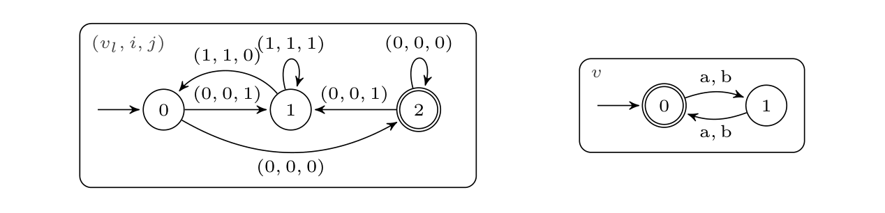

**Figure 3.4:** Final automata constructed for Example 3.3

S = {2 + 5k1 + 4k2} the corresponding unary DFA is shown below, which has an initial segment of length 2 and two interleaved loops of periods 4 and 5. Σ Σ 0 1 2 3 4 5 6 Σ Σ Σ Σ Σ Σ

We described how to propagate solutions from binary integer DFA to string DFA. In order to propagate solutions from string DFA to binary integer DFA, we reverse this process by converting a string DFA into a unary length DFA, extracting the semilinear set, and constructing the corresponding binary integer DFA. Consider the following example constraint:

(3.3) i = 2 × j ∧length(v) = i

Example 3.3 is a conjunction of an atomic integer constraints φ1 ≡i = 2 × j and φ2 ≡length(v) = i. The constraint φ2 is also a mixed constraint as it contains both a string and an integer variable.

Figure 3.4 shows the final automata constructed for the input formula φ ≡i =
2 × j ∧length(v) = i. The auxiliary variable vl represents bitwise encodings of the lengths of the strings that are represented with the variable v.

### Model Counting

In this section, we describe how to perform parameterized model counting by making use of the automata constructed by our constraint solving procedure. The model counting problem is to determine the size of JφK, which we denote #JφK. While a formula can have infinitely many models, we can count the number of models in an infinite space of solutions restricted to a finite range for the free variables. Hence, we perform parameterized model counting for string and integer constraints, where #JφK(bS, bZ) is a function over parameters bS, which bounds the length of string solutions, and bZ, which bounds the bit-length representation of integer solutions. The constraint solving procedure produces a final DFA, A, that contains multi-track solution sub-automata AS and AZ. The separation of string and integer automata may lose some relational information between string and integer variables; we can multiply the model counts for each automaton in order to give a sound upper bound on the number of models for tuples of integer and string variables. We use functions #FAS(k) and #fAZ(k) to count string and integer models respectively. We rely on the observation that counting the number of strings of length k in a regular language, L, is equivalent to counting the number of accepting paths of length k in the DFA that accepts L. That is, by using a DFA representation, we reduce the parameterized model counting problem to counting the number of paths of a given length in a graph. In a DFA, there is exactly one accepting path for every recognized string. Thus, if we are interested in computing only string models or only integer models, there is no loss of precision due to the the model counting procedure; any loss of precision for strings comes from the over-approximations of non-regular constraints in the solving phase, and for pure integer constraints, the model counting procedure is precise because integer solution automata construction is precise. Given a string automaton AS, computation of #fAS(k), the number of accepted strings of length k, can be done by constructing the transfer matrix of the automaton based on its transition relation [37, 38]. Let AS be a DFA with n states. The transfer matrix T of A is a matrix where Ti,j is the number of transitions from state i to state j. The number of paths of length k that start in state i and end in state j is given by (T k)i,j. Then the number of strings of length k accepted by A can be computed using matrix multiplication. We compute uT kv, where u is the row vector such that ui = 1 if and only if i is the start state and 0 otherwise, and v is the column vector where vi = 1 if and only if i is an accepting state and 0 otherwise. Note that for relational string constraints, the transition alphabet is over tuples of characters and the method described here will count the number of tuples of solutions of a given length. Our counting method is parameterized in the following sense: after a constraint is solved, we can count the number of solutions of any desired size k by computing uT kv, without re-solving the constraint. The method described above computes #fAS(k), the number of string solutions of length exactly k. It is of interest to compute #FAS(k), the number of solutions within a given bound. This is accomplished easily using a known “trick” often used to simplify graph algorithms. We add an artificial accepting state sn+1 to AS, resulting in a new DFA A′ S, with λ-transitions from each accepting state to sn+1, and a λ-cycle on sn+1. Then one can see that #FAS(k) = #fA′ S(k + 1), and so we apply the transfer matrix method on A′ S. The method for counting strings of a given length allows us to perform model counting for linear constraints as well. However, we must interpret the bound k in a slightly different manner. A solution DFA AZ for a set of integer tuples encodes the solutions as bit-strings. Thus, paths of length k in an integer automaton correspond to bit string of length k. Since we are using a 2’s complement representation with leading sign bits, bit strings of exactly length k correspond to integers in the range [−2k−1, 2k−1). Thus, the transfer matrix method allows us to perform model counting over integer domains parameterized by intervals of this form by computing #fAZ(k). To count models for arbitrary intervals (a, b), we intersect AZ with the DFA representing a ≤xi ≤b for any variable xi, and then count paths in the resulting DFA.

The methods described above allow us to compute #FAS(k) and #fAZ(k) independently. Now, we can compute #φ(bS, bZ) = #FAS(bS) · #fAZ(bZ).

### Implementation and Experiments

We implemented the techniques we presented in this paper in a tool called MultiTrack Automata Based model Counter (MT-ABC)1 by extending an existing tool called Automata Based Model Counter (ABC). We evaluated the precision and performance of MT-ABC using three types of constraints: constraints solely on string variables, constraints solely on integer variables, and constraints that contain both string and integer variables. We experimentally compared MT-ABC with five existing model counting constraint solvers: (1) ABC [23], a single-track automata-based model counter for strings, (2) S3# [25], a model counter for strings with some capability of handling relations between strings and integers, (3) SMC [24], a string model counter, (4) LattE [26, 39], a model counter for linear arithmetic constraints, and (5) SMTApproxMC [27], an approximate model counter for the theory of fixed-width words. Our experiments show: 1) MT-ABC is as or more precise with comparable efficiency than existing string model counters. 2) Multi-track automata enables MT-ABC to capture relations between variables more precisely than single-track automata used in ABC. 3) Parameterized model counting enables MT-ABC to compute multiple length bounds for the same formula efficiently without re-solving. 4) MT-ABC and S3# are the only tools that support mixed constraints with string and integer variables. MT-ABC is as or more precise than S3# for model counting constraints involving relations between string and integer variables, MT-ABC can handle a richer set of constraints than S3#, and S3# 1available at https://github.com/vlab-cs-ucsb/ABC

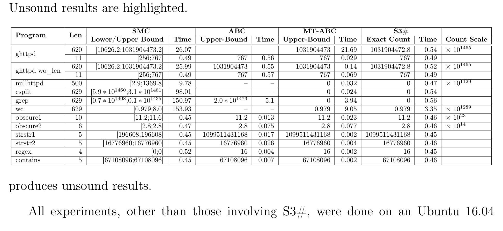

**Table 3.1:** Experiments with MT-ABC, ABC, S3#, and SMC on security benchmark. Unsound results are highlighted.

#### 3.4.1 String Constraints

Security Benchmark: Constraints in this benchmark are taken from various security contexts [25, 24]. For example, two constraints extracted from string manipulation utilities within the BUSYBOXY v.1.21.1 package (wc and grep), and one constraint extracted from a utility in the COREUTILS v.8.21 package (csplit) are used to quantify information leakage for homomorphically encrypted inputs.

Table 3.1 shows the results of MT-ABC, ABC, S3#, SMC for the security benchmark. Second column shows the string length value used for model counting (i.e., the tools count the number of solution strings with the specified length), last column indicates scale for larger lengths. Both MT-ABC and ABC report an upper bound on the number of solutions, while both SMC and S3# give both lower and upper bounds (S3# reports an exact count when the bounds are the same). Both MT-ABC and S3# generate bounds
which are as or more precise than those reported by SMC. In all cases, MT-ABC is as or more precise than ABC. The bounds generated by both MT-ABC and S3# agree for all constraints except ghttpd and ghttpd_ wo_len, where ghttpd_ wo_len is derived from ghttpd by removing the part of the constraint that uses the string length function. For solution strings of length 620, the two solvers give different counts. We could not confirm the model count for these constraints as they are too complex to manually count. However, while experimenting with variations of these constraints, we found out that S3# computes an erroneous count for a simplified version of these constraints. So, we believe that the count that S3# reports is erroneous. The running times for all four model counters are comparable for small constraints (obscure, strstr, regex, contains). For large constraints (ghttpd, wc, csplit, nullhttpd), ABC either times out after 20 minutes or runs out of memory, while both MT-ABC and S3# produce results faster than SMC. When the input constraint contains a high concrete value for the string length (ghttpd, wc, grep), MT-ABC generates a large automaton, which leads to a higher running time, whereas without the length constraint (ghttpd_wo_len), both MT-ABC and ABC produce results quickly. Simplified Kaluza Benchmark: Simplified Kaluza benchmark is a set of satisfiable constraints generated via symbolic execution of JavaScript and originally solved with the Kaluza string solver [40]. The authors of SMC simplified the Kaluza benchmark by replacing integer variables with constants and by removing disjunctions, since SMC cannot handle integer variables and loses precision for disjunctive constraints. Then, they translated these constraints into their input format and separated them into two sets: SMCSmall and SMCBig. We translated them from SMC format to MT-ABC input format. The SMCSmall set contains 17544 constraints and SMCBig contains 1342 constraints. Each constraint contains a query variable to model count on. We compared the performance and upper bounds produced by MT-ABC, ABC, and SMC using this

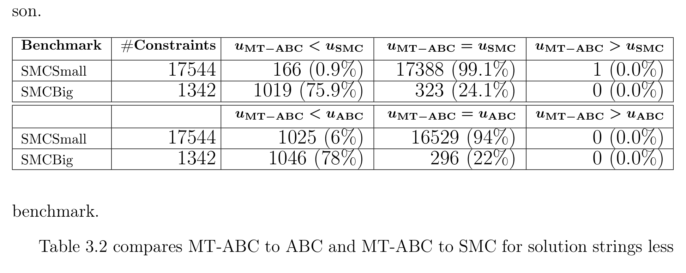

**Table 3.2:** ABC (uABC), MT-ABC (uMT−ABC) and SMC (uSMC) upper bounds comparison.

Table 3.2 compares MT-ABC to ABC and MT-ABC to SMC for solution strings less than or equal to 50. We did not include S3# in this comparison since S3# can only model count solution strings having length exactly equal to the given given length. For SMCSmall constraints ABC takes 0.0036s per constraint, SMC takes 0.42s per constraint, and MT-ABC takes 0.011s per constraint, on average. For SMCBig constraints ABC takes 6.09s per constraint, SMC takes 4.08s per constraint, and MT-ABC takes 1.35s per constraint, on average. For SMCSmall constraints, MT-ABC generates a more precise count than ABC for 6% of the constraints, and MT-ABC generates a more precise count than SMC for 0.9% of the constraints. For SMCBig constraints, MT-ABC generates a more precise count than ABC for 78% of the constraints, and MT-ABC generates a more precise count than SMC for 75.9% of the constraints. MT-ABC reported a higher count than SMC for one constraint; we manually determined MT-ABC reports the exact count in this case and concluded that the count reported by SMC is erroneous. In summary, for small constraints the performance of all three solvers are comparable, but for big constraints, MT-ABC is more efficient than ABC and SMC and produces more precise counts than ABC and SMC for more than 75% of the big constraints.

#### 3.4.2 Integer Constraints

Comparison with LattE: We compare the performance of MT-ABC with LattE for model counting linear arithmetic constraints on benchmarks containing constraints generated during reliability [41] and side-channel analyses of Java programs using the symbolic execution tool SPF [22, 42]. We extended the reliability benchmark by adding Merge sort, Quick sort, and Binary search functions. Password, LawDB, and CRIME come from side-channel analysis [22, 42]. Password, LawDB and Binary have 7,8, and 13 constraints respectively; the others range from 600-2000 constraints each. Some of the constraints (e.g., the constraints coming from the sorting functions) require a data structure with a certain size in order to enable symbolic execution. We fixed the size of such structures to 6. We counted solutions to the path constraints given bit-lengths 4, 8, 16, and 32. MT-ABC and LattE return identical counts for all constraints as both model counters are precise in counting linear arithmetic constraints. We focus on the timing comparison between MT-ABC and LattE. As a side note, the LattE input format does not support disequalities and thus needs a preprocessing step when such constraints arise. The LattE integration with SPF uses Omega [43]; we refer the reader to [41, 22, 42] for integration details.

Figure 3.3 shows that in general MT-ABC performs better than LattE, though there are exceptions (such as LawDB, Binary). Note that MT-ABC always outperforms LattEwhen counting multiple bit-lengths. Since MT-ABC is a parameterized model counter, it first solves a constraint without constraints on bit length, and then reuses the generated automaton to count for multiple bit-lengths. In contrast, LattE needs to be called separately for each bit-length.
Comparison with SMTApproxMC: We compare the performance of MT-ABC with SMTApproxMC using the same program analysis benchmarks we used in comparison

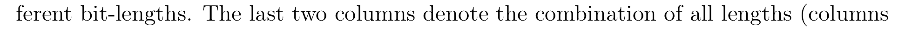

**Table 3.3:** MT-ABC and LattE average time (seconds) per numeric constraint for different bit-lengths. The last two columns denote the combination of all lengths (columns for lengths 4,16 omitted for space). For each bit-length, the execution time of the faster tool is in bold.

Bit-length = 8 Bit-length = 32 Bit-length = 4,8,16,32 Benchmark MT-ABC LattE MT-ABC LattE MT-ABC LattE LawDB 0.0218 0.0118 0.0223 0.0144 0.0227 0.0408 Heap 0.0165 0.0214 0.0209 0.0217 0.0212 0.0868 Booking 0.0104 0.0133 0.0106 0.0133 0.0107 0.0534 Bubble 0.0184 0.0218 0.0264 0.0221 0.0268 0.0879 Binary 0.0246 0.0250 0.0409 0.0256 0.0410 0.1036 DaisyChain 0.0128 0.0359 0.0138 0.0361 0.0140 0.3571 Selection 0.0171 0.0217 0.0224 0.0219 0.0228 0.0878 Crime 0.0143 0.2628 0.0151 0.2604 0.0153 0.9873 Merge 0.0183 0.0215 0.0262 0.0216 0.0266 0.0868 Flap 0.0094 0.0308 0.0094 0.0308 0.0096 0.1234 Quick 0.0173 0.0219 0.0236 0.0224 0.0239 0.0891 Insertion 0.0190 0.0218 0.0270 0.0220 0.0273 0.0880 RobotGame 0.0113 0.1408 0.0113 0.1397 0.0114 0.5717 AlarmClock 0.0095 0.0121 0.0096 0.0121 0.0097 0.0487 Password 0.0102 0.0542 0.0102 0.0542 0.0102 0.2185 of MT-ABC with LattE. Since SMTApproxMC targets the theory of fixed-width words, we translated each benchmark into the SMT2-BitVector format that SMTApproxMC is able to handle. We ran both MT-ABC and SMTApproxMC using bit-lengths of 2 and 3 since SMTApproxMC does not scale to larger bit-lengths. As some of the benchmarks contains constants which require more than 2 or 3 bits to be represented in bitvector format, we omit them from our comparison. Table 3.4 shows the execution time of both tools. For both bit-lengths and all benchmarks, MT-ABC is significantly faster than SMTApproxMC. MT-ABC produces an exact count in every case, while SMTApproxMC reports an approximate count which varies in precision. The average difference in model count as percentage of the domain size between the two tools is 3.7% and 4.2%, for bit-lengths of 2 and 3, respectively, with a maximum difference of 23.4% and 25.7% for bit-lengths of 2 and 3 for the FlapController. For every constraint in these benchmarks,

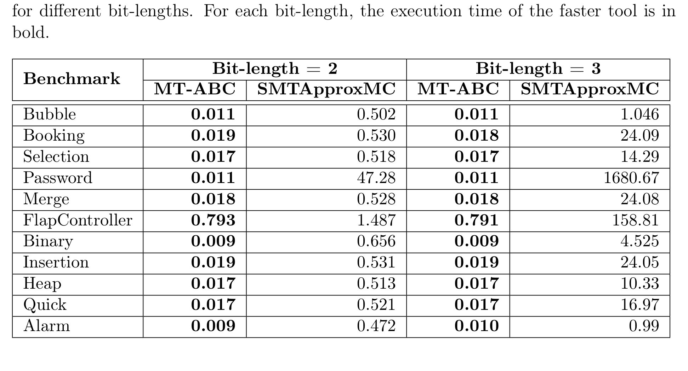

**Table 3.4:** MT-ABC and SMTApproxMC average time (seconds) per numeric constraint for different bit-lengths. For each bit-length, the execution time of the faster tool is in bold.

#### 3.4.3 Mixed String and Integer Constraints

For our final tool comparison we use the unmodified SMT2 Kaluza benchmark, used in [44], which requires constraint solvers to reason about constraints over mixed string and integer variables. In [25] this benchmark was used by the authors to demonstrate that S3# can handle mixed string and integer constraints. However, for these constraints, no model counting was performed, only a satisfiability check was done in [25]. When we used S3# to model count (by giving a string length) we found out that S3# reported erroneous results for many constraints. We focused on a subset of the SMT2 Kaluza benchmark. We compared MT-ABC and S3# on 28059 of the smaller constraints within the benchmark, given a query variable and a string length bound of 50 (solutions for the query variable must have an exact length of 50 characters). MT-ABC and S3# agree on 24317 (87%) of the constraints. In each of these cases, S3# was able to give an exact count, matching the upper bound given by MT-ABC. In the other 3742 (13%) constraints, S3# reported both a lower and upper bound, neither of which matched the upper bound reported by MT-ABC. For the constraints where MT-ABC and S3# produce different counts, the lower bound reported by S3# was between 1-3 models, while the upper bound seemed entirely random, fluctuating either below or above the count reported by MT-ABC. In the SMT2 Kaluza benchmark, there are many sets of constraints which are essentially equivalent to each other, some differing only in variable naming. We manually confirmed the upper bound returned by MT-ABC for many of the constraints was the exact count, while the upper bound reported by S3# between identical constraints varied wildly, with many of them being unsound. Additionally, we found that S3# gives different results for identical files with different names. Consider a constraint from the SMT2 Kaluza benchmark, length(s) = i, where s is an string variable, i an integer variable. We created three files each containing this single constraint, differing only in name. For query variable s and query length 5, the number of models is 2565 = 1099511627776, or 240. While MT-ABC gives the exact count for all three files, S3# reports three different upper bounds, all unsound (1.840133, 1.856730, 1.855426). We observed similar behavior from S3# given different constraints from the Kaluza dataset. We reached out to the developer of S3# ([25]) for a possible explanation. One issue is that they assumed that constraints from the Kaluza data set could be transformed into their solved form, but they did not verify this, nor the soundness of their results for this dataset in [25]. Thus, it is possible that either the Kaluza constraints cannot all be transformed into solved form, or S3# has a faulty implementation. Additionally, the authors of S3# were unable to explain why their tool was producing non-deterministic unsound upper bounds when the input constraint cannot be transformed into their solved form.

Our experiments suggest that the techniques presented in [25] and their implementation in S3# are not able to handle mixed numeric and string constraints with both string and integer variables. Hence, to the best of our knowledge, MT-ABC is the only model counting constraint solver that can handle this class of constraints.

### Chapter Summary

In this chapter, we showed that, using automata-based constraint solving, one can construct a model counting constraint solver that is able to handle both string and numeric constraints and their combinations. Our experiments on a large set of constraints generated from Java and JavaScript programs indicate that, automata-based model counting approach is as efficient and as precise as domain specific model counting methods, while it is able to handle a richer set of constraints than any other model counting constraint solver.

## Subformula Caching for Quantitative Program Analysis

#### Program Analysis

In this chapter we focus on improving the performance of model counting constraint solvers. We present a novel approach for formula caching that combines features of caching techniques that are based on syntax and canonical representations (building off of work done in Cashew [45]). Our approach has the following features that separates it from all prior results in this domain: First, our caching approach caches intermediate subformulas that arise in the pre-order traversal of the full formula enabling cache hits for common subformulas. Second, our approach combines syntax-based caching, with caching via a canonical representation in order to reduce the cost of caching while increasing the number of cache hits. Third, our approach uses an automata-based constraint representation which enables us to have a canonical representation of string and numeric constraints and their combinations. Techniques we present in this chapter aim to improve the performance of model counting queries generated during quantitative program analysis. In particular, we focus on automata-based model counting constraint solvers. Given a formula, the main difficulty

**Figure 4.1:** DFA that accepts the solution sets of the formulas charat(v0, 0) = “a” and

begins(v0, “a”).

in automata-based model counting is constructing a DFA accepting all solutions to that formula. Automata construction is exponential in the worst case as it may require determinization of an intermediate result automaton. Our caching techniques try to minimize the number of calls to automata construction operation. We use two types of caching, which we call syntactic caching and automata caching, to characterize the way the keys are generated for the intermediate results we cache. In both cases the result we are caching is an automaton constructed for a given formula. In syntactic caching the key for storing the automaton constructed for a formula is generated based on the formula syntax. In automata caching we generate a key for each constructed automaton based on the structure of the automaton. We use minimized deterministic finite automata (DFA) which are a canonical representation. Hence, formulas with the same set of satisfying solutions are mapped to equivalent automata and the keys generated for them match if and only if the formulas are semantically equivalent. Consider the following formulas:

length(x) ≤10 ∧charat(x, 0) = “b” (4.1) (4.2) begins(s, “d”) ∧length(s) ≤10 ∧s = t

Existing syntax-based formula caching techniques can be used to normalize these formulas in order to detect equivalent formulas. Normalization involves transformations such as variable renaming, character renaming, and sorting of the operations. Let us assume that the normalized form for the above formulas are:

length(v0) ≤10 ∧charat(v0, 0) = “a” (4.3) length(v0) ≤10 ∧begins(v0, “a”) ∧v0 = v1 (4.4)

Note that, syntactic normalization enables us to detect that formulas (1) and (2) have a common subformula length(v0) ≤10. However, with full formula caching, since these formulas (1) and (2) are not equivalent, the fact that they share a subformula will not be exploited during automata construction or model counting. In this paper, we demonstrate that subformula caching, which stores automata constructed for intermediate subformulas during evaluation of the model counting queries, enables the reuse of the result for subformula length(v0) ≤10. For the above example, if model counting query for constraint (1) is processed before the model counting query for constraint (2), then based on syntactic subformula caching, we can detect that the subformula length(s) ≤10 is equivalent to length(x) ≤10 and use the stored automaton constructed for length(x) ≤10 rather than constructing a new (and equivalent) automaton for length(s) ≤10. Above discussion explains our motivation for syntactic subformula caching, however it does not explain why we need automata caching. In syntactic caching we generate keys for the intermediate results using normalized syntax of the formulas. By automata caching we refer to generation of keys based on the structure of the automata, not the syntax of the corresponding formula. For example, the formulas charat(v0, 0) = “a” and begins(v0, “a”) are syntactically different but they are semantically equivalent. The set of solutions to both of these formulas is characterized by the automaton shown in

Figure 4.1. Again, assume that a model counting query for formula (1) is processed before a model counting query for the formula (2). The automata constructed for subformulas length(x) ≤10 and charat(x, 0) = “b” and the full formula length(x) ≤
10 ∧charat(x, 0) = “b” will be stored in the cache. If we process a model counting query for formula (2) next, then, syntactic caching will report a hit on subformula length(s) ≤10 and will return the cached automaton for length(x) ≤10 instead of reconstructing an equivalent one. Then, the syntactic caching will report a miss for the subformula begins(v0, “a”) and an automaton for that subformula will be constructed. Next step is to construct the automaton for the subformula length(v0) ≤10 ∧begins(v0, “a”). Now, syntax based caching will report a hit for the first argument of the conjunction operation and the automata based caching will report a hit for the second operand of the conjunction operation. Then, instead of reconstructing the automaton corresponding to the conjuction, the cached automaton for the formula length(v0) ≤10∧charat(v0, 0) = “a” will be returned. Then, the automaton for the subformula v0 = v1 will be constructed, followed by the construction of the automaton for the second conjunction. Note that syntax-based caching is necessary to reduce the number of calls to automata construction, and automata caching is necessary to catch the cases where syntax based caching is not able to detect equivalent formulas. In the following sections we will discuss the implementation of this caching approach.

### Caching for Model-Counting

Formula caching benefits quantitative program analyses by improving the performance of their enabling technology, model-counting constraint solvers. Formula caching frameworks allow model counters to reuse previously computed results and avoid performing expensive model counting. In the past, formula caching has been shown to improve the performance of model-counting constraint solvers by more than 10x [45]. Simple formula caching only attempts to reuse the results for the complete query (F, V, b). We instead integrate caching into the automata construction process of the model-counting constraint solver. This increases the potential for reuse. When constructing the automata for a formula F, we can reuse the automata of subformulas of F. For example, as we discussed earlier, in constructing the automata for the formula begins(s, “d”) ∧length(s) ≤10 ∧s = t we can reuse the automata constructed for the formula length(x) ≤10 ∧charat(s, 0) = “b”. Extending formula caching with subformula caching allows us to avoid expensive construction steps by reusing results. To determine when results can be reused, caching frameworks must be able to quickly detect when two queries are equivalent with respect to model-counting. A formula F is said to be equivalent to formula G with respect to model counting if the cardinality of satisfying solutions to F matches that of G for any length bound b. Note that two formulas might be equivalent according to this criterion even if they do not possess the same solution set. Determining if two formulas satisfy this criteria is non-trivial. Syntactic caching and automata caching are two different normalization techniques to determine the equivalence of formula, both of which we use in conjunction with subformula caching.

#### 4.1.1 Syntactic Caching

Under syntactic caching, the formulas of queries are transformed according to syntactic rules into a normal form. This normal form is then used as a key to the cache under which to store the automata. The constraint normalization procedure given in [45]

provides an effective, albeit incomplete method of determining if two formula are equivalent with respect to model counting. The normalization procedure takes a query (F, V, b) and produces a normalized query F, V, b, with variables V and bound b. Two queries normalize to the same form only if they are equivalent with respect to model counting, that is, only if the cardinality of their solution sets match for every length bound. We adopt the syntactic normalization procedure given in [45]. A query is normalized according to four sub-procedures which act on its formula. First, the formula conjuncts are sorted. Then the variable names are normalized in order of appearance in the sorted formula. Third, alphabet constants are normalized again in order of appearance, and finally, arithmetic constraints are shifted by an integral amount to center them about the origin. Note that normalized alphabet characters are still treated as characters, regardless of which character they are normalized to. As an example, consider formula F:

b = “.com” ∧contains(b, url)

and formula G: contains(s, link) ∧s = “.net”

After sorting and renaming, both F and G normalize to the same form:

v0 = “abcd” ∧contains(v0, v1)

which means that the automata constructed for one formula can be found in the cache and reused should a query be made on the other. We use syntactic caching for both full-formula queries and sub-formula queries. When we receive a query on formula F, we first syntactically normalize F and use its normal form as a key to query the cache as given in Algorithm 6. When a hit occurs, we use the stored automata for path counting. If a miss occurs, we turn to subformula caching to determine if we can reuse intermediate results during automata construction of F. If F ≡ op F1... Fn where op is any n-ary operator, then we perform two queries to the cache. One is on the syntactically normalized op F1... Fn−1 or if n = 2, F1. The other is on Fn. When a hit occurs, the cached automata is used and the construction of op F1... Fn−1 or F2 bypassed. If a miss occurs, querying continues recursively to op F1... Fn−2 and Fn−1 until an atomic1 formula is reached. When an atomic formula is reached, the automaton is constructed. Each time an automaton is constructed, we store the automaton in the cache under its syntactic key for future use. In the example given above, the constraint F has two subformulas: b = “.com" and contains(b, url). In the case where the normalized form of F is not found in the cache, the normal forms of these two subformulas would be queried. b = “.com" normalizes to v0 = “abcd" and contains(b, url) normalizes to contains(v0, v1). During the construction of G we get a hit since, after normalization, the key generated for G matches the key for F which means that the two formulas are equivalent as far as model counting is concerned.

#### 4.1.2 Automata Caching

Formulas that are semantically equivalent can have different syntactic normal forms. To capture additional equivalent formulas, we use automata caching. Under this caching, the normal form of a formula is its automaton itself. For deterministic and minimized automata, two formula have the same automaton if and only if they are semantically equivalent formulas. This is true since minimized deterministic DFAs provide a canonical form for regular languages. Unlike syntactic caching, this type of equivalence check captures all semantically equivalent formulas. When syntactic caching results in a cache hit, it is preferable to automata caching 1For the definition of atomic formula, see [46]

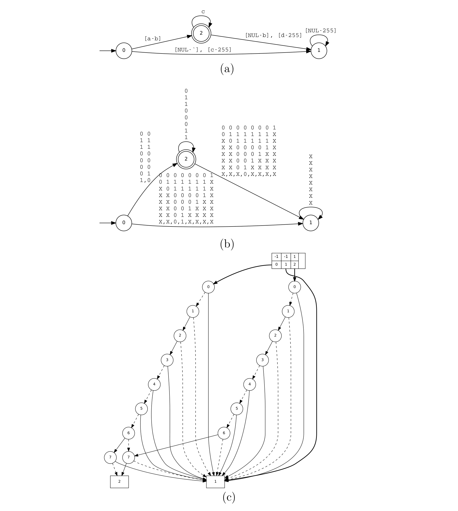

**Figure 4.2:** DFA constructed for the formula match(s, (a|b)c∗). (a) DFA with ASCII alphabet, (b) DFA with binary encoding of the ASCII symbols, (c) Multi-terminal BDD that encodes the DFA.

as its normalization is less expensive. We use automata caching when syntactic caching has failed on a query on a formula F ≡op F1... Fn where op is any n-ary operator. We construct the automata for each Fi. We then generate a key based on those automata and the operator op and query the cache with this key. If the resulting automaton for op has been previously constructed, we can reuse the result. This procedure is given in Algorithm 7. In cases where constructing the automaton for op is costly, the overhead of the caching queries is a beneficial trade-off. Each time we construct an automaton for a formula F = op F1... Fn, we generate its key for automata caching and store the result. In our implementation of the automata caching we use the automata package provided by the MONA tool [47]. Generation of keys for deterministic finite automata require us to encode the automaton as a string. Consider the formula match(s, (a|b)c∗) which states that string variable s can take any value that matches the regular expression (A|b)c∗. In Fig. 4.2, we show the automaton constructed for this constraint. Fig. 4.2(a) shows the minimized DFA with the ASCII alphabet. Initial state is 0, 2 is an accepting state and 1 is the sink state. Transitions are labeled with character ranges for readability. In order to improve the efficiency of automata manipulation, MONA uses a symbolic DFA representation. The basic idea is to represent the transition relation of the automata symbolically using Multi Terminal Binary Decision Diagrams (MTBDDs) [48]. In order to do this, we first have to use a binary encoding of the set of characters that can appear in a string. Fig. 4.2(b) shows the DFA that is equivalent to the DFA shown in Fig. 4.2(a) where the ASCII symbols are encoded using 8-bit binary numbers (X denotes a “don’t care” value). Finally, Fig. 4.2(c) shows the symbolic DFA representation based on the MTBDD data structure. The second row in the table at the top represents the DFA states while the first row in that table represents state types which are either accepting state 1 or rejecting state -1. The circle-shaped nodes are the BDD nodes. Each circleshaped node has a number n that represents its level i.e., which BDD variable n (in other

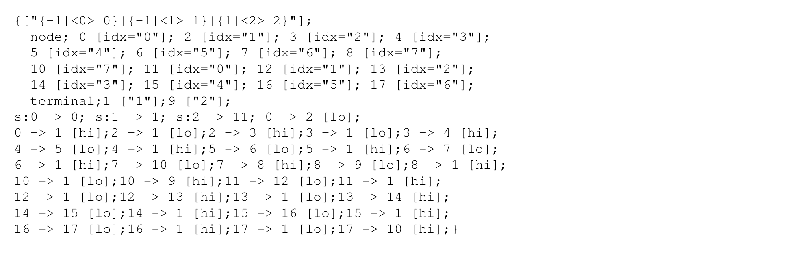

**Figure 4.3:** Key generated for the automaton in Figure 4.2 based on its multi-terminal BDD representation.

words, which bit n in an alphabet symbol it corresponds to. Each rectangle-shaped leaf node has a number n that represents the destination state that the node corresponds to. Dashed line represents a BDD variable (bit) value of 0 while a regular line represents a BDD variable (bit) value of 1. In Fig. 4.3 we show the key generated from the symbolic automata representation shown in Fig. 4.2(c). The key is a string that represents the nodes and the transitions in the MTBDD representation of the minimized DFA. Since minimized DFA representation is a canonical representation, given two formulas, the keys generated for them are identical if and only if the DFAs generated for them are identical.

#### 4.1.3 Formula Caching Algorithm

Algorithm 5 outlines how we leverage syntactic caching and automata caching in conjunction with subformula and full-formula caching. Given a formula F, we first query whether the full formula F can be found in the cache through syntactic caching. This is the cheapest normalization scheme and would provide the most benefit, so we check it first. If this check fails and F is atomic, the cache can be of no further use to us, so we construct the automata and store it in the cache under the syntactic normal form of F.

Otherwise, F is of the form F ≡op F1... Fn where op is some n-ary operator. In this case, sub-formula caching may benefit our construction process. As described above, we first syntactically query for the normalized form of op F1... Fn−1 or if n = 2, F1 and Fn. This querying continues recursively until either an atomic formula is reached or a cache hit occurs. Once the two automata have been either retrieved or constructed and stored under the syntactic normal form of the subformula, we use automata caching to potentially avoid an expensive construction of the op automata. We query using a key generated from the two automata and the op operator and either use the stored result or construct and store the automata. Algorithm 4 ModelCounting(F, V, b):

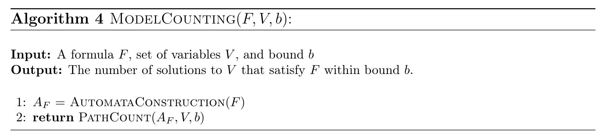

**Algorithm 4**

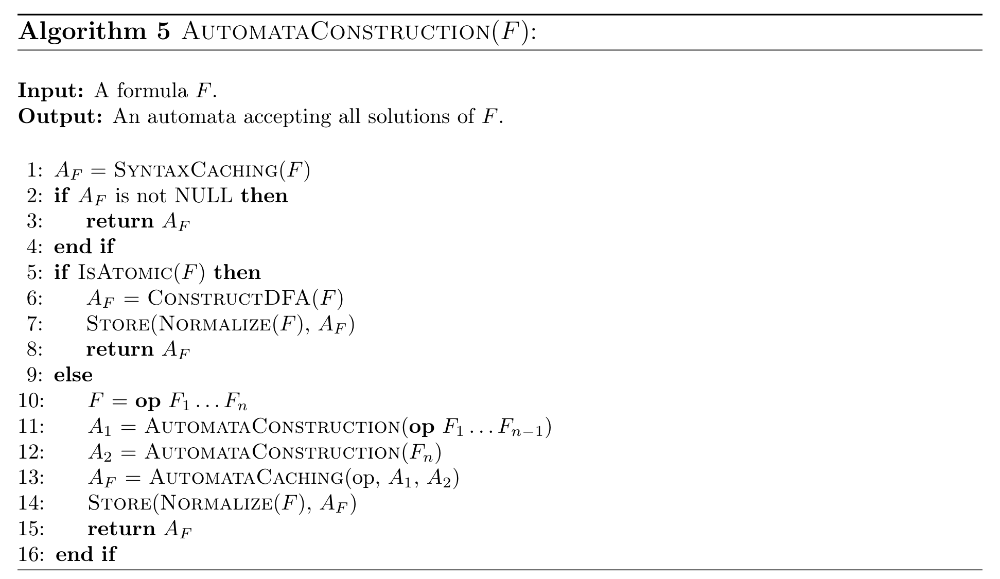

**Algorithm 5**

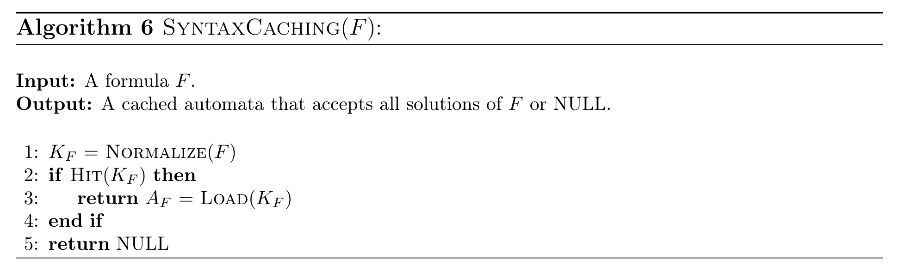

**Algorithm 6**

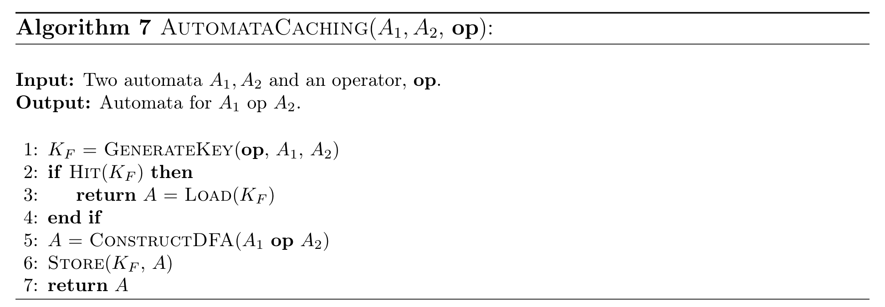

**Algorithm 7**

### Applications of Model Counting

In this section, we describe three different quantitative program analysis scenarios which use model-counting constraint solvers. For each scenario, we introduce the experimental benchmark we use to evaluate the effectiveness of our caching technique for the scenario.

#### 4.2.1 Model Counting Constraints

The most straightforward application of model counting is, given a set of constraints, to simply count the number of accepting solutions for each. This is common in symbolic execution, where model counting queries are generated for full path constraints after symbolic execution has completed. For this scenario we consider two sets of full path constraints, each generated from a different symbolic execution engine.

Kaluza Benchmark. The Kaluza benchmark is widely used benchmark for evaluating constraint solvers and model counting constraint solvers. The benchmark is a set of satisfiable constraints generated via symbolic execution of JavaScript programs and were originally solved by Kaluza string solver [49]. The constraints in this benchmark require a constraint solver to be able to reason over string and numeric constraints and their combinations. All the constraints from this benchmark were later divided into two sets: KaluzaSmall and KaluzaBig. The input format of these constraints were translated into the SMTLib2 input format by the authors of ABC [46, 23]. The KaluzaSmall set contains 28059 constraints, while KaluzaBig 7061 constraints. Each constraint contains a query variable for which to model count. We evaluate the performance of different caching techniques on this benchmark, comparing the time taken to count the number of solution strings of length less than or equal to 50 for each constraint. Sorting Constraints. We investigate the performance of our approach on constraints generated from symbolic execution of four different Java sorting programs: Quicksort, Bubblesort, Insertionsort, and Selectionsort. We fixed the array size of each to 7 elements and symbolic execution to a depth of 30. Each consists solely of numeric constraints, with the total number of constraints 12856, 5041, 5041, and 5041, respectively.

#### 4.2.2 Reliability Analysis

One measure of program reliability is the probability that the program executes successfully. Symbolic execution provides a means to compute program reliability. One run of symbolic execution generates a series of path constraints characterizing complete program paths. Because symbolic execution requires a depth bound, it is possible that not all complete program paths will be generated. Performing model counting over the generated path constraints and dividing the count by the domain size gives the probability that a randomly chosen input will execute that particular program path. By computing this probability for each complete program path, we can determine what percentage of the input space is captured by the path constraints generated by symbolic execution and therefore provide a lower bound on the reliability of the program. As an example, consider the password checking function in Figure 4.4. If this function were symbolically executed with length bound 4 for h, five path constraints would be generated. These constraints are given in Table 4.1. The probability of a given path can be computed by diving the model count of the path constraint by the size of the domain. The bound of 4 on h is a small bound. In general, we have no guarantee on the length of h, meaning symbolic execution will require a depth bound to terminate. However, by leveraging model counting, we can execute a bounded symbolic execution and then compute what percentage of the input space leads to a program path that terminates within our depth bound. This gives us the percentage of input space we can confidently say will execute without failure and thus provides a lower bound on the reliability of the program. For the PasswordChecker example, imagine we limit the search depth so that the loop symbolically executes only 3 times. In this case, all program paths for which the first three characters match would not complete their symbolic execution. Covered probability pc for reliability analysis will be then the summation of the probability of path constrains 1, 2 and 3 from Table 4.1. In practice, we are also often interested in guaranteeing a lower bound for program reliability. In this case, we can perform model counting at each step of symbolic execution to determine what percentage of input follows which path. This would allow us to guide the symbolic execution along the most probable paths in order to increase coverage most efficiently and stop execution once a certain coverage is reached. Conversely, one could also guide symbolic execution towards highly improbable paths in order to test corner cases. This can be alternatively calculated by doing model counting for each branches during symbolic execution and once it reached depth 3, counting constraint charat(l, 0) = charat(h, 0) ∧charat(l, 1) = charat(h, 1) ∧charat(l, 2)̸ = charat(h, 2) will provide the probability of covered reliability. More over, in this fashion we can keep calculating the probability of covered program paths and stop the process once we reach a desired reliability. For example, by calculating up to 3 iterations of the loop we can achieve a coverage of more than 99 percent.

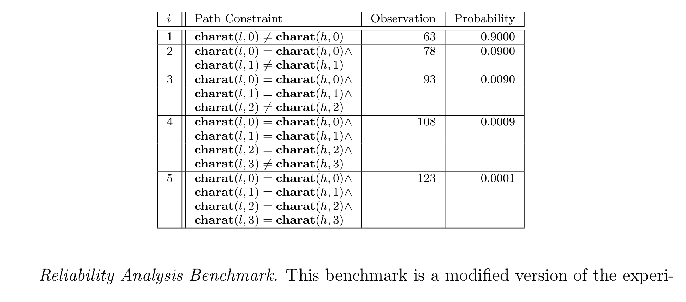

**Table 4.1:** Path constraints for program in Figure 4.4

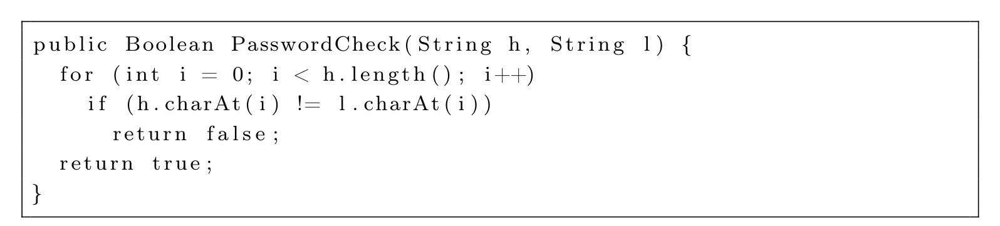

**Figure 4.4:** Password Checking example.

#### 4.2.3 Attack Synthesis

We focus on adaptive attack synthesis for side-channel vulnerabilities. Attack synthesis techniques generate inputs in an iterative manner which, when fed to code that accesses the secret, reveal information about the secret based on the side-channel observations [51, 52, 53]. Symbolic execution is used to extract path constraints, automata-based model counting is used to estimate probabilities of execution paths, and optimization techniques are used to maximize information gain based on entropy. Consider the password checking function in Figure 4.4. The function has a timing side-channel and one can reveal the secret by measuring execution time. If h and l have no common prefix, the program will have the fastest execution since the loop body will be executed only once; If h and l have a common prefix of one character, a longer execution will be observed since the loop body executes twice. The case when h and l match completely, the program has the longest execution. An attacker can choose an input and use the timing observation to determine how much of a prefix of the input has matched the secret. Adaptive attack synthesis approach starts by automatically generating the path constraints using symbolic execution. It then uses these constraints to synthesize an attack which determines the value of the secret (h). Based on Shannon entropy, the remaining uncertainty of h can be computed to measure the progress of an attack. At each step of an adaptive attack, attacker learns new information about h represented as a constraint on h based on the observed execution time. Suppose that the secret is “1337”. The initial uncertainty is log2 104 = 13.13 bits of information (assum- ing uniform distribution). Attack synthesis generates input “8229” at the first step and makes an observation with cost 63, which corresponds to constraint charat(h, 0)̸ = 8. Similarly, a second input, “0002”, implies charat(h, 0)̸ = 0. At the third step the input “1058” yields a different observation leading to updated constraint on h as below:

charat(h, 0)̸ = 8 ∧charat(h, 0)̸ = 0 ∧charat(h, 0) = 1 ∧charat(h, 1)̸ = 0

The updated constraint at an attack step has subformula from the previous step. For example, at attack step 2, constraint charat(h, 0)̸ = 8 ∧charat(h, 0)̸ = 0 has subformula charat(h, 0)̸ = 8 from earlier step and at attack step 3, constraint charat(h, 0)̸ = 8∧charat(h, 0)̸ = 0∧charat(h, 0) = 1∧charat(h, 1)̸ = 0 has subformula charat(h, 0)̸ = 8 ∧charat(h, 0)̸ = 0. A model counting tool without caching will re-count a number of formulas which was counted in the earlier steps. This is redundant and reduces the efficiency of attack synthesis. Results can be reused from prior iterations. Model counting is in the core of the attack synthesis process as it is repeatedly used to calculate information gain and progress of attack synthesis. Reusing model counting query results from earlier steps should improve the effectiveness of attack synthesis by reducing attack synthesis time. Attack Synthesis Benchmark. This benchmark was previously used in [54, 53] to synthesize attacks for programs vulnerable to side-channels. Example functions used in this benchmark includes different string manipulation and arithmetic operations, setting different sizes and lengths to define the domain of secret value. The function PCI is an implementation of password checker comparing a user input and secret password but inducing a timing side channel due to early termination optimization. SE is a method from the Java String library to check equality of two strings and known to be vulnerable to timing side-channel [55]. A similar side-channel was discovered in indexOf (IO) method from the Java String library. Function ED is an implementation of a dynamic programming algorithm to compute minimum edit distance between two strings. Function CO is a basic compression algorithm which collapses repeated sub-strings within two strings. SI, SCOI and SCI functions check lexicographic inequality (<,>=) of two strings whereas first one compares the strings, second one includes concatenation operation with inequality and third one compares characters in the strings.

### Implementation and Experiments

We implemented2 the caching techniques presented in this paper into the Automata Based Model Counter (ABC) [46, 23]. Internally, automata within ABC are represented as multi-terminal binary decision diagrams, implemented using the tool MONA [47]. Given the constraint formula F in SMTLib2 format, ABC first constructs the abstract syntax tree (AST) in negation normal form representing F where the root node represents the satisfiability of F, leaf nodes correspond to variables and constants, and intermediate nodes represent string or integer terms with boolean connectives (and, or). The AST is simplified before DFA construction using several heuristics. Dependency analysis identifies independent components which may be solved separately. Equivalence class generation detects equivalent variables through equality clauses and chooses a single representative for the class, and term re-write rules eliminate redundant terms and propagate constants. ABC then performs post-order traversal on the simplified AST, where the DFA for each node is constructed from the DFAs of its children nodes. We modify the constraint solving algorithm of ABC with support for both syntactic and automata caching on the nodes of the AST. In our implementation, we use the popular open source in-memory database store Redis [56] as the cache. We set the maximum database size to 8 GB, with a least recently used eviction policy (LRU). Note 2subformula caching implementation and dataset available at that the LRU algorithm Redis uses approximates the LRU set using sampling, 3 in this case. Given a constraint formula, ABC constructs the simplified AST representing the formula using the approach mentioned above. Prior to the post-order traversal for DFA construction, the cache is recursively queried for a smaller subset of the original formula until either an atomic formula is found, or a DFA is returned from a cache hit. Note that the key for each query is simply the string representation of the AST corresponding to the normalized form of a particular subformula. In either case, ABC begins its post-order DFA construction traversal from the corresponding AST node. For each subformula solved from this point, ABC stores the solution DFA into the cache. By exploiting the natural post-order traversal of ABC’s constraint solving algorithm we maximize the probability of a cache hit while minimizing the number of cache queries.

#### 4.3.1 Experimental Setup

We evaluate our caching technique across the three different quantitative program analysis scenarios described above. For each experimental scenario, we evaluate four different caching approaches. The NoCaching or NC approach performs the analysis with no caching of model-counting queries and serves as a baseline for comparison. The FullFormula or FF approach is an identical re-implementation of Cashew performs only syntactic normalization and only queries the cache for hits of the full formula of the model-counting query. The SubFormula or SF approach is also limited to syntactic normalization but performs recursive queries on the sub-formulas of the query formula when the full formula is not found in the cache. Finally, the SubFormula + Automata or SFA approach extends the SF approach with automata caching. The SFA approach is the most expressive caching scheme. We report the time in seconds for each benchmark program to complete (end-to-end) across these four caching scenarios. We also report the speedup demonstrated by the SFA approach versus both the NC and FF approaches. For all experiments, we use a desktop machine with an Intel Core i5-2400S 2.50 GHz CPU and 32 GB of DDR3 RAM running Ubuntu 16.04, with a Linux 4.4.0-81 64-bit kernel. We used the OpenJDK 64-bit Java VM, build 1.8.0 171.

#### 4.3.2 Experimental Results

We discuss how each of the four caching approaches perform across the three different quantitative program analysis scenarios. We evaluate under what kinds of analyses the SF and SFA approaches prove highly beneficial versus FF and NC and examine cases where the improvement was only marginal. Model Counting. The results for model counting constraints generated by symbolic execution are given in Table 4.2. We show results the simplified Kaluza benchmark and linear arithmetic constraints generated from running symbolic execution on a suite of sorting benchmarks. We found that out of 28059 of the constraints in KaluzaSmall, 647 were unique constraints after normalization, with the other 27412 being trivially satisfiable. KaluzaBig contained 376 unique constraints out of 7061 constraints, with the other 6685 constraints being of reasonable complexity. For both cases, SFA outperforms NC and FF. For the numeric constraints, SFA outperforms FF and NC in only one case. For the other three cases, the overhead of subformula caching outweighs any benefits gained due to the simplicity of the numeric constraints.

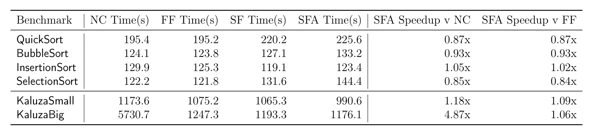

**Table 4.2:** Experimental Results for Model Counting Constraints Benchmark NC Time(s) FF Time(s) SF Time(s) SFA Time(s) SFA Speedup v NC SFA Speedup v FF

Reliability Analysis. The results on the reliability analysis benchmark are given in

Table 4.3. The upper half of the table shows the results on programs that produce only numeric constraints and the bottom half on programs that also contain string and mixed string and numeric constraints. We found no caching approach to be significantly beneficial in the benchmarks where only numeric constraints are encountered. In fact, because of the additional overhead of the FF and SFA approaches, we even observed a slight slowdown versus the NC or the more light-weight FF approach on some benchmark programs. Nevertheless, the additional overhead was never hugely debilitating and the
SFA approach never took more than 15% longer than the NC or FF approaches. On benchmarks with string or mixed string and numeric constraints, the SF approach demonstrated notable improvement over both the NC and FF approaches, and the SFA approach was even more successful. In some cases, the SFA approach was more than four-fold faster than either the NC or FF approaches. In all cases, some improvement was observed with the SFA approach. The reason for the significant improvement observed on benchmarks with string and mixed constraints lies in the expensive automata constructions demanded by those constraints. Numeric constraints, however, do not require expensive automata constructions making the effects of caching less beneficial. From these experiments, we learned that the SFA approach potentially provides enormous benefit when string or mixed constraints are encountered during the course of the analyses and does not significantly degrade performance when only numeric constraints are encountered. From this, we believe that enabling SFA caching is generally beneficial for reliability analysis but also note that the analyst could make an informed choice to enable should they have suspicions about the type of constraints likely to be encountered. Attack Synthesis. The results on the attack synthesis benchmark are given in TaAs shown in the execution time under the NC approach, this quantitative ble 4.4. program analysis is the most expensive of the three with some benchmark programs tak-

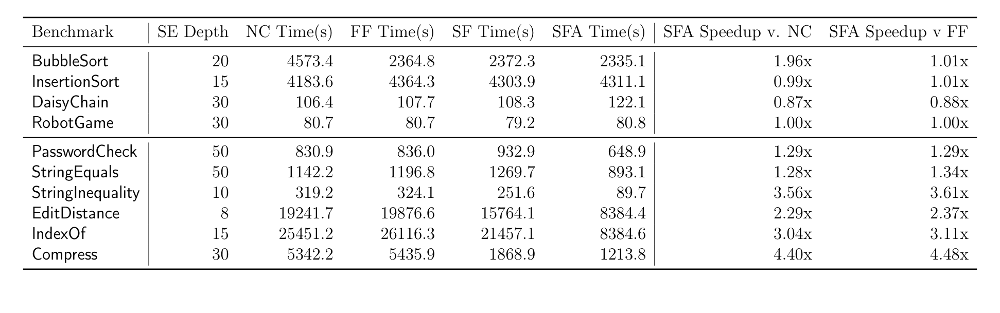

**Table 4.3:** Experimental Results for Reliability Analysis Benchmark SE Depth NC Time(s) FF Time(s) SF Time(s) SFA Time(s) SFA Speedup v. NC SFA Speedup v FF

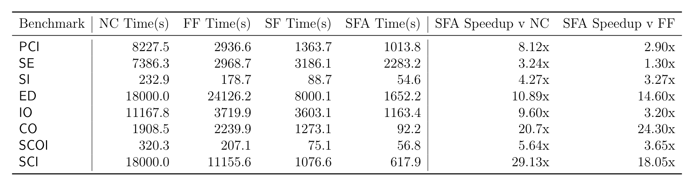

**Table 4.4:** Experimental Results for Attack Synthesis Benchmark NC Time(s) FF Time(s) SF Time(s) SFA Time(s) SFA Speedup v NC SFA Speedup v FF

### Chapter Summary

In this chapter we introduced sub-formula caching to improve the efficiency of quantitative program analysis techniques. We focused on automata-based model counting for string and numeric constraints. We used both syntactic and automata-based caching in order to reduce the number of times automata are constructed. We evaluated our approach in different scenarios and demonstrated that subformula caching can significantly improve the performance of quantitative program analysis techniques.

## ABC2: Precise Model Counting and Efficient Satisfiability Checking for Strings

#### Efficient Satisfiability Checking for

#### Strings

In this chapter we present the Automata-Based model Counter 2 (ABC2), a new automatabased model counter for string and numeric constraints. ABC2 builds off of the ideas from ABC [23, 46] but uses new algorithms and approaches for string and numeric constraints and combinations thereof. ABC2 implements specialized automata constructor functions to construct automata representing satisfying solutions to string and numeric constraints. It uses multi-terminal binary decision diagrams to symbolically represent automata. The novel research contributions I make to ABC2 are as follows: (1) Full support for string and numeric constraints specified in SMTLib2.6; (2) New algorithms for mixed string and numeric constraints, and constraint formula optimization and solving strategies; (3) Projected subset model counting; (4) Regression analysis for estimating model counts; and (5) An extensive experimental evaluation on over 55,000 constraints for both satisfiability and model counting capabilities which show that ABC2 satisfia-

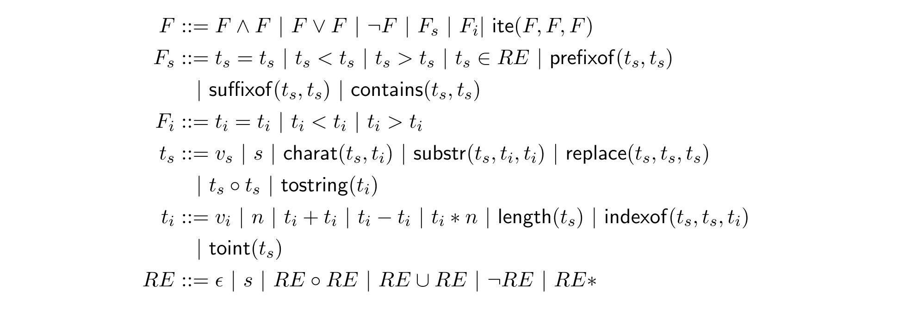

**Figure 5.1:** Base constraint language for ABC2. vs and vi denote string and integer variables, respectively. s and n denote string and integer constants, respectively.

bility performance is comparable to the state-of-the-art SMT solver Z3str3RE and that ABC2 is the best solver for model counting counting queries on string constraints

### ABC2 Algorithms and Extensions

In this section we discuss the novel contributions we make to automata-based constraint solving and model counting techniques, and how we incorporate them into the ABC2 tool.

#### 5.1.1 Extended Expressiveness

Similar to ABC, ABC2 supports string constraints and numeric constraints and their combinations. The core constraint language accepted by ABC2 is based on the SMTLib2.61 and is summarized in Figure 5.1. While ABC and ABC2 support the same core set of constraints (i.e., basic string functions and linear integer arithmetic), ABC is limited in its capability to handle complex combinations of string constraints, or must 1http://smtlib.cs.uiowa.edu/theories-UnicodeStrings.shtml overapproximate constraints the set of solutions to the constraints. Additionally, ABC2 can handle a wider set of constraints than ABC, which we discuss below. We will show in our experimental evaluation that the increase in expressiveness in ABC2 over other existing state of the art string model counters allows ABC2 to handle more complex constraints in benchmarks collected from real world program analysis.

Constraints with Boolean Variables and Implications Aside from string and linear integer arithmetic constraints, ABC2 also supports constraints containing boolean variables. When values of boolean variables can be determined syntactically, their values are propagated throughout the constraint formula. Otherwise, boolean variables are translated to integer variables which can take on values {0, 1}. Constraint implication, F ⇒F ′, is used often in constraint formulas. For automata-based constraint solving in ABC2, we first translate F ⇒F ′ into ¬F ∨F ′. Then, we construct automata for F, F ′, and ¬F and combine the automata using automata product.

Enhanced Integer-String Automata Construction We enhance automata-based techniques for constraint solving and model counting to cases where integer variables are used within more complex string functions such as substring and toint. As DFAs cannot precisely capture the set of solutions to the generalized form of these constraints, in the worst case the automata construction generates an overapproximation (sound upper bound) of the set of solutions. Recall that for string constraints we use a typical ASCII encoding (each transition in the DFA is an ASCII character) and for linear integer constraints we use a binary encoding (each transition is a 0 or 1). For constraints which contain both string and integer variables, such as s = len(i) or i = toint(s), in addition to the construction methods shown here, we use a translation algorithm to convert string automaton to

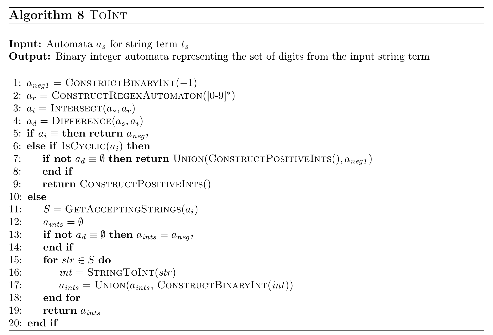

**Algorithm 8**

binary integer automaton and binary integer automaton to string automaton (based on [46]). The automata construction algorithm for toint is shown in Algorithm 8. On lines 2-3 we extract the strings corresponding to possible numeric values from subject automaton as. If there are none, then −1 is returned (per SMTLib2.6 specs). On lines 6-9, we check if there are infinitely many such strings, and if so, we return all possible positive integers (an overapproximation). Otherwise, there are finitely many possible numeric values from the subject automaton. On lines 15-18 we construct the automaton representing all such numbers. Note that regardless of if there are infinitely many strings, if the subject automaton contained strings corresponding to non-numeric values (from line 4) then we also return −1. Algorithm 9 shows the automata construction for substring. Given the automata as

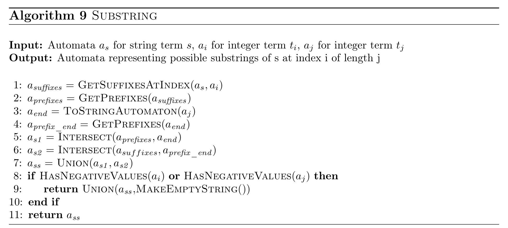

**Algorithm 9**

for subject string term ts, automata ai for starting indices term ti and automata aj for lengths term tj, substring returns the set of substrings of s beginning at possible indices i of possible lengths j. After getting the suffixes asuffixes from as, on line 2 we construct aprefixes corresponding to the prefixes of the suffixes. On lines 3 and 4 we construct aend and aprefix_end, corresponding to possible strings up lengths aj and at lengths aj, respectively. The union of these two is returned, which corresponds to set of possible substrings of as at indices ai up to and including lengths aj. Note that we also return the empty string if either ai or aj contain negative values.

#### 5.1.2 ITE Branch Elimination

A common occurrence in constraint formulas is the if-then-else expression ite(cond, Fthen, Felse) which returns Fthen if cond evaluates to true, or returns Felse if cond evaluates to false. Automata-based approaches such as ABC2 cannot directly construct an automaton for the expression ite(cond, Fthen, Felse). Rather, the if-then-else must be translated into logical formulas using the well-known identity ite(cond, Fthen, Felse) ≡(cond ∧Fthen) ∨(¬(cond) ∧Felse)

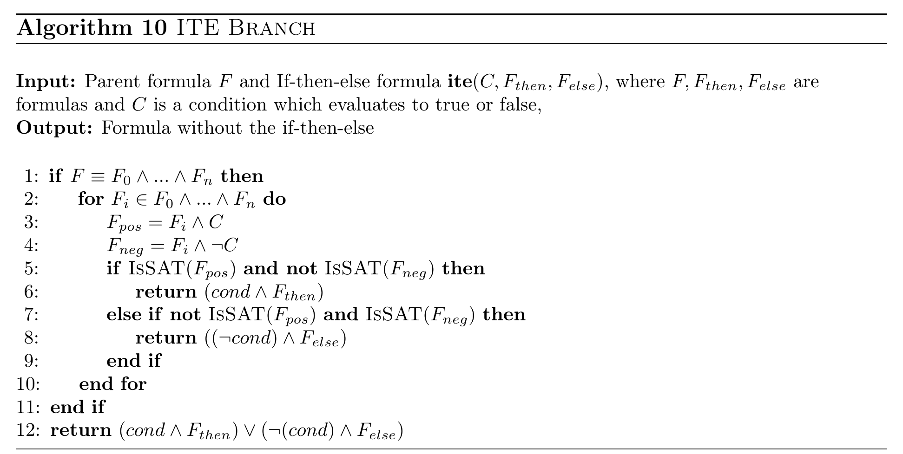

**Algorithm 10**

In some cases, ite terms can be simplified. For example if the ite condition must always evaluate to true for the constraint formula to be satisfied, then the else branch can be removed, simplifying the resulting formula. For example, ite(x ≥0, Fthen, Felse) ∧(x ≥4) ≡(x ≥0) ∧Fthen ∧(x ≥4)

Algorithm 10 shows how if-then-else conditions are handled in ABC2. Prior to translating ite terms, ABC2 attempts to simplify the ite terms by syntactically analyzing each term in the parent constraint formula. If the parent constraint formula is not a boolean AND formula, then ABC2 cannot optimize the if-then-else expression and instead returns the translation (cond ∧Fthen) ∨(¬(cond) ∧Felse) (line 1). If the parent constraint formula is a boolean AND formula, then we look at each child term Fi of the parent AND formula. Note that for simplicity, we assume that AND terms can have more than two children. On lines 3 and 4, Fpos and Fneg are constructed. If Fpos is satisfiable but Fneg is not, then it must be the case that if the condition were to be false the else branch must be unsatisfiable. Consequently, if Fneg is satisfiable but Fpos is not, then it must be the case that if the condition were to be true the then branch must be unsatisfiable Thus, in either of these cases one of the branches is eliminated. To check Fpos and Fneg ABC2 constructs the automata for the condition and automata for each child term and reasons about their satisfiability. This means that this optimization can be costly if there are many child terms, or if the child terms are more complex than atomic constraints. In practice, we only perform this optimization for specialized cases in which we can quickly check satisfiability (i.e., atomic constraints, linear integer arithmetic constraints).

#### 5.1.3 Formula and Solving Strategy Optimizations

Here we discuss the approaches we use to make automata-based constraint solving faster and more precise. These heuristics allow ABC2 to solve large constraints in an efficient and more precise manner, as we demonstrate later in our experimental evaluation.

Formula Optimizations Automata construction and operations can be costly in both time taken and memory, particularly determinization and multi-track operations. In addition to converting the formala to negation-normal-form (i.e., pushing negations down) ABC2 performs several preprocessing steps on the constraint formula prior to automata construction. We call these preprocessing steps formula optimizations, which often times simplifies the formula and reduces both the number of automata constructed and the number of automata operations. Additionally, our optimizations can result in a more precise upper bound reported by ABC2.

1. Regular expression constant term checking

2. Constant term propagation

3. Duplicate constraint removal

4. Constraint Sorting

ABC2 uses multi-track automata where each track corresponds to a string variable. The number of tracks corresponds to the number of string variables in the formula. The more variables there are, the greater the complexity of the automaton. Converting constant regular expressions into string constants combined with constant propagation reduces the number of string variables within the formula: e.g., if a formula contains the constraint X = "foo" then every instance of X is replaced by the string constant "foo". Generally ABC2 solves constraints in the order in which they appear in the formula. To provide a more precise sound upper bound, constraints which can be solved more precisely than other should be solved first. ABC2 uses constraint sorting to prioritize the order in which imprecise constraints should be solved.

Recall that automata-based constraint solving and Optimizing Solving Strategy model counting techniques like those used in ABC2 solve and model count constraint formulas by constructing deterministic finite state automata (DFA) which represent the satisfying solutions to the constraint. The expressive power of DFAs allow precise capturing of regular languages, but in general string constraints can be non-regular. In such cases, ABC2 computes an over approximation of the constraint, and thus computes a sound upper bound on the number of solutions to the constraint, and thus an upper bound on the satisfiability of the constraint. Consequently, the order in which constraints are solved even AFTER constraint sorting affects the level of approximation computed. The solving strategy of ABC2 prioritizes solving constraints which can be solved precisely using DFAs first, then solving those which result in an overapproximation. Recall that ABC2 can handle string and linear integer arithmetic constraints with boolean variables. The solving strategy is as follows:

1. Eliminate boolean variables

2. Solve linear arithmetic constraints first using multi-track binary integer automata

3. Solve regular string constraints using multi-track string automata

4. Solve non-regular constraints

In the first step, linear integer arithmetic constraints are solved first by constructing binary integer automata and combining them using automata product. Then string constraints which are regular such as X ∈regex, X̸ = c, or regular word equations X = Y ◦c (where X is a string variable and c is a string constant. Then constraints which ABC2 overapproximates the solution set for are solved (according to the constraint order from the constraint sorting).

#### 5.1.4 Regular Expression Extensions

ABC supports limited functionality when handling regular membership constraints ts ∈RE and requires ts to be a single variable and RE to be a regular expression containing only basic regular expression operators (concatenation, union, negation). Many program analysis techniques create constraints using more complex regular expression operations, such as re.loop(r, n1, n2), representing the union of regular expressions r ◦... ◦r repeated at least n1 times but no more than n2 times. E.g, for some regular expression r, re.loop(r, 1, 3) = r ∪(r ◦r) ∪(r ◦r ◦r). Other regular expression extensions include string variables within regular expressions, regular expression option (e.g., ?(a|b)), and regular expression range (e.g., [0-9] meaning any digit from 0 through 9). Due to space limitations, we mainly focus on re.loop (which is featured prominently in the experiments section). Algorithm 11 shows how the automaton for the regular expression re.loop(r, n1, n2) is created. We assume that n1, n2 are positive concrete integers. If n1 > n2 then the

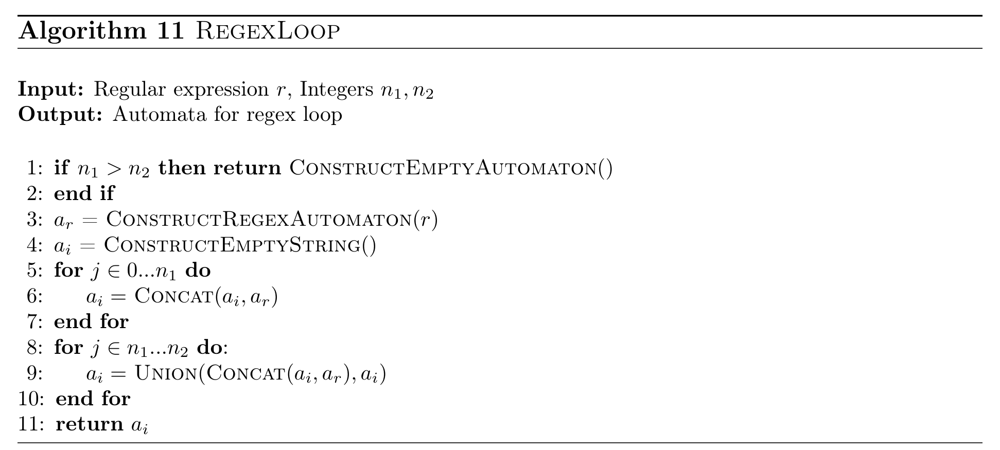

**Algorithm 11**

result is the empty set. Otherwise, an automata is constructed by first concatenating the automaton ar for regular expression r n1 times (lines 3-7). Then, the final regular expression is constructed by iteratively concatenating and unioning the previous automata with ar (lines 8-10).

Repeated Concatenation Optimization Some constraints require concatenation of an automaton a specific number of times. One such example is when constructing the automaton for re.loop(r, n, n) which requires n automata concatenation operations. For large n this leads to a significant amount of time spent on automata concatenation. We use a strategy similar to exponentiation by squaring for decreasing the number of concatenations. Consider a common scenario where the re.loop constraint is used to express a regular expression in which a pattern is repeated many times. For example, re.loop(a|b, 64, 64) which corresponds to the set of all strings of length 64 where each character is either a or b. One can first construct the automaton for a|b then perform 63 automata concatenation operations. A more efficient construction is recursively com- puting smaller re.loop terms and concatenating them together:

re.loop(a|b, 64, 64) = re.loop(a|b, 32, 32) ◦re.loop(a|b, 32, 32)

This leads to a significant reduction in the number of automata concatenation operations required. In general:

re.loop(r, n, n) = (re.loop(r, ⌊n/2⌋, ⌊n/2⌋)) ◦(re.loop(r, ⌈n/2⌉, ⌈n/2⌉))

and given a concatenation operations that is repeated n times ABC2 constructs the resulting automaton using O(log n) concatenation operations rather than O(n) concatenation operations.

### Projected Model Counting

Given a formula F, the goal of ABC2 is to construct an automaton AF such that L(AF) = JFK. The number of solutions to the formula is the number of accepting paths in the automaton. ABC2 uses multi-track automata which accept tuples of strings where each track corresponds to the values for a single variable. To count the number of solutions for all variables within the formula, ABC2 counts the number of accepting tuples of strings accepted by the multi-track automata. This is called tuple counting. Each element of the tuple corresponds to an accepting string for a particular variable. For example, consider the formula

X ∈(a|b)∗∧Y = cd∗

One solution to the formula is the tuple (X, Y) = ("aa","cd"). For length less than or equal to 2, the tuple count for this formula is 14. Model counting queries are often over a single variable, or a subset of variables within a formula. This can be different for than

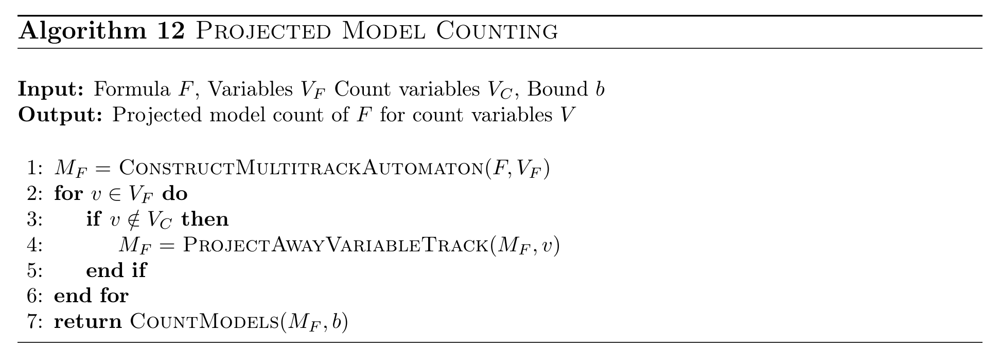

**Algorithm 12**

the tuple count for a formula: for length less than or equal to 2, the number of strings for the variable X is 7. This count is called the projected model count. This idea can be extended to counting a subset of the variables for a given formula. That is, if the formula contains variables (X, Y, Z, W, V) one may want to know the number of accepting tuples for variables (X, Z). We discuss how generalized projected model counting is done in ABC2. Algorithm 12 shows how ABC2 computes the projected model count for a formula F. Given formula F, variables in formula VF, set of count variables Vc, and length bound b, the algorithm returns the projected model count of formula F for count variables Vc ∈VF where each accepting string for variable v ∈VC is of length less than or equal to b. The algorithm works by first constructing the multi-track automaton MF for the given formula F and then iteratively projecting away the tracks corresponding to each variable v /∈VC.

### Regression Analysis

In this section we discuss how ABC2 finds regression equations that model how a given formula’s projected model count for some variable varies with respect to its bound. These can be reused to quickly estimate the counts for arbitrary bounds without the overhead of model counting. Regression analysis is a statistical process for estimating how one or more independent variables (in this case, the bound) affect a dependent variable (i.e. count for a variable). Regression analysis entails choosing the models to estimate, and applying optimization techniques to choose the parameter values that minimize the error [57]. We discuss how this is implemented in ABC2.

#### 5.3.1 Regression Parameters and Models

We define three parameters a, b, n ∈R and three models which use some subset of those parameters. When evaluated with parameter values β, each model yields a regression equation which is a function f: N →R that maps bounds to predicted variable counts. We apply a logarithmic (base 2) transformation to the variable count because of limitations of popular curve fitting libraries on input datapoints with large numbers, such as on constraints with Kleene operators. That is, the models are used to yield regression equations that predict the log of the variable count, not the raw count itself. The models we define are as follows:

Constant Equation 5.1 best models a variable whose count (in log scale or otherwise) does not vary with the bound.

log2 count ≈b (5.1)

For example, consider a variable s with a single constraint (s = “a”). For all bounds greater than 1, its count is constant at 1.

Equation 5.2 best models a variable whose log-count grows linearly with the Linear bound, or equivalently, whose raw count grows exponentially with the bound.

count ≈2a×bound+b =⇒log2 count ≈a × bound + b (5.2)

For example, consider a variable s with a single constraint given by match(s, (a|b)+). Its variable count is given by bound 2k ≈2bound+1 X k=0 and its log-count is estimated by bound + 1.

Equation 5.3 best models a variable whose log-count grows logarithmiLogarithmic cally with the bound, or equivalently, whose raw count grows polynomially with the bound.

count ≈β0 + β1 × bound + · · · + βn × boundn (5.3)

To generalize the model to any degree of polynomial and to avoid overfitting with many parameters, we approximate the polynomial in Equation 5.3 using a binomial expansion.

count ≈(a × bound + b)n (5.4)

As a corollary of the binomial theorem, not every polynomial can be represented like Equation 5.4; however, the loss in accuracy using this model is mitigated because only the highest degree terms (e.g. βn ∗boundn = an) dominate the growth in the variable count and also because we apply a log-transformation. Therefore, in log scale, Equation

5.4 is log2 count ≈n log2(a × bound + b)

Consider a variable s that has a single constraint match(s, a+). Its variable count is given by count = bound. Moreover, consider a variable t that has a single constraint match(t, a+b∗). For all bounds greater than 1, the variable count is bound X k = Θ(bound2) k=1

#### 5.3.2 Choosing the Best Regression Equation

We choose the best regression equation in two steps. First, for each model, we get a regression equation by finding the parameter values that minimize the least squares error. Second, among all models, we choose the regression equation with the lowest root mean square error (RMSE). We use the Python Scipy library in our approach. For the first step, we use Scipy’s LeastSquares function which implements the Levenberg-Marquardt algorithm for nonlinear least squares curve fitting [58]. Given some datapoints and an initial guess of the parameter values β0, the algorithm iteratively finds the ideal parameter values ˆβ that minimize the sum of the squares of the residuals [59]: n ˆβ = argmin X countsi −model(β, boundsi)2 β i=1 where

• β ∈Rk are the k parameters

• bounds1,..., boundsn are n input bounds

• counts1,..., countsn are n input counts

• model(β, boundsi) is the predicted variable count when the regression equation is evaluated at boundsi

For the second step, we use ˆβ to compute a root mean square error (RMSE) for each regression equation. The RMSE, which is commonly used in regression analysis, is defined as the standard deviation of the residuals. That is, for a given regression equation, sPn i=1 countsi −model(ˆβ, boundsi)2 RMSE = n We compare the RMSE for each regression equation from above, and output the regression equation with the lowest RMSE.

#### 5.3.3 Regression Analysis Workflow

The ABC2 regression analysis workflow is shown in Algorithm 13. It takes as input the SMT formula F, a variable s which is declared in F, and a range of bounds specified by lower and upper bounds klo, khi and step size ∆k. First, it calls ABC for each bound in the range, gathering a set of (bound, count) pairs to input to the curve fitting algorithm. Then, for each model in the implemented set of models, it initializes the parameter values β0, and it calls Scipy to get the parameter values ˆβ that minimize the least squares error. For each model, it calculates the root mean squared error (RMSE) by applying ˆβ to the model and stores the regression equation with the lowest RMSE. To demonstrate the workflow, consider a formula with a variable s that must match a regular expression for valid email addresses below:

We count s for bounds 4 through 10 (for bounds 1 through 3, there are no models). The RMSEs for the constant, logarithmic, and linear regression equations are 2.098,

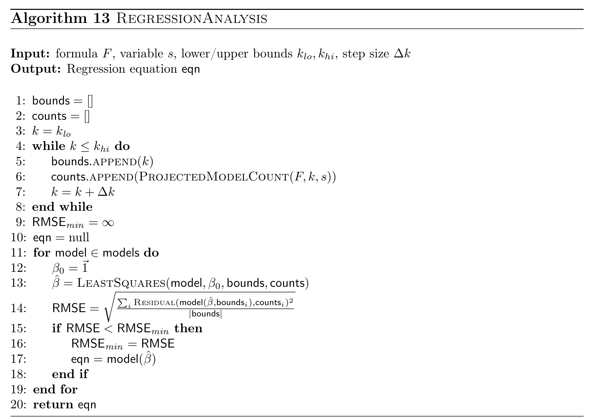

**Algorithm 13**

0.241, and 0.002, respectively. The linear regression shown below has the lowest RMSE:

log2 count ≈8.000607 × bound −8.240978

### Experiments

In this section, we discuss the empirical evaluation of ABC2. We evaluate the efficiency and correctness of ABC2 in the context of satisfiability checking and model counting. In order to evaluate ABC2, we aim to answer the following research questions: RQ1: How does ABC2 perform on satisfiability queries against the state-ofthe-art SMT solver Z3str3RE? RQ2: How does ABC2 perform on model counting queries against existing

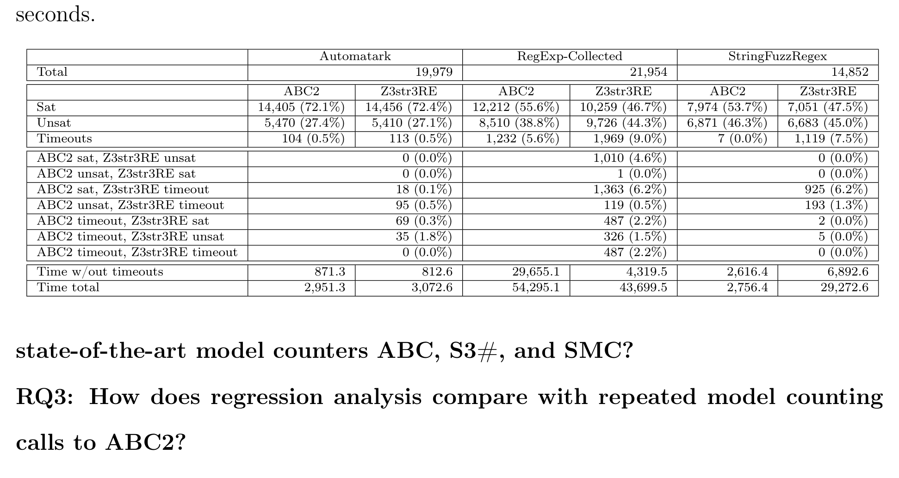

**Table 5.1:** Comparison with ABC2 and Z3str3RE on three benchmarks. Time is in seconds.

#### 5.4.1 Experimental Setup

We experimentally compared ABC2 with the state-of-the-art SMT solver Z3str3RE [60], and compared the precision and performance of ABC2 with ABC [23, 46], S3# [61], and SMC [24]. For our experiments, we use three suites of benchmarks containing approximately 55,000 constraints. The three benchmarks, Automatark, StringFuzz, and RegExp-Collected, have been widely used to compare the performance of SMT solvers; a detailed discussion of their contents can be found in [60]. We conduct five experiments: (1) a satisfiability comparison with ABC2 and the state-of-the-art Z3str3RE SMT solver, (2) a model counting comparison between ABC2 and ABC, (3) a model counting comparison between ABC2 and S3#, (4) a model counting comparison between ABC2 and SMC, and (5) a regression analysis experiment. For the satisfiability experiment, we show the number cases for which each tool reported a satisfiable or unsatisfiable result for each constraint, as well as the number of timeouts and total time. For the model counting comparison experiments, we report on the precision and timing results from each tool. A 20s timeout is used for all experiments. The experiments comparing ABC2, ABC, and Z3str3RE were run on a machine running Ubuntu 20.04 with Intel i5 3.5GHz X4 processors and 32GB of memory. Due to compatibility issues, the experiment for S3# was run on a virtual machine running Ubuntu 14.04 with 8GB of memory, on the same machine. The experiments comparing ABC2 with SMC was done on an Ubuntu 18.04 desktop machine with an Intel i7 3.6GHz processor, 128GB DDR4 RAM, with a Linux 4.4.0-210-generic 64-bit kernel.

The results comparing ABC2 and Z3str3RE are shown in Satisfiability Comparison

Table 5.1. For the Automatark benchmark, ABC2 performed comparably to Z3str3RE in both execution time and number of constraints solved. For the RegExp-Collected benchmark, ABC2 and Z3str3 solved a comparable number of constraints, but Z3str3RE was significantly faster for the majority of constraints, and ABC2 overapproximated and reported sat for 1010 constraints which Z3str3RE reported as unsat. There was 1 constraint in which ABC2 reported unsat and Z3str3RE reported sat. We manually determined that ABC2 was correct and Z3str3RE was unsound for that constraint. For the StringFuzzRegex benchmark, ABC2 significantly outperformed Z3str3RE in terms of both number of constraints solved and total execution time. These results show that ABC2 is comparable with the state-of-the-art constraint solver Z3str3RE for satisfiability queries on string constraints.
Model Counting Comparison with ABC2 and ABC We compare the model counting performance of ABC2 with ABC on the three benchmarks, for solution strings on a given query variable with length less than or equal to 50. For the majority of the

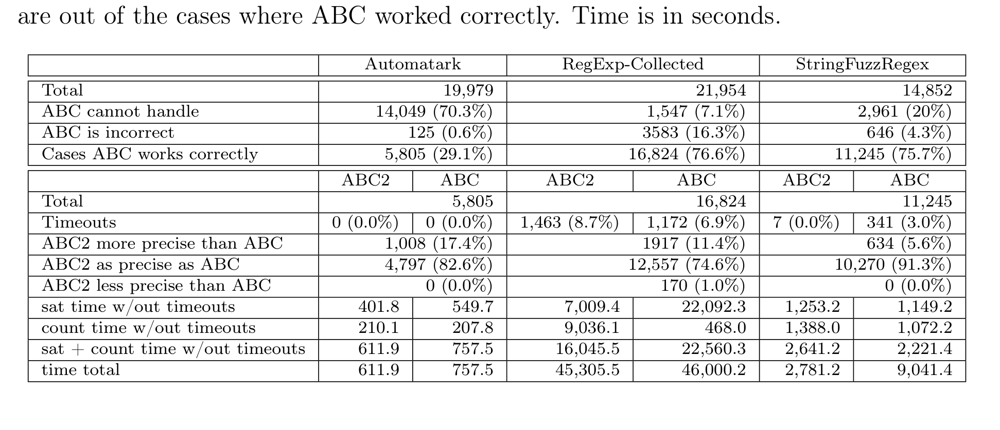

**Table 5.2:** ABC2 compared with ABC. The percentages for timeouts and precision results are out of the cases where ABC worked correctly. Time is in seconds.

Model Counting Comparison with ABC2 and S3# We compare the model counting precision and performance of ABC2 with S3# on the three benchmarks. S3# can only count the number of solutions for lengths equal to the given bound, not less than or equal to the given bound. We compare the upper bound of S3# with the upper bound reported by ABC2. The results of this comparison are in Table 5.3. S3# could not handle 19,979 (100%) of the constraints in the Automatark benchmark, 1,255 (5.7%) of the constraints in the RegExp-Collected benchmark, and 11,549 (77.6%) of the constraints in the StringFuzzRegex benchmark. Additionally, S3# reported unsound results for 51 constraints. Of the constraints which S3# could handle, ABC2 reported a more precise count in a 5208 (21.7%) of constraints, while S3% reported a more precise count for only 322 (1.3%) of constraints. The constraints where S3# reported a more precise bound were UNSAT and ABC2 reported SAT (a sound upper bound/approximation). For S3# to generate the count for strings less than or equal to 50, one would have to run the S3# tool 51 times, one for each bound k ∈[0, 50]. S3# took a total of 16,832.4 seconds, or 4.7 hours to model count the 23,951 constraints for strings of length equal to 50. If we ran S3# 51 times for all the constraints to generate the count for strings of length less than or equal to 50, it could take 51 × 16, 832.4 = 858, 452.4 seconds, or 238.5 hours. In contrast, for ABC2, computing the number of strings of length less than or equal to 50 takes the same amount of time to compute the number of strings of length equal to 50. This is a substantial difference in model counting time.

Figure 5.2 shows a summary of the comparison between ABC2 and S3#. S3# could not handle 57.7% of the constraints within the benchmarks, and when factoring in timeouts, only gave a more precise bound in 5.6% of constraints. ABC2 gave a more precise result in 8.8% of constraints and handled significantly more constraints than S3#.
Model Counting Comparison with ABC2 and SMC We compare the model counting precision and timing of ABC2 with the string model counter SMC. As shown in Table 5.4 the SMC algorithm can handle roughly 50% of the constraints within the

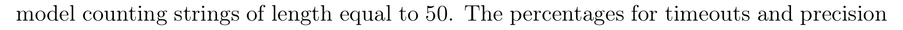

**Table 5.3:** ABC2 compared with S3#. The results for the three benchmarks are for model counting strings of length equal to 50. The percentages for timeouts and precision results are out of cases where S3# works correctly. Time is in seconds.

Automatark RegExp-Collected StringFuzzRegex Total 19,979 21,954 14,852 S3# cannot handle 19,979 (100%) 1,255 (5.7%) 11,549 (77.6%) S3# incorrect/unsound 0 (0.0%) 15 (0.1%) 36 (0.2%) S3# works correctly 0 (0.0%) 20,684 (94.2%) 3,267 (22.2%) ABC2 S3# ABC2 S3# ABC2 S3# Total 0 20,684 3,267 Timeouts N/A 2,981 (14.5%) 6 (0.03%) 0 (0.0%) 0 (0.0%) ABC2 more precise than S3# N/A 5,198 (25.1%) 10 (0.3%) ABC2 as precise as S3# N/A 12,181 (58.9%) 3,253 (99.6%) ABC2 less precise than S3# N/A 318 (1.5%) 4 (0.1%) time w/out timeouts N/A 13,559.6 13,435.3 718.7 3,287.1 time total N/A 73,179.6 13,545.3 718.7 3,287.1 benchmarks. This is because SMC cannot handle integer variables, extended regular expressions, and more complex functions such as toint and tostring, which are featured in many of the constraints. For the rest of the constraints, we were unable to run the SMC tool on them as the tool was not functioning for regular expressions (nearly every constraint within the benchmark contained at least one regular expression). We contacted the authors but they explained that the tool has not been updated since release and were not able to make any fixes. So, we instead compared ABC2 with SMC on a benchmark composed by the SMC authors called SMCKaluza. SMCKaluza is from the SMC authors and contains approximately 19,000 constraints which contained simplified versions of the constraints from the RegExp-Collected benchmark (used in our other experiments). The SMC authors simplified constraints to not contain integer variables or complex constraints their tool could not handle. We refer the reader to [24, 46] for more information on the benchmark. The SMCKaluza benchmark is split into two parts: SMCBig (large complex formulas) and SMCSmall (small simple formulas). The result of ABC2 and SMC on the SMCKaluza benchmark is shown in Table 5.5. ABC2 takes 1.2s and SMC takes 4.6s per constraint in SMCBig. ABC2 takes 0.01s and SMC takes 0.96s per constraint on SMCSmall. ABC2

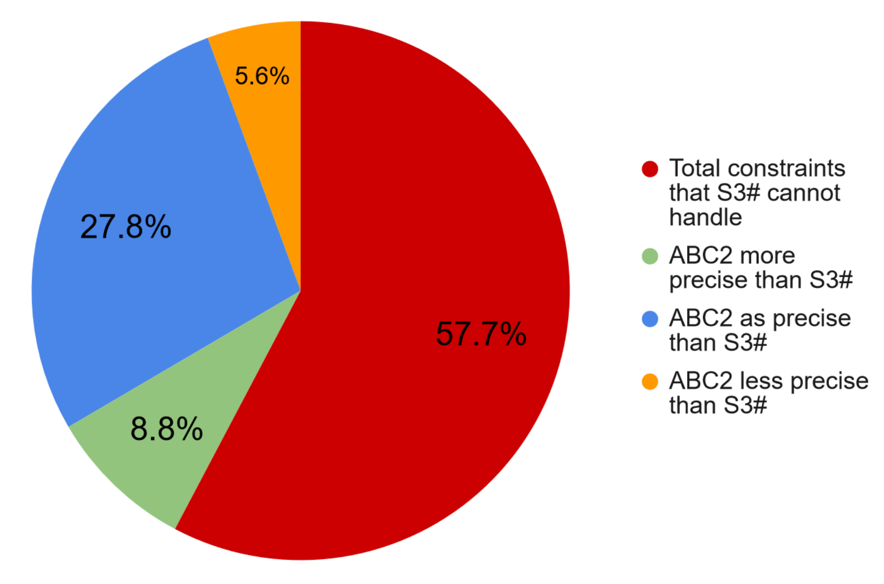

**Figure 5.2:** Summary of S3# comparison.

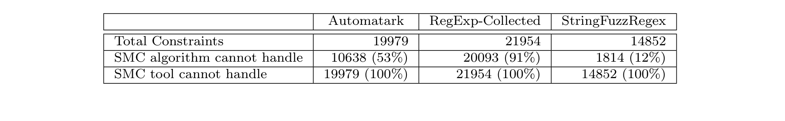

**Table 5.4:** Percentage of constraints which SMC can handle

Regression Analysis Efficiency and Accuracy We invoked ABC2’s regression analysis on a dataset of constraints for a single variable. We used odd bounds from 1 through 19 (inclusive) as inputs to the regression analysis. We then predicted the count at bounds 20, 30, 40, and 50, as well as called ABC2 to get the actual counts for those bounds for comparison. We measured the time taken to do the regression analysis using Algo-

**Table 5.5:** ABC2 compared with SMC

Figure 5.3. The red circles are the predicted counts from the regression, and the blue X’s are the actual counts from ABC2. The linear regression equation for instance291 fits the actual counts well, hence the low error of ≈0. The logarithmic regression equation for instance3483 does not fit as well (hence the error of 14.22%) because the chosen input bounds do not adequately represent the growth in the count; for bounds ≤7, the count is 0 and for bounds ≥17, the count becomes constant at approximately 4.28×109 or 31.994 in log scale.

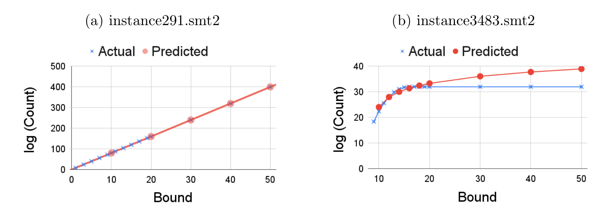

**Figure 5.3:** Regression equation plots for sample constraints. We used bounds < 20 to find the regression equation (shown by the red line) and bounds ≥20 to validate its accuracy.

(a) instance291.smt2 (b) instance3483.smt2

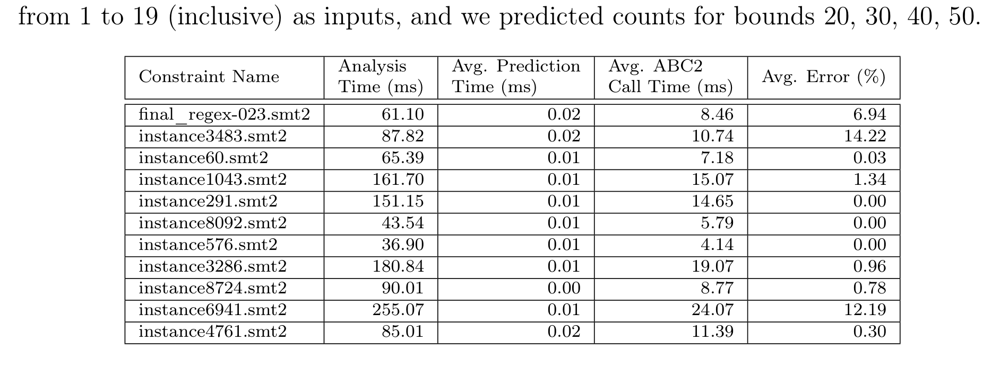

**Table 5.6:** Regression analysis results on a dataset of constraints. We used odd bounds from 1 to 19 (inclusive) as inputs, and we predicted counts for bounds 20, 30, 40, 50.

### Chapter Summary

In this chapter we presented the Automata-Based Model Counter 2 (ABC2). ABC2 supports model counting string and numeric constraints and their combinations. ABC2 has been applied to several quantitative program analysis problems such as probabilistic symbolic execution, quantitative information flow analysis and adaptive attack synthesis. We introduced novel algorithms and techniques for more precise handling of relational string constraints, and implemented them in ABC2. ABC2 can also find regression equations which model a given formula’s projected model count which can be reused for quickly estimating counts for arbitrary bounds. Our experimental evaluation showed that ABC2 is as efficient as the state-of-the-art Z3str3RE solver for satisfiability queries over string constraints, and that ABC2 is the most precise and efficient model counting constraint solver for strings. We also showed that ABC2 can handle a richer set of constraints than current state-of-the-art model counters over string constraints.

## Quantifying Permissiveness of Access Control Policies

#### Control Policies

In this chapter we present a framework to quantify permissiveness of access control policies using model counting constraint solvers. Our research contributions include: 1) A formal model for access control policies. 2) A formalization of access control policy permissiveness. 3) An automated approach for quantifying permissiveness of access control policies by translating a policy to a SMT formula and using a model counting constraint solver to quantify its permissiveness. 4) An extension of the formal model and automated approach to quantify relative permissiveness between policies. 5) A heuristic that transforms formulas extracted from policies for improving model counting performance. 6) An open-source tool, quacky, that implements the automated approach to analyze policies written in AWS Identity and Access Management (IAM) and Azure policy languages. 6) A publicly available policy dataset consisting of dozens of real-world policies from AWS forums and Azure documentation, as well as hundreds of policies synthesized by applying mutation techniques to the real-world policies.

### Policy Model

In this section, we introduce our policy model which forms the basis of our framework. Our model is designed to be expressive enough to model complex policy specifications that can be efficiently and precisely analyzed by modern verification and validation techniques. We use an approach similar to [11] in defining our policy model. An access control policy specifies who can do what under which conditions. We define an access control model in which declarative policies field access requests from a dynamic environment, and all requests are initially denied. An access request is a tuple (δ, a, r, e) ∈∆× A × R × E where ∆is the set of all possible principals making a request, R is the set of all possible resources which access is allowed or denied, A is the set of all possible actions, and E is the environment attributes involved in an access request. An access control policy P = {ρ0, ρ1,...ρn} consists of a set of rules ρi where each rule is defined as a partial function ρ: ∆× A × R × E,→{Allow, Deny}. The set of principals specified by a rule ρ is ρ(δ) = {δ ∈∆: ∃a, r, e: (δ, a, r, e) ∈ρ} (6.1)

ρ(a) for a ∈A, ρ(r) for r ∈R, ρ(e) for e ∈E are similarly defined. Given a policy P = {ρ0, ρ1,...ρn}, a request (δ, a, r, e) is granted access if

∃ρi ∈P: ρi(δ, a, r, e) = Allow ∧∄ρj ∈P: ρj(δ, a, r, e) = Deny

The policy grants access if the request is allowed by a rule in the policy and is not revoked by any other rule in the policy. Explicit denies overrule explicit allows (if a request is allowed by one rule and denied by another rule, the request is ultimately denied). The set of allow rules and deny rules for P are defined as:

PAllow = {ρi ∈P: (δi, ai, ri, ei) ∈ρi ∧ρi(δi, ai, ri, ei) = Allow} (6.2) PDeny = {ρj ∈P: (δj, aj, rj, ej) ∈ρj ∧ρj(δj, aj, rj, ej) = Deny} (6.3)

Given a policy P, the requests allowed by the policy are those in which a policy rule grants the access through an Allow effect and is not revoked by any policy rule with a Deny effect:

Allow(P) = {(δ, a, r, e) ∈∆× A × R × E: ∃ρi ∈P: (δ, a, r, e) ∈ρi ∧ρi(δ, a, r, e) = Allow (6.4) ∧∄ρj ∈P: (δ, a, r, e) ∈ρj ∧ρj(δ, a, r, e) = Deny}

The set of principals, resources, or actions allowed by a policy is

Allow(P, ∆) = {δ ∈∆: (δ, a, r, e) ∈Allow(P)} (6.5) Allow(P, A) = {a ∈A: (δ, a, r, e) ∈Allow(P)} (6.6) Allow(P, R) = {r ∈R: (δ, a, r, e) ∈Allow(P)} (6.7)

### Permissiveness Analysis

In this section we discuss how the permissiveness of our policy model is analyzed. Given a policy, the goal is to determine what requests are allowed by the policy, and if the policy is more or less permissive than another policy. This is done by reducing policies to logic formulas, similar to the approach used in [62, 11].

#### 6.2.1 SMT Encoding of a Policy

The permissiveness of a policy is determined by the number of requests that it allows: the more requests allowed by a policy, the higher its permissiveness. The policy allowing all possible requests is the most permissive policy, and the policy which denies all requests is the least permissive policy. It follows that, given a policy, reasoning over all possible requests allowed by the policy determines the permissiveness of the policy. We encode the set of possible requests by introducing variables {δsmt ∈∆, rsmt ∈ R, asmt ∈A, esmt ∈E} in the generated SMT formula.

    JPK = _ ^ _ JρK ¬ JρK (6.8) ρ∈PAllow ρ∈PDeny  _  ^  _  ^ JρK = δsmt = δ asmt = a (6.9) δ∈ρ(δ) a∈ρ(a)  _  ^  _  rsmt = r esmt = e r∈ρ(r) e∈ρ(e)

The SMT encoding of a policy P is given by JPK and represents the set of requests allowed by P. Policy rules are encoded as values for sets of (δ, a, r, e), where each value set potentially grants or revokes permissions. Satisfying solutions to JPK correspond to requests allowed by the policy, i.e.,

Allow(P) = {(δ, a, r, e): (δ, a, r, e) |= JPK} (6.10)

#### 6.2.2 Relative Permissiveness of Policies

For a single policy, equations 6.8, 6.9 provide a way to model the semantics of a policy in isolation. Below, we provide a policy analysis framework that, given two policies, determines the relative permissiveness between the two.

Intuitively, given two policies P1 and P2 we can determine whether one is more permissive than the other by analyzing formulas JP1K ⇒JP2K and JP2K ⇒JP1K. However, it is possible that both policies allow different sets of requests, or the set of requests overlap. In general, there are four possible outcomes:

1. Allow(P1) ⊂Allow(P2)

2. Allow(P1) ⊃Allow(P2)

3. Allow(P1) = Allow(P2)

4. P1 and P2 do not subsume each other

The relative permissiveness of P1 and P2 directly follows from each scenario: P1 is less permissive than P2, P1 is more permissive than P2, P1 and P2 are equally permissive, or P1 and P2 are incomparable. The calculation involves satisfiability checks of two formulas: JP1K̸ ⇒JP2K and JP2K̸ ⇒JP1K • If JP1K̸ ⇒JP2K is not satisfiable, then P1 cannot be more permissive than P2 (P2 is at least as permissive as P1).

• If JP2K̸ ⇒JP1K is not satisfiable, then P2 cannot be more permissive than P1 (P1 is at least as permissive as P2).

• If both JP1K̸ ⇒JP2K and JP2K̸ ⇒JP1K are not satisfiable, then P1 and P2 are equivalent.

• Otherwise, P1 and P2 do not subsume each other.

Note that the formula JP1K̸ ⇒JP2K can be simplified as

JP1K̸ ⇒JP2K = JP1K ∧¬JP2K (6.11)

which can be checked using an SMT solver.

### Quantifying Permissiveness

Translating an access control policy into an SMT formula for satisfiability checking allows some permissiveness analysis, but it does not give insight as to how permissive a policy is. In this section, we introduce a novel approach for more precise reasoning in determining the permissiveness of a single policy or the relative permissiveness of two policies. Given P, Allow(P) is the set of all requests allowed by P. Let |Allow(P)| denote the number of such requests. The permissiveness of P is given by

|Allow(P)| = |JPK| (6.12)

Where |JPK| denotes the number of models for formula JPK. Using a model counting constraint solver, we can automatically compute the value of |JPK|. Larger values for |JPK| indicate a more permissive policy; lower values indicate a less permissive policy. A metric for analyzing permissiveness of a policy is to consider the likelihood that a randomly generated request is allowed by the policy. Let D be the set of all possible requests, with |D| being the number of all possible requests. If |JPK| = 0 all requests are denied by P, if |JPK| = |D| all requests are allowed by P. Let σ = (δ, a, r, e) be a request chosen uniformly at random from the set all possible requests. The probability that σ is allowed by P is p(σ |= JPK) = |JPK| (6.13) |D| This effectively gives permissiveness of a policy with respect to its domain. Higher probabilities indicate more permissive policies, lower probabilities indicates less permissive policies. A probability of 0.5 indicates the policy allows half of all possible requests. Note that a probability of 0 indicates a policy which denies all requests while a probability of 1 indicates a policy allowing all requests. This approach can be extended for quantifying relative permissiveness between policies. Given policies P1, P2, the number of requests allowed by P1 and not allowed by P2 is: |JP1K̸ ⇒JP2K| = |{(δ, a, r, e): (δ, a, r, e) |= JP1K ∧¬JP2K}| (6.14)

The number of requests allowed by P2 and not allowed by P1 is:

|JP2K̸ ⇒JP1K| = |{(δ, a, r, e): (δ, a, r, e) |= JP2K ∧¬JP1K}| (6.15)

Recall that when calculating relative permissiveness there are four possible outcomes: P1 is equivalent to P2, P1 is more permissive than P2, P1 is less permissive than P2, or P1 and P2 are incomparable. Using equations 6.14, 6.15:

• If P1 is more permissive than P2 then |JP1K̸ ⇒JP2K| quantifies how much more permissive P1 is than P2

• If P2 is more permissive than P1 then |JP2K̸ ⇒JP1K| quantifies how much more permissive P2 is than P1

• If P1 and P2 do not subsume each other, |JP1K̸ ⇒JP2K| and |JP2K̸ ⇒JP1K| can be used to determine which policy is objectively more permissive (total requests allowed)

### Constraint Transformation

In this section we present a heuristic that transforms a set of equality and inequality constraints for a string variable to a set of range constraints on an ordered set. We do this by mapping a set of string constants to an ordered set of values. As we discuss below, this enables us to compactly encode constraints on policy actions extracted from access control policies. In practice, there are a finite number of valid actions in an access control policy. For example, s3:GetObject is a valid action, but the fictitious action s3:FooBar is not. For our analysis to be precise, constraints specifying valid actions must be specified. Recall that JPK is the constraint formula extracted from policy P. I.e., JPK ≡F where F is an SMT formula. In a formula F extracted from an access control policy, we observe three types of terms that involve actions asmt = c asmt̸ = c asmt ∈regex (6.16)

where c is a string constant and regex is a regular expression. We first consider cases where only the first two types of terms are present in a formula, and then discuss how the transformation handles regular expression constraints. Consider the formula:

F ≡(asmt = s3:ListBucket) ∨(asmt = s3:ListBucketVersions) (6.17) ∨(asmt = s3:ListBucketMultipartUploads)

By mapping s3:ListBucket 7→0, s3:ListBucketVersions 7→1,

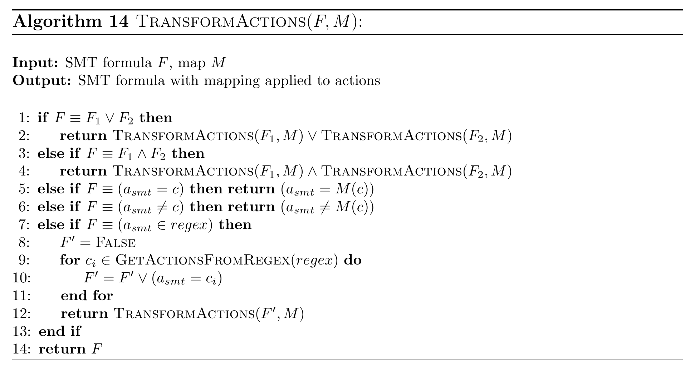

**Algorithm 14**

s3:ListBucketMultipartUploads 7→2, F can be rewritten as

F ≡(asmt ≥0 ∧asmt ≤2) (6.18)

The use of range constraints gives a more compact encoding for constraints on policy actions, particularly when there is a large number of constraints on policy actions (such as the constraints specifying the set of all valid actions). We introduce a constraint transformation which transforms the constraints on valid actions into a much smaller set of range constraints. Let V (a) be the set of all valid actions. The key insight is that the set V (a) can be mapped to a totally ordered set V ′(a) which can be compactly represented using a combination of equality and inequality constraints. The mapping and V ′(a) are straightforward to construct: each valid action a ∈V (a) is mapped to a unique integer i ∈[0, |V (a)| −1], and V ′(a) is the set of all such integers. The constraint transformation heuristic consists of two phases: the first applies the mapping to constraints on actions, the second transforms disjunction constraints into

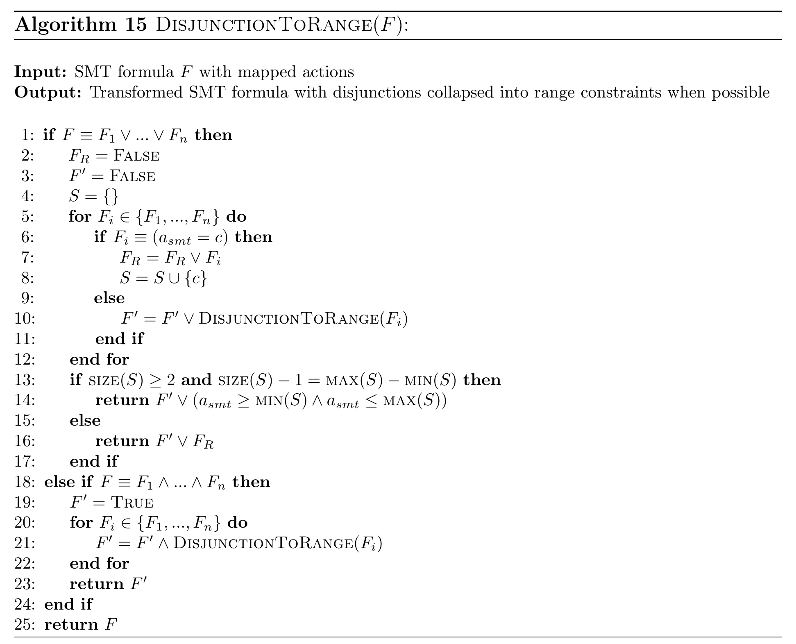

**Algorithm 15**

range constraints. Given a constraint formula in negation normal form and the action mapping, Algorithm 14 first transforms constraints containing action variable asmt so it is consistent with the mapping. For constraints asmt = c or asmt̸ = c where c is some string constant, c is replaced by the integer according to the mapping. For regular expression constraints on action asmt ∈regex, the function GetActionsFromRegex(regex) returns all valid actions satisfied by the regex (the number of valid actions is finite) and a disjunction on all possibilities is returned: e.g., if the constraint is (asmt ∈ s3:ListB∗) (where ∗corresponds to a wildcard) then GetActionsFromRegex returns the only valid actions matching the regex, s3:ListBucket, s3:ListBucketVersions, s3:ListBucketMultipartUploads. After the action constraints have been mapped, Algorithm 15 attempts to transform equality constraints on actions under a single disjunction into range constraints (such as in equation 6.18). If the transformation is not possible (e.g., the constants are not contiguous) the input formula is returned.

### Analyzing AWS and Azure Policies

Based on our proposed notion of policy permissiveness and our approach for quantifying permissiveness, we have developed a differential policy analysis framework for permissiveness analysis of access control policies. Our framework is general enough to be applied to a variety of policies written in multiple policy languages. To demonstrate the effectiveness of our approach, we show that it can be applied to existing real world access control models: policies for AWS IAM and Microsoft Azure.

#### 6.5.1 Translation and Implementation

Scope and Translation of the AWS Policy Language The AWS policy language is enormous, with each service having its own rules on actions and resources. We consider three of the most popular AWS services: Elastic Compute Cloud (ec2), Identity and Access Management (iam), and Simple Storage Service (s3). We consider two levels of constraints for each service. First, actions are constrained to the set of actions defined by the service. s3:ListBucket or s3:PutObject are valid s3 actions but s3:FooBar is not. Second, actions and resource types are constrained by each other: certain actions can act only on certain resource types; e.g., action S3:ListBucket operates on resource arn:aws:s3:::bucket. Additionally, resource types are constrained by naming requirements; e.g., length of bucket names is between 3 and 63 characters An AWS policy is a list of statements, each statement allowing or denying access for a given set of principals, actions and resources. For each statement, we create a rule ρ capturing its semantics. Principals, actions, and resources within a statement map to ∆, A, R in ρ. Modeling conditions into environment attributes of E is more complex. Each condition key together with a condition operator specifies values for which access is allowed or denied. The environment attributes are thus a set of tuples specifying the condition key and their respective values, where the number of tuples depends on the condition operator. For wildcard or anychar (‘∗’,‘?’) symbols, we use regular expressions to capture the set of allowed strings. For example, resource = bucket∗translates to (match resource /bucket.*/) where ‘.’ corresponds to anychar, ’/’ denotes the start and end of a regular expression, ‘*’ represents Kleene star. We handle condition operators such as StringLike similarly.

Scope and Translation of the Azure Policy Language. Like AWS, each Azure service has its respective set of rules on actions and resources. We consider Azure VMs and Blob Storage, which are analogous to ec2 and s3. We consider the same two levels of constraints as we do for AWS. An Azure “policy” is given by a list of role definitions and a list of role assignments. We join them together on the roleDefId into rules ρ. For each ρ, we map principalId to ∆, (Actions ∪DataActions) \ (NotActions ∪NotDataActions) to A, and scope to R. The condition is parsed into a tree whose leaves specify condition keys and their respective values; these are the environment attributes. Like for AWS, we use regex for wildcards.

Translating Action and Resource Type Constraints Let T be the set of constraints representing action and resource type restrictions. Equation 6.12 now becomes

|JPK| = |JPK ∧T| (6.19)

For comparing multiple policies, equations 6.14, 6.15 become

|JP1K̸ ⇒JP2K| = |(JP1K̸ ⇒JP2K) ∧T| (6.20) |JP2K̸ ⇒JP1K| = |(JP2K̸ ⇒JP1K) ∧T| (6.21)

We implement translation for T for AWS by scraping the AWS resource and property types reference webpages to identify the resource types each action can operate on. For Azure, we generate constraints by reading a CSV file from the Azure Portal that relates actions to resource types. Note that prior work [11, 63] does not consider type constraints in their analysis of access control policies.

Policy Translator. Based on our approach, we implemented an open-source tool called quacky that quantifies permissiveness or relative permissiveness by translating policies into SMT formulas and passing the formulas to a model counting constraint solver. Our implementation uses the popular Automata-based Model Counter (ABC) [23, 46] which uses automata-theoretic to model count string and numeric constraints. ABC counts satisfying solutions to the formula by constructing automata for an SMT formula and performing path counting on the automata. SMT formulas from quacky can also be fed into other SMT-LIB-conformant constraint solvers, such as Microsoft Z3. quacky translates a policy P into a SMT formula JPK by translating each rule ρ, as shown in Algorithm 16. To quantify the permissiveness of a policy P, quacky translates P, appends the type constraints T, and calls ABC to count the solutions satisfying JPK∧T, as shown in Algorithm 17. To analyze the relative permissiveness between two policies P1 and P2, quacky produces two SMT formulas JP1K̸ ⇒JP2K and JP2K̸ ⇒JP1K and calls ABC to check their satisfiability and to count models, as shown in Algorithm 18.

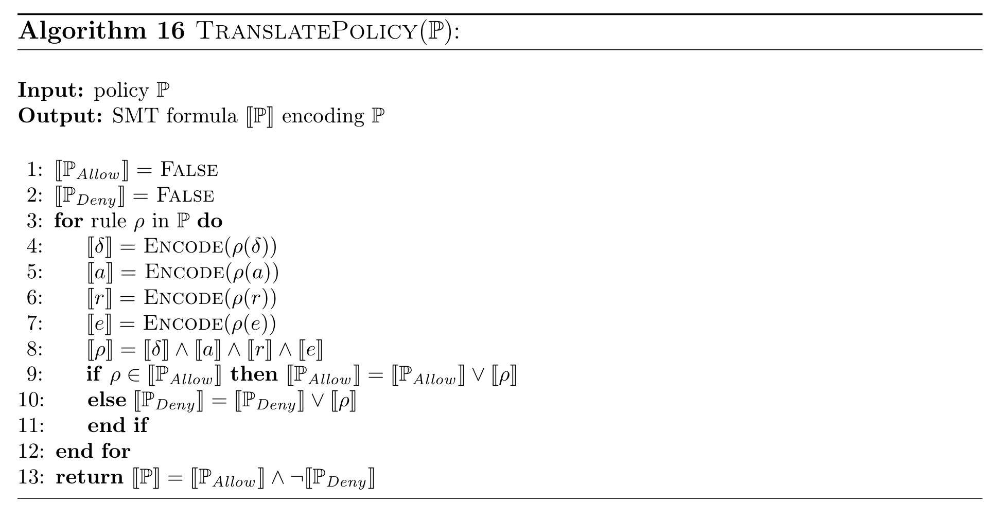

**Algorithm 16**

### Experimental Evaluation

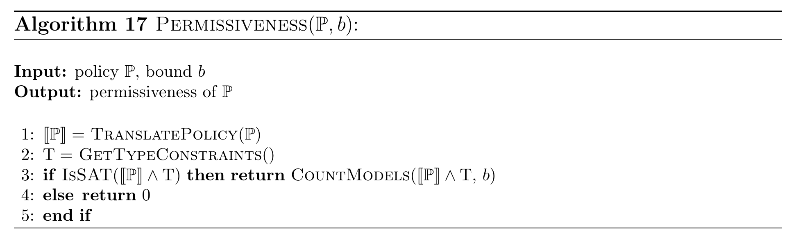

**Algorithm 17**

Below, we first describe our methodology for gathering policies; then we discuss the four experiments we conducted to evaluate our approach and its implementation in quacky 1. The first experiment benchmarks quacky, and it evaluates quacky’s performance and identifies which factors influence the analysis. The second experiment evaluates how effective quacky is at reasoning about the relative permissiveness of access control policies. The third experiment compares the performance of quacky with an enumerative model counting approach based on SMT solvers. The fourth experiment 1Tool and benchmarks available at https://github.com/vlab-cs-ucsb/quacky

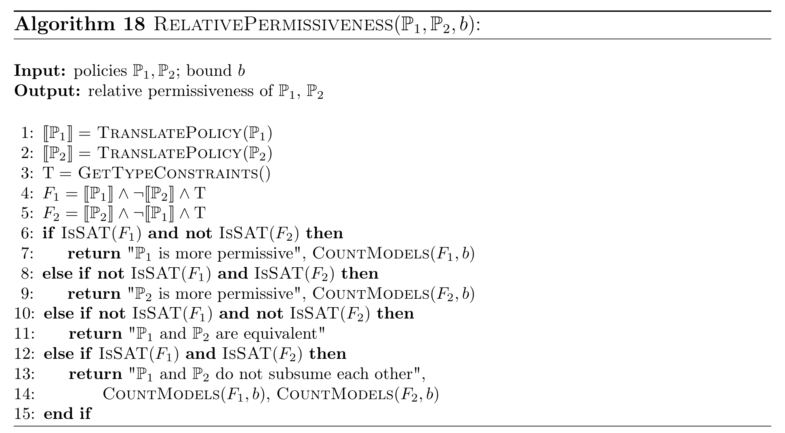

**Algorithm 18**

demonstrates that our approach can be applied to Azure policies. Unless otherwise noted, all experiments use the constraint transformation heuristic, and include type constraints. In the experiments reported below we assume string variables (principal, action, resource, condition keys) contain any of the 256 ASCII characters and at most 100 characters long, unless otherwise specified. We report permissiveness as number of requests allowed (a request is a tuple (δ, a, r, e)). Results are reported in log-scale. For all experiments, we use a desktop machine with an Intel i5 3.5GHz X4 processor, 128GB DDR3 RAM, with a Linux 4.4.0-198 64-bit kernel, Z3 v4.8.11, and the latest build of ABC 2.

#### 6.6.1 Policy Datasets

Due to security implications of making access control policies that are used in an organization public, policies that are both publicly available and representative of realworld policies are practically non-existent. We are unaware of any such dataset for neither 2https://github.com/vlab-cs-ucsb/ABC

AWS (those in [64, 11] were not released to the public) nor Azure policies. To evaluate our approach, a comprehensive dataset is required. We use two AWS policy datasets collected from users and argue these datasets are representative of real-world policies and comprehensive enough to show that our approach is effective. We also compile a dataset of Azure role definitions from Microsoft Docs.

Obtaining AWS Policies from Users. The lack of publicly available policy datasets for AWS means that finding quality policies is a cumbersome task. AWS users tend not to share policies possibly containing sensitive data (policies can leak organization structure). However, we found this to not be the case when users needed assistance designing and debugging their policies. AWS policies can be complex and unwieldy, especially to those unfamiliar with access control. Consequently, AWS provides forums where users needing assistance often post their policies and other users (and AWS employees) can provide assistance. Such policies are usually sanitized and vary in complexity, making the AWS forums a good source for compiling a dataset.

AWS Policy Selection Criteria and Breakdown. As of 2021, AWS offers more than 200 services, many of which use access control policies and all of which have dedicated forums. We searched for policies based on several criteria. We focused on iam, s3, and ec2 as they are among the most popular services and are more likely to yield the best sample of policies. Our goal was to have a good balance of simple and complex policies as well as policy sets, and we only included policies that are semantically valid. Out of several hundred forum posts dating back several years, we identified 30 posts containing a total of 41 well-formed policies (the vast majority of posts either contained no policies or fragmented/invalid policies): from ec2 9 posts with single policies and 2 posts with multiple policies (4 policies), from iam 2 posts with single policies and 3 posts with multiple policies (6 policies), from s3 9 posts with single policies and 5 posts with multiple policies (11 policies). From our observations, we found that when users sought assistance via the forums, they often only posted a single policy in isolation. Only 10 posts contained either multiple versions of the same policy or multiple policies combined together in a policy set (multiple AWS policies can be combined into a single policy).

Synthesizing AWS Policies Through Mutations. We synthesize AWS policies through mutations for two reasons. First, we want a larger dataset on which to evaluate our policy analysis framework and tool. Second, we want to mimic realistic scenarios where the semantic meaning of a policy is slightly modified by an employee within some organization. Modifications to a policy can alter the permissiveness of a policy in ways indiscernible without intensive manual inspection. A simple modification could allow one more user access to a resource or it could allow one thousand more users access to a resource; in either case, the modified policy is more permissive but clearly differs in magnitude. Synthesizing policies through mutation is one approach for modeling such scenarios. We use ideas from mutation testing to synthesize policies [65, 66]. Mutation testing is a widely used software testing technique for measuring test suite strength. The technique applies mutations to a program under test to generate variations of the program, and evaluates them against a test suite. A faulty program, or mutant, is killed if at least one test in the suite fails. The more mutants killed, the higher the confidence in the test suite. We synthesize mutants of a policy with mutations intended to alter the permissiveness of a policy, which we use to evaluate the effectiveness of our approach. We implement three types of mutations which mimic realistic scenarios and generally yield more permissive mutants:

1. If a statement’s Effect is Deny, change it to Allow and negate the statement’s Action and Resource keys to NotAction and NotResource or vice versa.

2. If a statement’s Action or Resource values are lists, change them to a single string containing a wildcard. For example, an Action list containing s3:ListBucket and s3:GetObject is changed to a single string s3:*.

3. If a statement contains any Conditions, remove them.

For each statement of a given policy, we create a set of applicable mutation types. For example, consider a statement with an Allow effect, a list of Action values, and a Condition. The set of applicable mutations is {type 2, type 3} because the type 1 mutation does not apply to the Allow effect. The power set of applicable mutation types represents combinations of mutations that can be applied to that statement. Thus, we create such a powerset for each statement. By choosing one set from each powerset and applying the mutation types in that set to its respective statement, we output a mutated policy. From 9 original ec2 policies, we generated 240 mutants. From 6 original iam policies, we generated 26 mutants. From 14 original s3 policies, we generated 280 mutants. In total, from 29 original policies, we generated 546 mutants.

Obtaining Azure Policies from Microsoft Docs As of 2021, Azure comprises more than 200 services and 120 built-in roles. We are unaware of any forums where users post custom role definitions, so we searched Microsoft Docs for built-in role definitions. We focused on Azure VMs and Blob Storage because they are analogous to ec2 and s3. We obtained 2 policies from VMs and 3 from Blob Storage for our proof of concept.

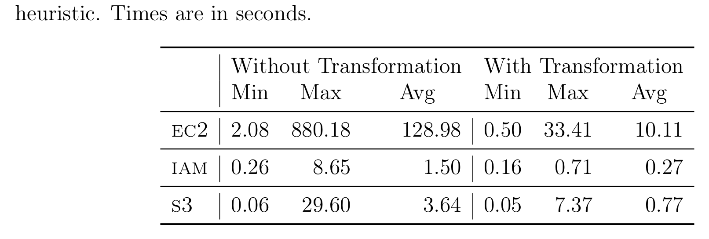

**Table 6.1:** Times for each AWS service, with and without the constraint transformation heuristic. Times are in seconds.

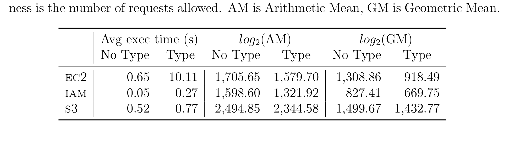

**Table 6.2:** Results for each AWS service, with and without type constraints. Permissiveness is the number of requests allowed. AM is Arithmetic Mean, GM is Geometric Mean.

The goal of these experiments is to evaluate quacky’s performance and identify which factors influence the effect of the analysis (in terms of counts and time taken). We evaluate the performance and effectiveness of quacky on 41 policies taken from AWS forums. First we evaluate the effectiveness of the constraint transformation heuristic from Section 5 by analyzing each policy, with type constraints, twice, both without the heuristic and with the heuristic enabled. Then, we analyze each policy twice, once without type constraints and once with type constraints.

Effectiveness of Constraint Transformation The results, separated by AWS service, are shown in Table 6.1. The decrease in minimum times with the constraint transformation heuristic was between 16% for s3 to 76% for ec2. The maximum times decreased between 75% for s3 to 96% for ec2. The results for average times were similar, with a decrease of between 78% for s3 to 92% for ec2. The heuristic reduced the minimum, maximum, and average times by about an order of magnitude for ec2, but not as much for iam and s3. This may be because ec2 has more actions (311 as of writing) than both iam (183) and s3 (223), and thus it may reap more benefits from range constraints as opposed to equality constraints.

Impact of Type Constraints The results for each AWS service are shown in Table 6.2. Out of the 41 policies, 1 policy allowed no request both with and without type constraints; 1 policy allowed requests without type constraints but allowed none when type constraints were present. Without type constraints, quacky analyzed each policy in under a second. Type constraints slow the analysis considerably but drastically effect permissiveness, decreasing the number of allowed requests by hundreds of orders of magnitude. This is due to type constraints restricting the set of possible actions and constraining actions to only act on specific resource types. Type constraints represent all possible action and resource type restrictions and must be explicitly enumerated within the constraint, slowing down the analysis. For every policy, the presence of type constraints resulted in a more precise analysis. Without type constraints to model the semantics of the policy language, quacky gives an overapproximation of the permissiveness for a policy.

#### 6.6.3 Relative Permissiveness Quantification

The goal of this experiment is to evaluate how effective quacky is at reasoning about the relative permissiveness of access control policies, and to showcase the effectiveness of quantifying relative permissiveness in general. We evaluate the effectiveness of quacky in quantifying relative permissiveness between a policy and its synthesized mutants. We record the average times and differences in permissiveness between the mutants and the

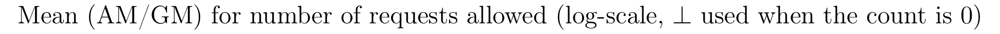

**Table 6.3:** Results for AWS policies compared with their mutants. Arithmetic/Geometric Mean (AM/GM) for number of requests allowed (log-scale, ⊥used when the count is 0) are reported when the mutant is less or more permissive than its original policy.

#Pm Less #Pm More Pm Less permissive Pm More permissive Avg exec # Neither Policy # Equivalent time (s) permissive permissive subsumes log2(AM) log2(GM) log2(AM) log2(GM) [ec2] P1 30.23 0 (0%) 60 (93.8%) 4 (6.3%) 0 (0%) ⊥ ⊥ 1823.2 1614.7 [ec2] P2 85.18 0 (0%) 28 (87.5%) 4 (12.5%) 0 (0%) ⊥ ⊥ 1361.5 1162.8 [ec2] P3 57.79 0 (0%) 6 (75%) 2 (25%) 0 (0%) ⊥ ⊥ 1331.8 993.2 [ec2] P4 71.64 0 (0%) 12 (75%) 4 (25%) 0 (0%) ⊥ ⊥ 461.8 431.6 [ec2] P5 24.48 0 (0%) 12 (37.5%) 4 (12.5%) 16 (50%) ⊥ ⊥ 1197.7 788.9 [ec2] P6 45.68 4 (25%) 8 (50%) 0 (0%) 4 (25%) 461.4 292.7 123.1 123.1 [ec2] P7 47.29 0 (0%) 28 (87.5%) 4 (12.5%) 0 (0%) ⊥ ⊥ 1361.5 1008.3 [ec2] P8 170.28 8 (25%) 0 (0%) 24 (75%) 0 (0%) 154.1 154.1 ⊥ ⊥ [ec2] P9 3.11 0 (0%) 0 (0%) 8 (100%) 0 (0%) ⊥ ⊥ ⊥ ⊥ [iam] P10 1.38 0 (0%) 2 (50%) 2 (50%) 0 (0%) ⊥ ⊥ 486.7 486.7 [iam] P11 4.71 0 (0%) 6 (75%) 2 (25%) 0 (0%) ⊥ ⊥ 1385.0 1288.9 [iam] P12 1.05 0 (0%) 2 (50%) 2 (50%) 0 (0%) ⊥ ⊥ 486.6 486.6 [iam] P13 6.13 0 (0%) 0 (0%) 2 (100%) 0 (0%) ⊥ ⊥ ⊥ ⊥ [iam] P14 0.92 0 (0%) 2 (50%) 2 (50%) 0 (0%) ⊥ ⊥ 5.6 5.6 [iam] P15 3.60 0 (0%) 2 (50%) 2 (50%) 0 (0%) ⊥ ⊥ 2124.9 2124.9 [s3] P16 2.28 6 (37.5%) 4 (25%) 4 (25%) 2 (12.5%) 628.9 628.9 684.7 684.7 [s3] P17 1.37 0 (0%) 6 (75%) 2 (25%) 0 (0%) ⊥ ⊥ 2287.3 1953.9 [s3] P18 1.02 0 (0%) 6 (75%) 2 (25%) 0 (0%) ⊥ ⊥ 800.4 536.2 [s3] P19 10.22 2 (25%) 4 (50%) 2 (25%) 0 (0%) 1484.7 1484.7 1276.9 1276.9 [s3] P20 3.46 0 (0%) 0 (0%) 16 (100%) 0 (0%) ⊥ ⊥ ⊥ ⊥ [s3] P21 1.38 0 (0%) 12 (75%) 4 (25%) 0 (0%) ⊥ ⊥ 684.7 684.7 [s3] P22 10.56 16 (25%) 40 (62.5%) 8 (12.5%) 0 (0%) 2192.0 2192.0 2294.7 2268.8 [s3] P23 2.51 0 (0%) 8 (50%) 8 (50%) 0 (0%) ⊥ ⊥ 5.6 5.6 [s3] P24 2.83 0 (0%) 0 (0%) 4 (100%) 0 (0%) ⊥ ⊥ ⊥ ⊥ [s3] P25 2.06 0 (0%) 4 (50%) 4 (50%) 0 (0%) ⊥ ⊥ 2144.0 2144.0 [s3] P26 0.67 0 (0%) 10 (62.5%) 6 (37.5%) 0 (0%) ⊥ ⊥ 1479.1 1435.1 [s3] P27 5.06 6 (18.8%) 20 (62.5%) 4 (12.5%) 2 (6.3%) 2056.0 2056.0 2378.8 2273.9 [s3] P28 2.57 0 (0%) 2 (50%) 2 (50%) 0 (0%) ⊥ ⊥ 684.7 684.7 [s3] P29 76.08 8 (12.5%) 24 (37.5%) 24 (37.5%) 8 (12.5%) 2076.9 2076.9 2268.9 2268.9 original policy. Each policy P is compared against every one of its mutants Pm twice: once to quantify the number of requests allowed by P but not Pm and once to quantify the number of requests allowed by Pm but not P. We used type constraints, constraint transformation, and a timeout of 10 minutes for each pair of comparisons. The results are shown in

Table 6.3. The third column shows the average time across all pairs of comparisons. Columns 3-6 of Table 6.3 show the distribution of permissiveness between each policy and its mutants. The majority of mutants were either less permissive, more permissive, or equivalent to the original policy. Columns 7-10 show the results of quantifying the difference in permissiveness whenever a policy and its mutant were not equivalent and did not subsume each other. For each policy and its set of mutants, columns 7 and 8 report the arithmetic and geometric means for the number of requests allowed by P but

**Figure 6.1:** Counts for the enumerative approach as percentage of the count from quacky on a simple policy over a 20 minute period, for bounds 18 (left) and 19 (right).

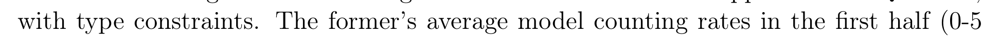

**Table 6.4:** Average model counting rates for the enumerative approach and quacky, with type constraints. The former’s average model counting rates in the first half (0-5 min.) and second half (5-10 min.) of the 10 minute timeout interval are reported.

Average models counted per second quacky Enum. (0-5 min.) Enum. (5-10 min.) ec2 10474.53 2.33 1.32 iam 10398.54 4.02 2.30 s3 10705.92 0.94 0.76 not by Pm. Conversely, columns 9 and 10 report the means for the number of requests allowed by Pm but not by P.

#### 6.6.4 Comparison with Enumerative Model Counting

SAT/SMT solvers have been used in prior access control policy analysis techniques to resolve queries about policy behavior (e.g., Zelkova, Margrave [67, 11, 68]). This often involves enumerating the set of solutions to the query, through repeated calls to a constraint solver. In each call, the constraints are revised by appending the negation of all prior solutions. Our approach differs fundamentally as we do not rely on enumerating solutions by repeatedly calling a constraint solver, but rather we use a model counting constraint solver (ABC) that can count all solutions in a single call. In these experiments we compare our approach to an enumerative approach using the

Z3 SMT constraint solver [69, 70]. First, we analyze a simple policy allowing 2 s3 actions on 2 resources: arn:aws:s3:::foo* and arn:aws:s3:::bar. We varied the string bound from 16 to 21 to let the wildcard match 0 to 5 characters (resp.), and we set a 20 minute timeout. For bounds 16 and 17, both approaches finished counting 4 and 516 models in 0.15 and 16.77 seconds (resp.) for the enumerative approach and in 0.03 and 0.03 seconds (resp.) for quacky. For bounds 18 to 21, the enumerative approach timed out after counting 3446, 3217, 3340, 3125 models (resp.), whereas quacky finished counting 1.3 × 105, 3.4 × 107, 8.6 × 109, 2.2 × 1012 models (resp.) within one second. The results for bounds 18 and 19 are shown in Fig. 6.1. We also analyze the 41 AWS policies using both approaches. The results are shown in Table 6.4. For each namespace, quacky yielded an astronomically greater average model counting rate than the enumerative approach. Moreover, the average rate of the enumerative approach decreased between the first and second halves of the 10 minute timeout interval. These results show that quantifying permissiveness using an enumerative approach for policy analysis (such as [68]) based on an off-the-shelf SMT or SAT solver is not a viable option for quantitative permissiveness analysis.

#### 6.6.5 Microsoft Azure Policies

The goal of this experiment is to demonstrate that our approach can be used to analyze Azure policies. Like we did for AWS, we evaluate the performance and effectiveness of quacky on the 5 policies taken from Microsoft Docs. We analyze each policy twice, once without type constraints and once with type constraints. Because many string variables in Azure policies are more than 100 characters long, we assume that they are at most 250 characters long. The results are shown in Table 6.5. Like previous experiments, there is a tradeoff

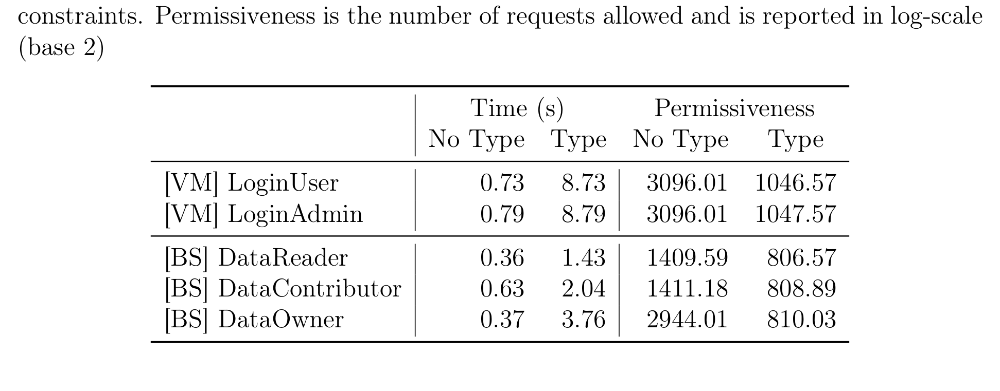

**Table 6.5:** Results for Azure VM and Blob Storage policies, with and without type constraints. Permissiveness is the number of requests allowed and is reported in log-scale (base 2)

### Chapter Summary

In this chapter we presented a new approach for modeling and quantifying permissiveness of access control policies. Our approach relies on model counting constraint solvers to assess the permissiveness of a given policy. We implemented this approach for AWS policies and experimentally evaluated its effectiveness on AWS policies we collected from discussion forums. Our results demonstrate that our quantitative permissiveness analysis approach is applicable in practice.

## Quacky: Quantitative Permissiveness Analyzer for Access Control Policies

#### Analyzer for Access Control Policies

In this chapter, we introduce the open-source tool quacky for quantitatively assessing quacky is based on the the permissiveness of access control policies in the cloud. technical approach presented in Section 6. We extend this approach into a full-fledged open source tool, add support for GCP policies, and build a web interface to improve quacky quantifies permissiveness of policies written in the AWS Identity usability. and Access Management (IAM), Azure, and GCP policy languages. Using quacky, we analyze 41 real-world AWS policies, 5 Azure policies, and 5 GCP policies, showcasing its ability to analyze real-world policies. The envisioned users of quacky include researchers, software engineers, cloud solutions architects, system administrators, and others who write or use access control policies in the cloud and want to ensure their policies do not allow unintended access to private data. The challenge we propose to address involves understanding the permissiveness of an access control policy.

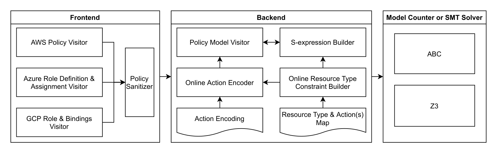

**Figure 7.1:** Architecture of Quacky (online)

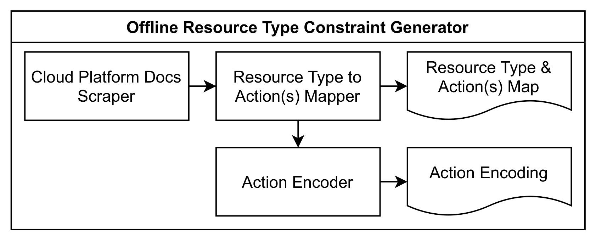

**Figure 7.2:** Architecture of Quacky (offline)

quacky

### quacky

Figure 7.1 shows the core framework of quacky. quacky takes in policies written in the AWS IAM, Microsoft Azure, or GCP policy languages into its frontend, which encodes policies into an intermediate policy model. The backend translates the policy model into one or more SMT formulas, depending on whether the analysis is on a single policy or on multiple policies. The solver component analyzes the SMT formulas through queries to a constraint solver or model counter and outputs the desired permissiveness result. The analysis is supplemented by an offline resource type constraint generator, shown in Figure 7.2, which prepares resource type constraints for the SMT formulas (discussed in more detail below).

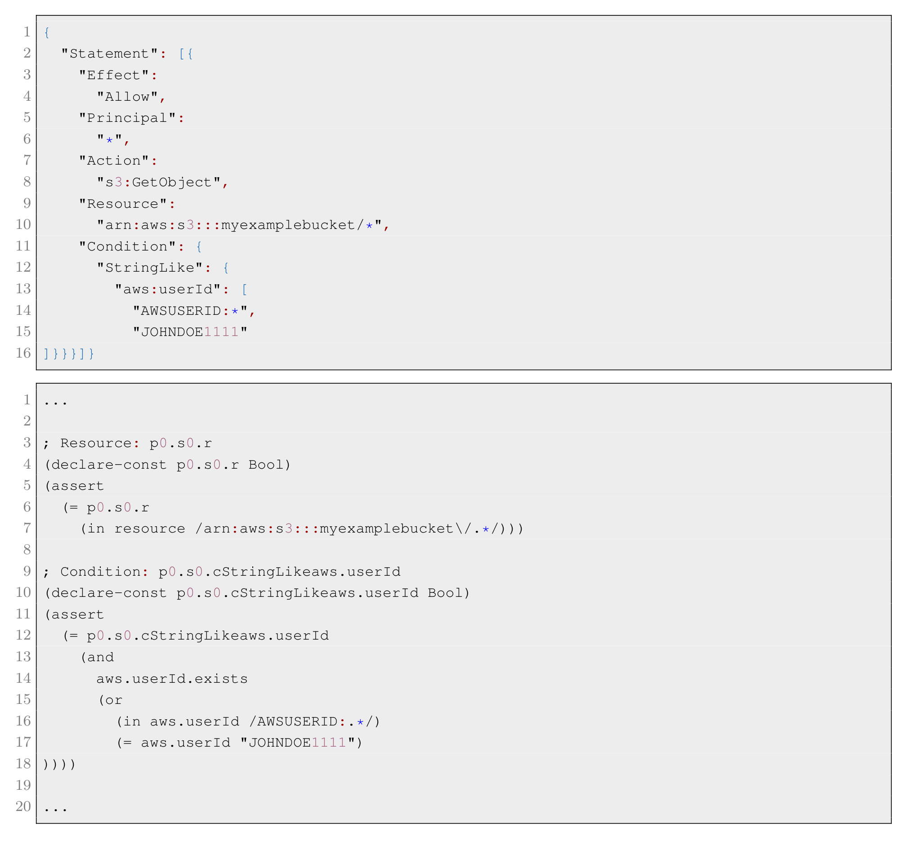

**Figure 7.3:** Sample policy (top) and a snippet from its SMT encoding (bottom)

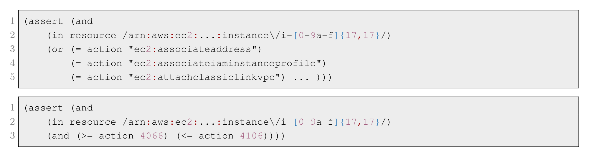

**Figure 7.4:** Snippet from the resource type constraint for EC2 instances without (top) and with (bottom) action encoding

quacky Frontend The frontend takes access control policies as input and outputs instances of our formal policy model, implemented as tree data structures. The input depends on the cloud provider. For AWS, the input is 1 or 2 policies, saved as serialized JSON. Figure 7.3(a) shows an example policy written in the AWS IAM policy language. The AWS Policy Visitor checks and makes sure the JSON files are well-formed. For Azure, the input is 1 or 2 pairs of role definitions and role assignments, which are also JSON. The Role Definition and Assignment Visitor opens the files and checks if they are well-formed. If a role definition and a role assignment both refer to the same RoleId, the visitor joins them on that role ID, producing an AWS-like policy. GCP’s input is similar to that of Azure, except its versions of role definitions and role assignments are called roles and role bindings, respectively. The Role and Bindings Visitor joins the role(s) with the role binding(s) on any common role name(s), producing an AWS-like policy. Visitors’ outputs are passed to the Policy Sanitizer, which rewrites keys and action values in lowercase and replaces scalar values with lists. Then, the frontend transforms each policy into a tree by doing a post-order, depth-first traversal of the JSON policy and constructing nodes at each key, such as Policy (root), Statement, Principal, etc.

quacky Backend The backend takes in 1 or 2 trees representing policies. Figure 7.2 shows the architecture of the background of quacky. It outputs SMT formulas that encode the semantics of each policy. The Policy Model Visitor builds the SMT formula incrementally. It visits each node in the tree in a post-order, depth-first traversal. For each node, it appends a set of constraints to the SMT formula. These constraints are built by the S-expression Builder, which takes in operands and an operator and returns a constraint conforming to the SMT-LIB standard. Figure 7.3 shows a policy and its SMT encoding. For a more precise analysis, the backend can add resource type constraints, which capture a cloud service provider’s valid resource types, actions, and pairings thereof, to the formula. The Online Resource Type Constraint Builder builds constraints on valid resource type and action pairs. A map of each resource type to the actions operating on it is pre-built offline (discussed below). The Constraint Builder takes a set of actions from an Action node, reads the map, identifies the relevant types, and builds constraints on those types and their actions. An example is shown in Figure 7.4. Note that this process is online; that is, the constraints are built during translation, based on actions in the policy. Irrelevant constraints are not built, reducing the size and complexity of the SMT formula. Adding resource type constraints may significantly slow down model counting. To mitigate it, the backend does action encoding. The Action Encoder replaces action names, which are strings, with a numeric encoding. The encoding is specified by a JSON map that is pre-built offline. Action encoding replaces constraints with disjunctions of action names with more compact constraints with ranges of numbers. An example is shown in

Figure 7.4.
quacky uses the Automata Based model Counter (ABC) [23, 46], Model Counter which can model count string and numeric constraints. ABC takes a SMT formula F as input, and it returns the number of models satisfying F, up to a bound k. It implements model counting by constructing automata for F and counting paths to accepting states of the automata. The SMT formulas produced by the quacky backend can be sent to other SMT-LIB-conformant constraint solvers. For example, Microsoft’s Z3 [69, 70] can be used to get a model (i.e. an allowed request).

Offline Resource Type Constraint Generator

Figure 7.2 shows the offline re-
source type constraint generator. In the backend, the Online Resource Type Constraint Generator and Action Encoder depend on pre-built maps, as we discussed earlier. These are pre-built offline to avoid repeating work every time quacky is run. The valid resource type and action pairings are specified in the cloud service provider’s documentation, which are scraped and processed into a JSON map. The Action Encoder assigns numbers to actions, where a set of actions for a given resource type is assigned to a contiguous set of numbers. This enables the online action encoder to build more compact range constraints.

#### 7.1.1 Support for GCP Policies

We handle policies written in GCP’s policy language by extending quacky’s frontend, backend, and offline resource type constraint generator (see Figures 7.1 and 7.2). In the frontend, we implemented the GCP Role and Bindings Visitor, which specifies how roles and role bindings are transformed into the formal policy model. In the backend, we added routines to translate GCP-specific conditions to SMT-LIB. In the offline resource type constraint generator, we wrote a new scraper to get the GCP resource type constraints from GCP’s online documentation, and we generated a new resource type and actions map and a new action encoding. quacky can support other policy languages by further extending the aforementioned components. Note that the formal policy model need not be extended as long as the

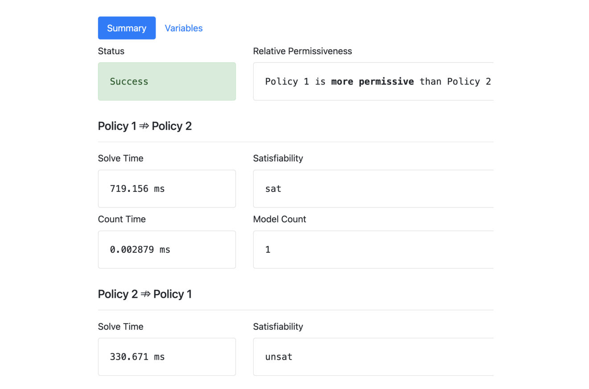

**Figure 7.5:** Results summary tab on the quacky web app

input(s) for that language can be transformed into the model.

#### 7.1.2 Usage

quacky1 has a command-line interface and a web-based interface2. quacky’s commandline arguments include the input file name(s), the output file name(s), the model counting bound, and the timeout. There are flags to use resource type constraints, action encoding, and the PCRE regular expression syntax (which ABC can parse). For AWS, the input files are AWS policies; for Azure, the input files are role definitions and role assignments; for GCP, the input files are roles and role bindings. For all, the input files are in JSON, and the output files (the SMT formulas) are in SMT-LIB. The quacky web app takes a subset of these arguments as input. The input form on the web app has textareas for policies, a number for bound, and checkboxes for the resource type constraints and action encoding flags. To reduce CPU, memory, and disk 1The tool’s source code, policy datasets, experimental results, and documentation are publicly available at https://github.com/vlab-cs-ucsb/quacky 2The web app’s source code and documentation are publicly available at https://github.com/vlabcs-ucsb/quacky-web-app

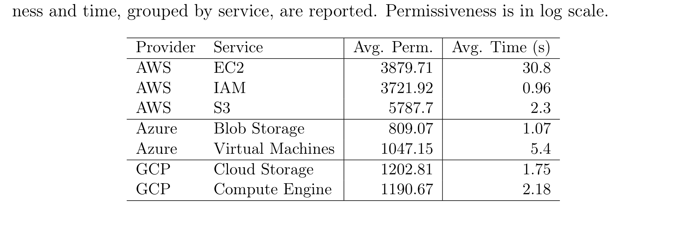

**Table 7.1:** Real AWS, Azure, and GCP policy analysis results. The average permissiveness and time, grouped by service, are reported. Permissiveness is in log scale.

### Evaluation

We evaluated quacky using a dataset of 41 real AWS policies from forums, 5 Azure policies from Microsoft Docs, and 5 GCP policies from GCP documentation. We selected well-formed policies that varied from simple to complex. For all experiments, we used a desktop machine with an Intel i5 3.5GHz X4 processor, 128GB DDR3 RAM, with a Linux 4.4.0-198 64-bit kernel, Z3 v4.8.11, and the latest build of ABC 3. To evaluate quacky’s performance, we quantified the permissiveness of our original AWS, Azure, and GCP policies. We used a model counting bound of 250. The average 3https://github.com/vlab-cs-ucsb/ABC

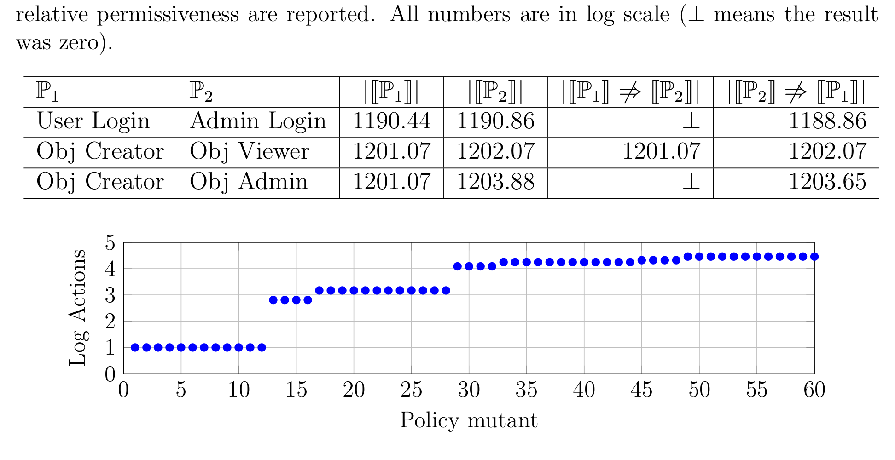

**Table 7.2:** GCP policy analysis results. Each policy’s permissiveness and each pair’s relative permissiveness are reported. All numbers are in log scale (⊥means the result was zero).

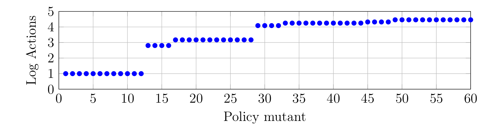

**Figure 7.6:** The number of actions allowed by each mutant that are not allowed by the original policy

permissiveness and analysis time, grouped by cloud service, are shown in Table 7.1. For most services, the average time was on the order of a few seconds. The exception was AWS Elastic Compute Cloud (EC2), which generally has the most complex real-world policies and resource type constraints.

Table 7.2 shows a closer look at quacky’s results for GCP’s Storage and Compute services. We can see that the OS admin login policy is more permissive than the OS user login policy, where the former allows 21188.86 distinct requests that the latter does not. Moreover, object admin is more permissive than object creator by 21203.65 distinct requests. Object viewer is incomparable to object creator, but individually, the former allows more requests than the latter. These results make sense intuitively; we expect admins to have absolutely more permissions than regular users, whereas we expect object creators and object viewers to each have permissions that the other does not, according to the GCP documentation.
To demonstrate the usefulness of quantitative permissiveness analysis, we mutated an original AWS policy to make 64 mutants. Figure 7.6 shows the number of actions 60 mutants allowed that the original policy denied (4 mutants are not shown because they were equivalent to the original). By quantifying relative permissiveness, we see that the mutants shown allow anywhere between 2 and 22 more actions than the original. Without quantitative analysis, all mutants shown would simply be classified as “more permissive" than the original, which is less insightful to policy authors.

### Chapter Summary

We presented the quacky tool for quantifying permissiveness of access control policies in the cloud. We showed that quacky can handle a variety of policies written in the most popular cloud policy languages. In the future, we aim to investigate how quacky can be used to quantify properties of access control policies other than permissiveness.

## Quantitative Policy Repair for Access Control on the Cloud

#### Control on the Cloud

In this chapter, we present a quantitative symbolic analysis approach for automated policy repair in order to reduce the permissiveness of access control policies. The repair approach is sound, i.e., it guarantees that the repaired policy meets the given permissiveness constraints. Our research contributions include: (1) A formalization of the access control policy repair problem; (2) A quantitative and symbolic policy repair algorithm for automatically reducing the permissiveness of a given access control policy; (3) Access control policy permissiveness localization and reduction techniques, including a regular expression generalization technique for characterizing the set of resources based on a given set of access control requests; and (4) An experimental evaluation of our quantitative policy repair approach.

### Motivation and Overview

In this section we give an overview of the access control policy repair problem and provide motivating examples. From a security perspective, access control policies should grant only the permissions required to perform a task. Overly permissive policies, which grant more permissions than necessary, can allow attackers unfettered access to secure data if the associated role or users are compromised. Thus, overly permissive policies should be modified, or repaired, to allow only those requests which are necessary.

#### 8.1.1 Policy Repair Problem

Access control policies grant permissions to users or services by allowing requests. The more permissions granted by a policy, the more requests it allows. The fewer permissions granted by a policy, the lower the number of requests it allows. In this sense, we can think of the number of permissions granted, or requests allowed, by the policy as defining the permissiveness of the policy. A natural question then is, given an overly permissive policy, is it possible to modify, or repair the policy so that it is no longer overly permissive? This gives rise to the Policy Repair Problem: Given an access control policy, ensure that it only allows the requests necessary to achieve its intended purpose. However, this is difficult to ensure as complex policy specifications are difficult to craft and the set of requests to be allowed or denied may not be explicitly defined or known. In this work, we introduce and formalize the following variation of the access control policy repair problem: Given a policy, a permissiveness bound, and a set of must-allow requests, check that the policy meets the permissiveness bound while allowing all the requests in the must-allow set, or repair it such that it meets the permissiveness bound and allows all the requests in the must-allow set. Note that permissiveness bound puts an upper bound on the desired level of permissiveness while the must-allow request set puts a lower bound on the desired level of permissiveness.

Permissiveness Bound. The permissiveness bound is a restriction on the permissiveness of the policy. That is, it is a restriction on the maximum number of requests allowed by the policy. If the permissiveness of the policy (number of requests allowed by the policy) is greater than the permissiveness bound, then we call this policy an overly permissive policy. Our approach aims to repair overly permissive policies by reducing the permissiveness of the policy so that the permissiveness of the policy is less than or equal to the permissiveness bound. While in this paper we assume that such a permissiveness bound is given a priori, we also discuss methods for automatically finding permissiveness bounds later in the paper.

Must-Allow Request Sets. The set of must-allow requests are requests which must be allowed by the policy. Without a must-allow request set, a policy that does not allow any requests would meet any permissiveness bound and would be a viable (but meaningless) solution to the policy repair problem. The must-allow request set is used to guide the algorithm towards a less permissive but still useful policy. In our approach, we assume that the set of must-allow requests is given as input to the policy repair algorithm. In our approach we assume that the policy developer has access to a set of must-allow requests. We assume that the policy developer has knowledge of, and access to, what kinds of requests should be definitely allowed by the policy. The concept of a must-allow request set is analogous to the concept of whitelists from the security domain which explicitly enumerate what should be allowed (e.g., a firewall only allowing requests from a certain domain). Typically, policy developers have access to such a whitelist, and we make the same assumption for the set of must-allow requests [71, 72, 73].

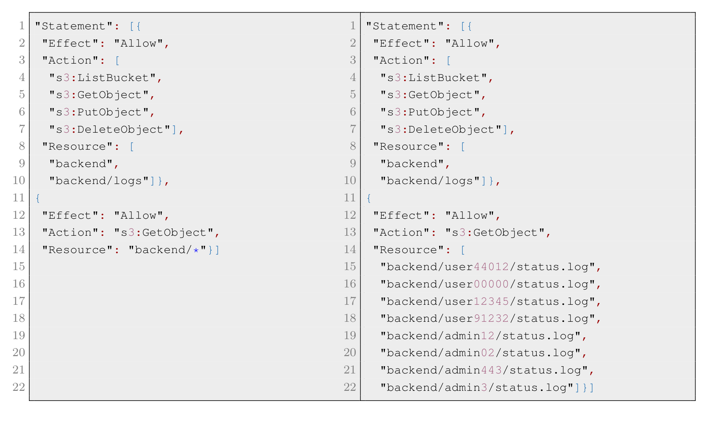

**Figure 8.1:** Original (left, (a)), first repaired policy (right, (b))

#### 8.1.2 Motivating Examples

The goal of the repair algorithm is to find a policy repair that satisfies both of the above constraints (permissiveness bound and must-allow requests). To illustrate the policy repair problem concretely, we discuss a couple of motivating examples below. Consider the role of an automated log consolidator in the Amazon Web Services (AWS) cloud, hereafter referred to as simply logger, which routinely gathers logs and consolidates them into a single log file for further analysis. The permissions granted to the logger role are given by the policy attached to the role. The initial policy attached to the logger role is given in Figure 8.1(a). This policy gives varied access to the "backend" AWS S3 bucket: The first statement allows the logger role to list objects within the bucket and gives read and write access to the “logs” object, while the second statement allows the logger role to read all objects within the “backend” bucket. Note that broad

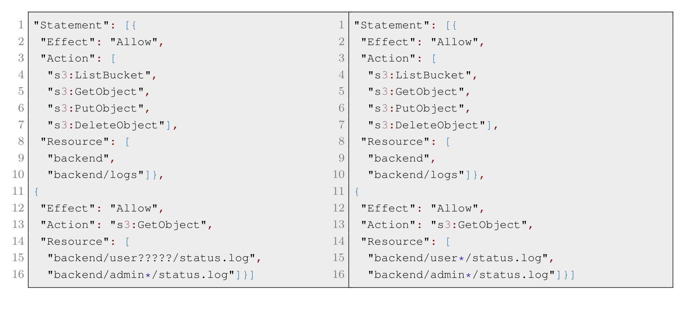

**Figure 8.2:** Second repaired policy (left, (a)), third repaired policy (right, (b))

access is achieved through the use of the wildcard symbol ‘*’ (representing any string) within the resource description “backend/*”. Though not present in this first policy, the ‘?’ symbol is used similarly to represent any character. Essentially, this second statement allows the logger role to gather all logs in the bucket, while the first statement allows the logger role to consolidate those logs into a single logs file. This policy allows the logger role to accomplish its tasks. However, the policy gives the logger role read access to all objects in the “backend” bucket using the S3:GetObject action, regardless of whether or not the object is a log file. Ideally, the policy should be repaired so that it only allows access to log files within the “backend” bucket. Repairing the permissiveness of the policy in 8.1(a) requires some information to be known regarding the requests fielded (allowed or denied) by the policy. Without such domain specific knowledge, the best repair would be to modify the policy to allow no requests. Suppose that the following requests, which specify action and resource pairs, should be allowed by the policy:

These requests represent what kind of actions and resources should be allowed by the original policy, which we refer to as the must-allow request set. Any repaired policy must allow these requests. The simplest way to repair the policy is to explicitly enumerate the allowed requests within a statement in the policy, as shown in Figure 8.1(b). Instead of specifying “bucket/*” in the second statement (which specified all objects within the bucket), the list of known resources is explicitly specified by explicitly enumerating them. While this is a valid repair and does in fact reduce permissiveness, it does not handle other log files which may exist but were not captured in the must-allow request set. It simply makes the must-allow set the policy. In our approach, we remedy this by generalizing the allowed requests using resource characterization techniques. The policies in Figure 8.2 show two repairs which our quantitative repair approach generates. Both policies reduce the permissiveness of the original policy. However, the second and third repaired policies generalize the resources from the must-allow request set. The second repaired policy (Figure 8.2(a)) generalizes requests containing the “user”

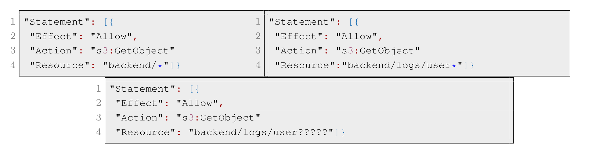

**Figure 8.3:** Original policy (top left, (a)), partially repaired policy (top right, (b)), fully repaired policy (bottom, (c))

and “admin” strings, but is more restrictive for resources containing the “user” string: It allows resources such as bucket/user44012/status.log which is in the must-allow request set, but does not allow bucket/user1234567/status.log which is not in the must-allow request set. The third repaired policy (Figure 8.2(b)) also generalizes requests containing the “user” and “admin” strings, but is equally as restrictive in both cases. Based on the input permissiveness constraints and parameters, our approach can generate repairs with different levels of permissiveness while meeting the permissiveness constraints. We discuss this further in Section 8.2.

Permissiveness Bound Example. In this example we discuss the importance of the permissiveness bound in the repair process. Recall that the permissiveness of a policy is the number of requests allowed by the policy. Given a permissiveness bound, a policy is determined to be overly permissive if the permissiveness of the policy is greater than the permissiveness bound. For example, if the desired permissiveness bound is 1,000 (maximum of 1,000 distinct requests allowed), and the permissiveness of a given policy is 10,000, then the permissiveness of the policy exceeds the permissiveness bound and is in need of repair. While the permissiveness bound is a bound on the maximum number of requests allowed by the policy, it can also be used to interpret the maximum number of wild characters allowed within the policy; that is, the number of characters which are allowed to be unspecified in the policy. Consider the policies in Figure 8.3 together with the following set of must-allow requests:

Let us assume that the desired permissiveness bound is 5 wild characters, which corresponds to a maximum of 2565 = 1.1 × 1012 distinct requests which can be allowed by the policy. Note that the number of wild characters can be obtained by taking the log256 of the desired permissiveness (since each wild character corresponds to 256 possible characters). Additionally, assume only ASCII characters are allowed in the resource field, and the length of resources can be at most 30 characters long. The first policy (Figure 8.3(a)) has a permissiveness of 9.6 × 1052, or 22 wild characters, which far exceeds the permissiveness bound. The second policy (Figure 8.3(b)) is a partially repaired version of the first policy, which further restricts the requests allowed by the policy. The permissiveness of this second policy is 2.0×1031, or 13 wild characters which still exceeds the permissiveness bound. The third policy (Figure 8.3(c)) shows a fully repaired policy with a permissiveness of 1.1 × 1012, or 5 wild characters, which does not exceed the permissiveness bound, and is thus repaired. In this case, note that the resource field in the policy "Resource":

of wildcard characters to 5, which meets the permissiveness bound.

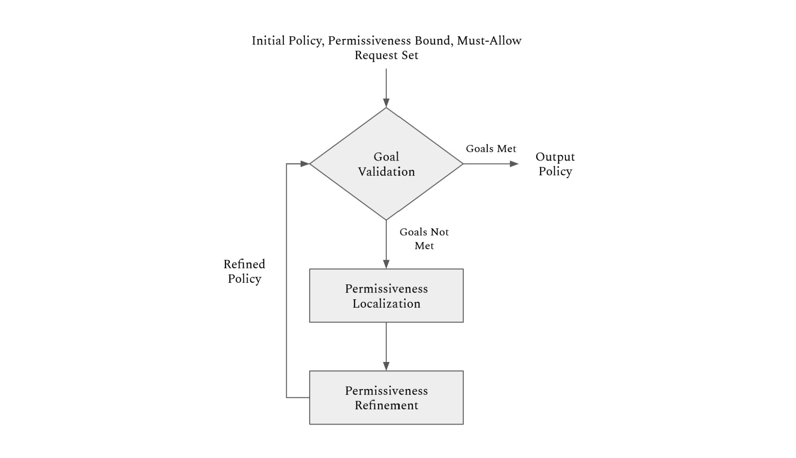

**Figure 8.4:** Flow of repair algorithm. The inputs are Initial Policy, Permissiveness Bound, Must-Allow Request Set

### Quantitative Policy Repair

Recall that policy repair has three inputs: 1) a permissiveness bound, 2) a set of must-allow requests, and 3) a policy to be repaired. The goal is to create a revised (repaired) version of the input policy in which all must-allow requests are allowed and the permissiveness bound is not exceeded. Our policy repair algorithm consists of three main stages: (1) Goal Validation, (2) Permissiveness Localization, and (3) Permissiveness Refinement. Figure 8.4 shows the overall flow of the repair algorithm. Algorithm 19 is the core repair algorithm corresponding to the flowchart shown in Figure 8.4. Given a policy (consisting of one or more rules), a permissiveness bound, and set of requests, the repair algorithm first checks if the permissiveness goals are met using Goal Validation. If they are met, then the algorithm stops and returns the policy. Otherwise, it finds the most permissive elements of the policy through Permissiveness Localization, then reduces permissiveness and refines the policy elements through Permissiveness Refinement. The algorithm then goes back to Goal Validation and repeats the process until the policy is successfully repaired meeting the permissiveness constraints. In the following sections, we will discuss the algorithms corresponding to each of the stages.
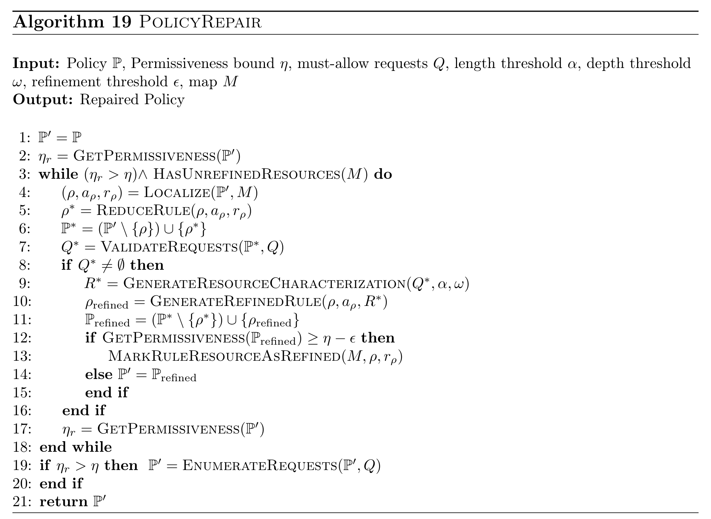

**Algorithm 19**

Since our repair approach uses a greedy strategy to quantitatively repair overly permissive policies, it is not guaranteed to produce an optimum repair. However, we believe that a greedy repair strategy like ours that focuses on most permissive elements of the policy first is a reasonable and practical approach.

#### 8.2.1 Repair Goal Validation

Recall that the main goal of policy repair is to reduce the permissiveness of the given policy to meet the given permissiveness bound while preserving the set of must-allow requests. Validating that the repair goal is reached requires two steps: (1) quantitatively assessing that the permissiveness of the repaired policy is within the given permissiveness bound, and (2) verifying that the given set of must-allow requests are allowed by the repaired policy. When both of these goal validation steps are achieved, the repair algorithm stops and we return the repaired policy. Note that it may not be possible to achieve the permissiveness bound without changing the policy to only allow the requests that are in the must-allow set. In such a scenario we generate a policy that corresponds to explicit enumeration of the requests in the must-allow set. In cases where permissiveness bound cannot be reached without enumeration of the must-allow set, our approach uses a stopping condition where only rules that have not been previously refined (from the permissiveness refinement stage) are eligible for refinement; the repair algorithm stops if there are no rules left to refine, regardless of whether the permissiveness goal has been reached. To simplify the presentation of our policy repair algorithm, we assume that the permissiveness level required by the must-allow set is not more than the input permissiveness bound (which would correspond to an unsatisfiable set of permissiveness constraints), and furthermore, we assume that the initial policy does allow all the requests in the mustallow set. We can easily get rid of these assumptions with extra checks. The permissiveness goal is checked on lines 2 and 3 in the repair Algorithm 19 through the GetPermissiveness function. A policy P is first encoded into an SMT formula JPK then sent to a model counter which returns number of satisfying solutions to JPK, which corresponds to the number of requests allowed by policy P. Recall that the number of requests allowed by P corresponds to the permissiveness of P. If the permissiveness is less than the bound, then the permissiveness goal has been reached and the algorithm returns the current policy. Otherwise, it gets in the while loop starting in line 3 in order to modify the current policy to reduce its permissiveness. 
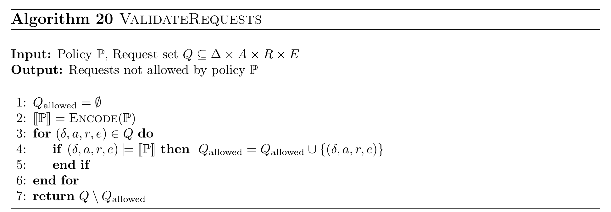

**Algorithm 20**

Algorithm 20 shows how the set of must-allow requests Q are checked against a policy P. For each request (δ, a, r, e) in the must-allow set, we have to determine if (δ, a, r, e) |= JPK, i.e., does P allow (δ, a, r, e)? This is done by generating the SMT formula J(δ, a, r, e)K ∧JPK and checking if it is satisfiable using an SMT solver. Note that J(δ, a, r, e)K corresponds to SMT encoding of the request (δ, a, r, e) and JPK is the SMT encoding of all the requests allowed by P. So, if SMT solver reports that J(δ, a, r, e)K∧JPK is satisfiable, then we know that the request (δ, a, r, e) is among the requests allowed by P. If the SMT solver reports that it is not satisfiable, then we know that the request (δ, a, r, e) is not allowed by P. By encoding requests and policies as SMT formulas, we can implement the goal validation step using an SMT solver, and without requiring access to an access control policy evaluation engine. Algorithm 20 accumulates the requests in Q that are allowed by P in the set Qallowed. At the end it returns the set difference Q \ Qallowed, i.e., the set of requests in Q that are not allowed by P. These requests are used in the permissiveness refinement step.

#### 8.2.2 Permissiveness Localization

We use a greedy strategy in repairing the permissiveness of a policy. We quantitatively assess permissiveness by first finding the most permissive rule in the policy, then finding the most permissive elements within the rule. This is done using calls to a model counter.

Recall from Section 6.1 that Allow(P) is the set of all Permissiveness Analysis requests allowed by P. It follows then that |Allow(P)| is the number of such requests. Following the work from [74], the permissiveness of P is the number of requests allowed by P, which corresponds to the number of solutions to the formula encoding P, which is JPK. I.e., |Allow(P)| = |JPK|. Thus, a lower permissiveness corresponds to a lower number of allowed requests, while a higher permissiveness corresponds to a higher number of allowed requests. Note that, although satisfiability of JPK can be computed using a constraint solver, computing cardinality of JPK, i.e, computing |JPK|, requires a model counting constraint solver.

Similar to fault localization techniques in traditional Permissiveness Localization repair algorithms, we introduce the notion of permissiveness localization for policy repair to find the most permissive sections of a policy. Our permissiveness localization technique consists of a two-step process: (1) a course-grained approach which first finds the most permissive rules in a policy, and (2) a fine-grained approach is used to find the most permissive elements within each rule. In the course-grained approach each rule is analyzed independently of other rules within the policy: each rule ρi ∈P is treated as an independent policy Pi = {ρi}. The permissiveness of each Pi is assessed using a model counter, where the most permissive rule in P corresponds to the most permissive policy Pi. A rule contains principals, actions, resources, and environment conditions. In order to better analyze the permissive elements of the most permissive rule, we use a fine- grained approach to determine the greatest source of permissiveness. More specifically, we analyze the actions and resources within the rule, as in our observations these tend to be the most permissive elements. Once this is done, the repair algorithm refines the permissiveness of the rule and its elements. 
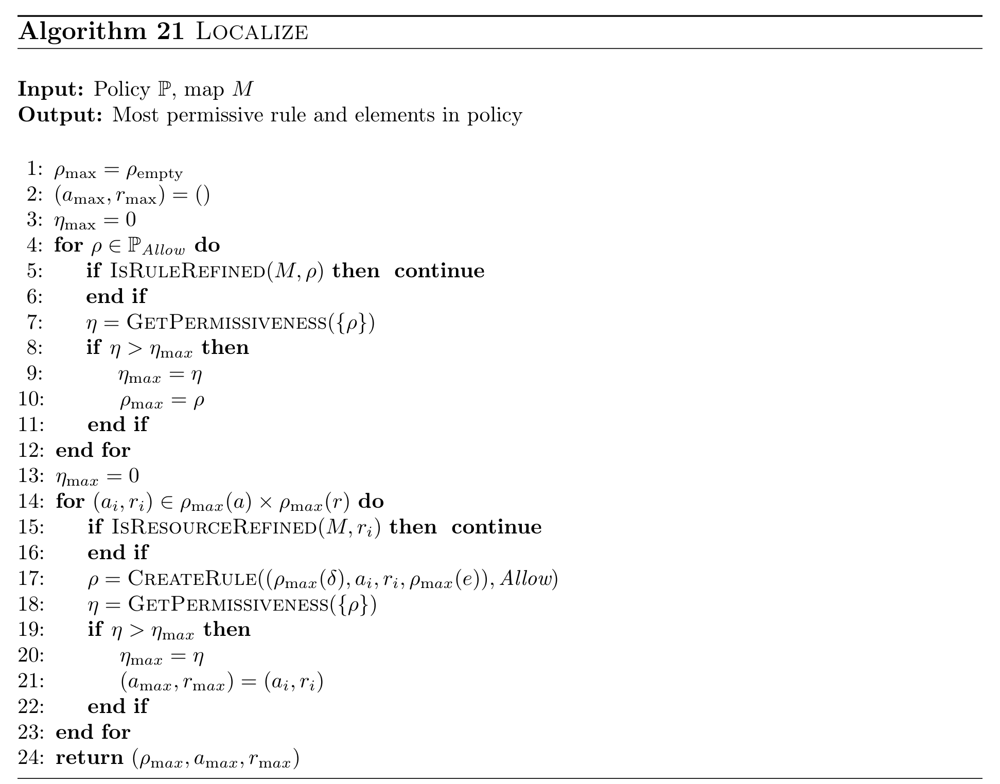

**Algorithm 21**

Algorithm 21 shows the how the repair is localized. First, in lines 4-12 the most permissive rule is found by iterating through the allow rules (those that allow requests) in the policy. Only rules which contain unrefined resources are considered; additionally, we do not consider deny rules (those that deny requests) as by definition deny rules cannot increase permissiveness. We keep track of which parts of a policy is already refined by using a map M.

The GetPermissiveness function encodes the given policy as a SMT formula using the techniques in Section 6.1 and calls the model counter on the formula. The GetPermissiveness function is called on a policy consisting only of the given rule. Next, on lines 14-23 the most permissive action, resource pairs are located within the rule. This is done by iterating over all action, resource pairs and creating a new rule where the action, resource pair is allowed with any combination of the principals and environment attributes specified in the most permissive rule. Note that, as before, only unrefined resources are considered. The permissiveness of the newly created rule is calculated using the GetPermissiveness function. Once found, the most permissive rule and its respective action, resource pair is returned. Note that Algorithm 21 involves numerous calls to a model counter through the GetPermissiveness function, and calls to a model counter can be expensive. This is a concern that we later discuss while presenting our implementation and experiments.

#### 8.2.3 Permissiveness Refinement

Once the most permissive rule and elements in the rule are found using permissiveness localization, the rule is modified to reduce permissiveness. However reducing permissiveness has the possible effect that some requests in the set of must-allow requests are now not allowed. In this situation, the denied requests are analyzed and the rule is then refined using resource characterization and generalization techniques so that all must-allow requests are allowed. Algorithm 19 shows how a rule is reduced and refined, while Algorithm 22 and Algorithm 23 show how the resource characterization is generated from the denied requests.

Within Algorithm 19, once the most permissive rule and Permissiveness Reduction its permissive elements are located using Algorithm 21 on line 4, on line 5 the Reduc- eRule function modifies the rule so that permissiveness is reduced. Our approach for reducing permissiveness greedily removes the most permissive element of the most permissive rule. The rule is only modified so that the permissive action and resource pair is removed. On line 6, a new policy is created by removing the permissive rule from the original policy and replacing it with the reduced rule from line 5. While the permissiveness of the rule is clearly reduced using this approach, a clear consequence is that some requests (possibly from the set of must-allow requests) that were previously allowed are now denied. This is an intentional consequence of our approach. It allows us to remove redundant elements of a policy while refining the rule (as we discuss below). The goal is to generate a possibly less permissive characterization of resources while keeping the must-allow requests still valid.

Permissiveness Refinement Lines 7-17 in Algorithm 19 details how permissiveness is refined through the construction of a new policy. In the case that the permissiveness reduction results in the set of must-allow requests being invalidated, we must refine the permissiveness in order to fix the set of must-allow requests. On line 7, using Algorithm 20 we determine which requests from the set of must-allow requests are denied in the new policy. If the set of must-allow requests are still valid, the current repair iteration ends and the next iteration starts with the modified policy as the policy to be further repaired. Otherwise, the modified policy must first be repaired so that the set of must-allow requests are valid. Lines 9-11 show how this is done. We first generate a characterization of resources from the invalid requests in the must-allow request set. This is done by extracting a regular expression from the finite-state automaton by state elimination [75]. Once the characterization is obtained, the new resources are added into the rule through the GenerateRefinedRule function which generates a new rule using the newly refined resource and the other existing elements within the rule. However, it can be the case that the newly refined rule does not decrease permissiveness, either at all or by an appreciable amount. If the permissiveness of the refined policy does not appreciably decrease (lines 12-15), the current repair is rolled back and the resource within the rule is marked as not eligible for refinement. 
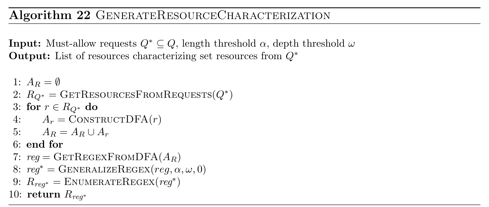

**Algorithm 22**

Resource Characterization from Invalid Requests To finish the permissiveness reduction and refinement step, the modified policy must be further refined so that the set of must-allow requests is valid. Trivially, this can be done by enumerating the invalid requests and adding a new rule to the policy which allows only that specific requests. However this does not generalize for requests not in the must-allow set but were intended to be allowed, and can make the policy more complicated in the case that the must-allow set is large. Thus, we aim to generate a characterization of the invalid requests, but more specifically the resources in the requests, which can be added to the modified rule. Ideally, this characterization will increase permissiveness to fix the invalid requests, but still remain less permissive than previously. To do so, we generate a regular expression characterizing the set of requests. Algorithm 22 shows our regular expression and automata-based approach for resource

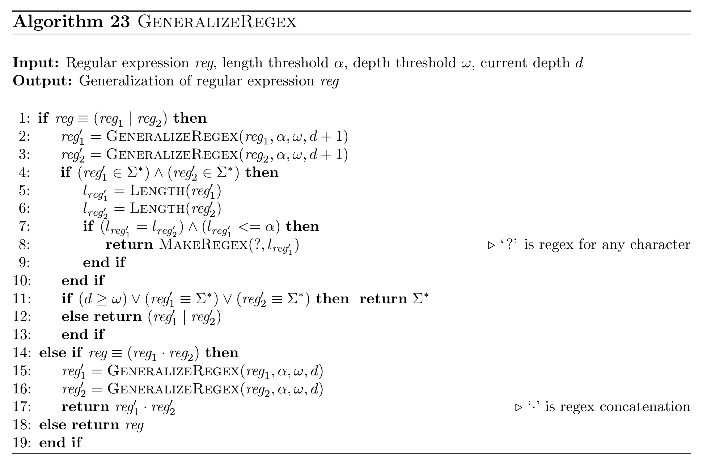

**Algorithm 23**

characterization. The algorithm works by constructing a deterministic finite-state automaton (DFA) for each resource and then taking the automata union of all such DFAs (lines 3-6). Each DFA constructed for a resource (line 4) is a DFA that accepts only that resource, which is a constant. Thus, the union of all such DFAs is a DFA with no loops. We then use the state elimination algorithm [75] to obtain a regular expression characterizing the set of resources. It is well known that this regular extraction algorithm can produce arbitrarily complex regular expressions which are often not useful in practice. This is mainly due to the presence of loops within the DFA, and since our DFAs contain no loops, the resulting regular expression contains only concatenation and unions. Consider the resources from an example must-allow request set:

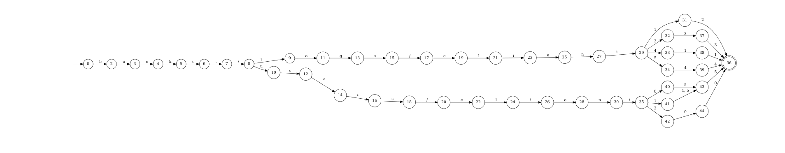

**Figure 8.5:** DFA example. Resulting regex: bucket/(logs/client(((12|333)|

Figure 8.5 shows the DFA constructed from the union of these requests, and the initial regular expression extracted from the DFA. The extracted regular expression however is an enumeration of the input resources using disjunctions, and must be generalized. The recursive GeneralizeRegex algorithm (Algorithm 23) takes the extracted regular expression and transforms the regular expression to a more general regular expression which specifies a broader list of resources. The algorithm works to eliminate some disjunctions in a depth-first manner by replacing them with anychars (‘?’) and wildcards (‘*’) when possible. The length threshold controls when strings of the same length should be collapsed into anychar symbols: e.g., if the length threshold is 3, then "(123|456)" will be simplified to "???", while "(1234|5678)" will remain the same. The depth threshold controls when nested disjunctions get simplified into the wildcard (anystring) character: the greater the threshold, the deeper the nesting of disjunctions is allowed. Once the generalized regular expression is obtained, the refined resources are gathered by enumerating the leftover disjunctions within the general regular expression. Using a length threshold of 3, depth threshold of 2, we obtain a more general, more permissive regular expression:
Note that different values for the thresholds yield different regular expressions. For example, length threshold of 3, depth threshold of 4 yields the less general, less permissive regular expression:

### Policy Repair for the Cloud

Currently, our policy repair approach works on the policy model we introduced in Section 6.1. This policy model abstracts away the implementation and intricacies of modern policy languages used in the cloud. In this section, we show how our policy model can be applied to one of the most popular policy languages for the cloud, that of Amazon Web Services (AWS), and we demonstrate that our approach repairs such policies.

#### 8.3.1 Policy Transformations for Repair

Recall that our approach localizes permissiveness to the most permissive action, resource pair and then mutates it when possible. We cannot directly apply the approach to AWS IAM policies that may contain NotPrincipals, NotActions, NotResources, and/or negative condition operators like StringNotEquals because such elements let policy developers specify the complements of allowed values. If we directly applied our approach, then removing policy elements would increase permissiveness, straying away from the repair goal. To avoid this and to avoid complicating the repair approach, we transform original policies, removing “negative” policy elements. Algorithm 24 shows how an AWS statement ρ is transformed. In the algorithm, ρ.keys refers to the Principal, Action, and Resource (or their negations) which exist in the statement. This is done in two passes. In the first pass on lines 4-8, the NotPrincipals, NotActions, and/or NotResources are removed (there is no NotCondition in the AWS IAM policy language). This is not enough, because condition operators like StringNotLike

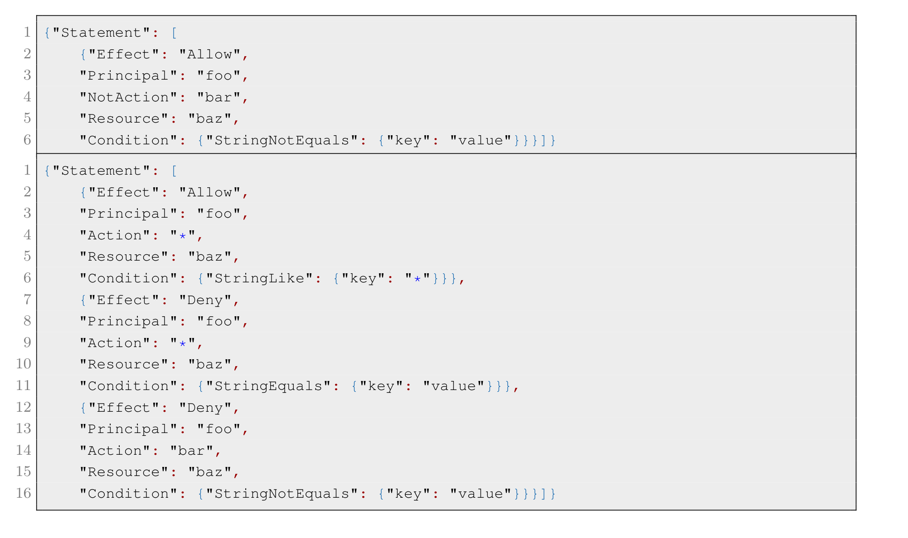

**Figure 8.6:** Original AWS IAM policy with one statement with NotAction and String-

NotEquals condition operator (top, (a)); Transformed policy with three statements (bottom, (b)).

may be used to specify complements of allowed condition values. In the second pass on lines 10-20, these negative condition operators are removed similarly. Figure 8.6 shows the transformation applied to an AWS IAM policy. Figure 8.6(a) shows the original policy, which has one statement with a NotAction element and a StringNotEquals condition operator. Figure 8.6(b) shows the transformed policy after both passes are done. The transformation has three limitations: (1) We do not transform deny statements in the original policy. (2) We assume that the original policy does not have statements allowing requests that the newly added statements deny. Otherwise, the transformed policy is less permissive than the original policy because a statement denying a request overrules one allowing it. (3) We currently support the case-sensitive string condition operators only.

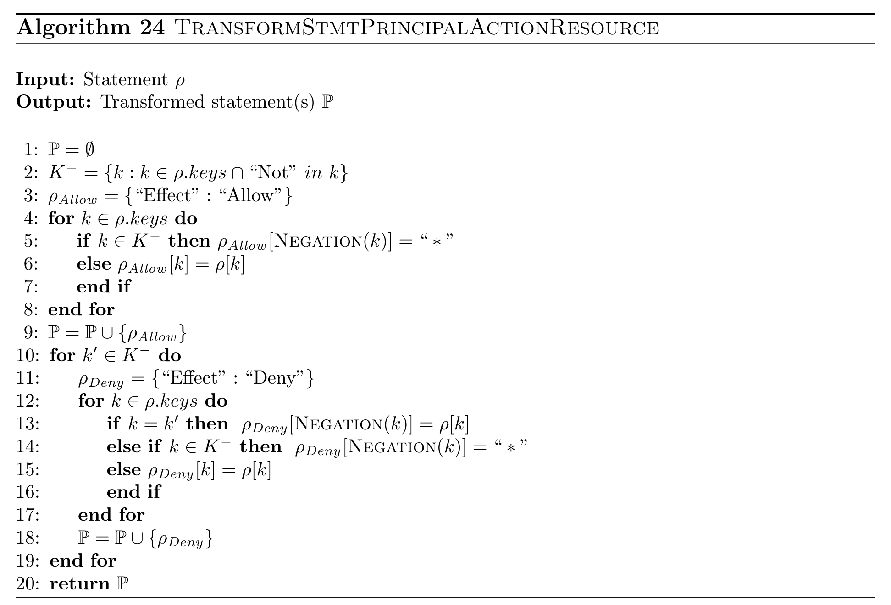

**Algorithm 24**

#### 8.3.2 Determining Permissiveness Bounds

Our approach can be used to automatically reduce the permissiveness of policies while making sure that they allow what is necessary (based on the must-allow request set). Even without a desired permissiveness bound, our approach can be used to find a less permissive policy by using permissiveness of other policies as a bound or by giving a permissiveness bound that is less than the current permissiveness of a policy as we discuss below.

Inferring a Permissiveness Bound from Other Policies When the permissiveness bound is not known, the permissiveness value of another policy can be used as the permissiveness bound. Assume that a policy P is given and the policy developer wants to determine if it is overly permissive, but the permissiveness bound is not known or is difficult to determine. In this instance, assume that the policy developer has another policy P′ which is known to be not overly permissive. Let ηP′ be the permissiveness of P′. Then, to determine if P is overly permissive, ηP′ can be used as the desired permissiveness bound. If the permissiveness of P is greater than ηP′ then P is overly permissive and should be repaired using our approach with the permissiveness bound being ηP′. Note that this approach assumes that the policy developer has access to another policy P′ whose permissiveness can be used as the permissiveness bound when repairing P; for example, for a new role, a policy should be attached to the new role which has similar permissiveness to policies attached to other roles. If such a policy P′ does not exist, then an iterative approach for reducing the permissiveness of a policy can be used as we discuss next.

Iteratively Decreasing Permissiveness Consider when the permissiveness bound for a given policy P is not known but the policy developer wants to ensure that P is not overly permissive. That is, the policy developer wants to ensure that P does not allow more requests (permissions) than what is required. In this case, our repair algorithm can be used to iteratively reduce the permissiveness of P

1. Let ηP be the permissiveness of P

2. Set the permissiveness bound as ηP′ = ηP −δ

3. Repair P using permissiveness bound ηP′ to obtain a repaired policy Pr

4. If Pr has the desired permissiveness level, halt; otherwise go back to step (1) with P = Pr where δ is a positive integer defining the step size which determines how much the permissiveness bound should decrease in each step. This can be continued until a repaired policy with a desired level of permissiveness is produced, or the approach cannot further repair the policy. In each step the permissiveness of P is decreased by δ.

### Experiments

In order to evaluate our repair algorithm, we consider the following research questions: RQ1: Does the policy repair algorithm successfully find repairs for policies collected from user forums? RQ2: How does the effectiveness of the algorithm change for varying permissiveness bounds? RQ3: What factors contribute to the overall performance (execution time/iterations/- calls) of the repair algorithm? We discuss below the policy dataset we use in our approach, how we set up our experiments to answer the research questions, and the results of our experiments. For quantifying the permissiveness, we use the model counter ABC [23, 46]; for validating requests in the must-allow request set we use the SMT solver Z3 from Microsoft, and the quacky tool for translating policies into SMT formulas. 1

#### 8.4.1 Experimental Setup

AWS Policy Dataset. AWS offers over 200 services. Each service has its own actions and resource types that can be allowed or denied in access control policies. For our repair experiments, we used the policy dataset published in [74], which includes 43 real-world policies collected from using forums from the most popular AWS services, namely iam, 1Our policy repair tool and policy and request datasets are publicly available at https://github.com/vlab-cs-ucsb/policy-repair s3, and ec2.

Permissiveness Bounds. Recall that the policy repair problem specifies a permissiveness bound. In general, this permissiveness bound relates to the number of requests allowed by the policy. In our repair algorithm, and in our experiments, we consider a more restrictive permissiveness bound definition in which the permissiveness is determined by the number of actions and requests allowed by a policy. The reason for this is that in the policies we have observed, the most permissive element is the resource element, and since the action and resource elements are tied very closely in the policy semantics (e.g., only S3 actions work on S3 resources) it makes sense to consider them together. Because resources are strings, and strings can be infinitely long, we must bound the maximum length of allowed resources (otherwise the permissiveness of a policy is infinite due to wildcard characters). In our analysis, we bound the maximum length of any resource to be 100. Note that actions are also strings, but there are a finite number of actions (e.g., S3:GetObject is a valid action, S3:FooBar is not). Thus, the maximum number of actions allowed by a policy is the number of possible actions, which in practice is relatively small (a few hundred for the AWS services we consider). In our experiments, we use the action constraint encoding from [74] which maps constraints on actions into numeric range constraints to simplify the constraint formulas generated in our approach. In our experiments, the permissiveness bound is given in terms of log256. Intuitively, since resources are strings where each character in the string can be one of 256 ASCII characters, this gives a measure of uncertainty regarding the number of unknown characters in the resource. For example, the resource "foo12" has a log256 permissiveness of 0 (all characters in the string are known) while the resource "foo??" has a log256 permissiveness of 2 (2 characters in the string are unknown) since ‘?’ is a special character denoting any possible character. We bound the maximum length of strings at 100 so giv- ing permissiveness bounds in terms of log256 gives a restriction on how many of characters of the resource be unknown. Note that while this is just an approximate measure (strings can be less than 100 characters) it nevertheless gives a useful measure for bounding the permissiveness of a policy.

Allowed Requests. We augmented the policy dataset we used with sets of allowed requests. We created requests containing only the action and resource field, as our repair approach is currently tailored for reducing permissiveness based on action and resources. Our metholodgy for sythensizing requests was to create requests which are likely to resemble requests created by actual users. For actions, we focus on the most common actions for the AWS services in our policies (such as S3:GetObject and EC2:RunInstances). For resources, we observed from the policy dataset and AWS online documentation that resources generally have the following structure:

resource = service. prefix. middle. suffix

The service section consists of AWS service, region, and account number. The prefix section corresponds to the resource type and is generally dependent on the action in question: e.g., the prefix for s3 resources generally corresponds to the bucket name. The middle consists of the intermediate directory structure (usually delimited using ’/’). The suffix consists of the object, filename, or instance in question. Consider the following resource arn:aws:s3:::mybucket/folder1/folder2/clients.txt where the service is “arn:aws:s3:::”, the prefix is “mybucket/ ”, the middle is “folder1/folder2”, and the suffix is “clients.txt”. When synthesizing the requests, we observed that the service and prefix parts of the resource were specific to services for the particular policy,

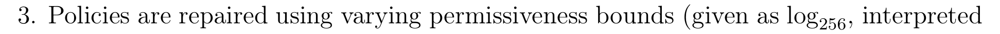

**Table 8.1:** Results for 43 total policies with length threshold of 2 and depth threshold of 3. Policies are repaired using varying permissiveness bounds (given as log256, interpreted as number of unknown characters allowed in a resource) .

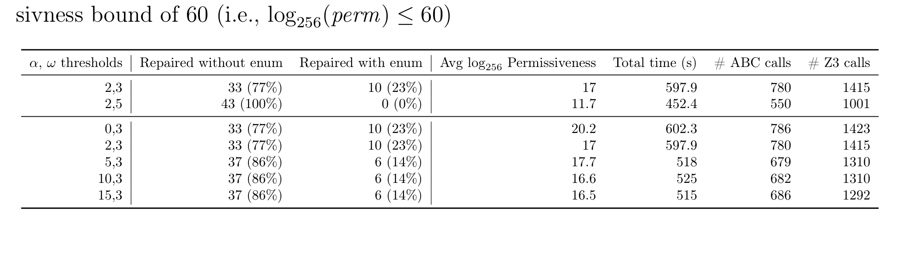

**Table 8.2:** Results for varying length (α) and depth (ω) thresholds for a single permissivness bound of 60 (i.e., log256(perm) ≤60)

We ran all experiments on a machine with an Intel i5 3.5GHz X4 processor, 32GB DDR3 RAM, a Linux 4.4.0-198 64-bit kernel, Z3 v4.11.1, the latest build of ABC 2, and the latest release of quacky3.

#### 8.4.2 Results

To answer our research questions, we conducted a wide variety of experiments on 43 policies collected from user forums using our quantitative repair algorithm. We now 2https://github.com/vlab-cs-ucsb/ABC 3https://github.com/vlab-cs-ucsb/quacky

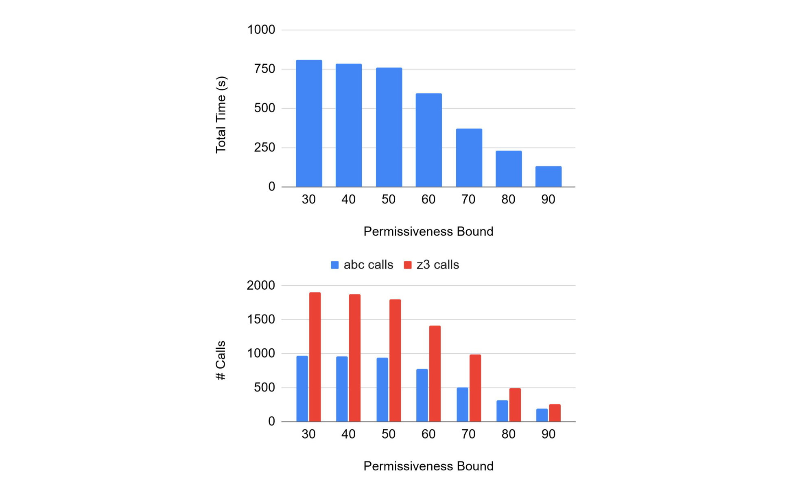

**Figure 8.7:** For all 43 policies and each permissiveness bound: total time taken (top (a)); total calls to ABC and Z3 (bottom (b)).

discuss the results and how they answer the aforementioned research questions.

RQ1: Does the policy repair algorithm successfully find repairs for policies Recall that the policy repair algorithm tries to find a collected from user forums? repair meeting the permissiveness bound through goal validation, permissiveness localization, and permissiveness refinement, and if it cannot will begin enumerating requests and replacing elements of the policy with these requests. Our repair algorithm will always successfully find repairs (so long as the initial assumptions are met, see Section 4). Some of these repairs may require request enumeration, which is not ideal. We ran the repair algorithm on the dataset of 43 policies with varying permissiveness bounds to determine if the repair algorithm could generate a repair without request enumeration and how often our repair was generated with request enumeration. Table 8.1 shows the results. The permissiveness bounds ranged from 30 to 90, meaning that the repair algorithm must generate a repaired policy with permissiveness less than the given bound. For each permissiveness bound, we used a length threshold (α) of 2, depth threshold (ω) of 3, and refinement threshold (ϵ) of 0.01. For lower bounds, request enumeration was required to generate successful repairs, with 14 of the 43 (67%) repairs requiring request enumeration for bounds 30 and 40. As the permissiveness bound increases, the number of repairs generated which required request enumeration decreases. For permissiveness bounds of 80 and 90, 100% of the repairs generated by algorithm were generated without enumerating requests. Intuitively, this makes sense as a lower permissiveness bound requires the policy to more concretely specify the requests allowed by the policy; a higher permissiveness bound means that the policy can be more generalized in what is allowed.

RQ2: How does the effectiveness of the algorithm change for varying permissiveness bounds? As the results in Table 8.1 show, while the repair algorithm generates repairs for all policies for all given permissiveness bounds, lower permissiveness bounds required the repair algorithm to resort to enumerating requests. This means that while the permissiveness localization algorithm from Section 4 (Algorithm 21) was able to localize where the most permissive elements were, the permissiveness refinement algorithms (Algorithms 22,23) could not generate a resource characterization to reduce the permissiveness enough to meet the permissiveness bound. This could be due to the length (α) and depth (ω) threshold values used in Algorithm 23. Thus, we ran the repair algorithm again on the 43 policies, but this time for a single permissiveness bound but with different threshold values. Table 8.2 shows the results. We observed that, in general, the length and depth threshold values did not have an appreciable impact on the total time taken by the repair algorithm. However, we did observe that a higher depth thresh- old corresponded to more repairs not requiring explicit request enumeration. We believe this is because a higher depth threshold results in a less generalized, more enumerative regular expression characterization. Recall from Algorithm 23 that the depth threshold corresponds to the maximum level of nested disjunctions within a regular expression. When the level of nested disjunctions reaches the depth threshold, it gets “squashed”, or generalized into a wildcard ‘*’ (anystring) regular expression. Thus, while the repair algorithm with length threshold of 2 and depth threshold of 5 repaired all 43 policies without explicit enumeration, it is likely that regular expression characterizations generated in this case allowed more disjunctions, and thus were a more enumerative generalization.

RQ3: What factors contribute to the overall performance (execution time/iterations/calls) of the repair algorithm? The repair algorithm utilizes a constraint solver (Z3) and model counter (ABC) for verifying the requests in the must-allow request set and for quantifying permissiveness. Both tools incur significant overhead in the process. Figure 8.7(a) shows the time taken for various permissiveness bounds, while

Figure 8.7(b) shows the number of calls to Z3 and ABC for each permissiveness bounds. As the permissiveness bound is increased, the total time taken for repairing the 43 policies significantly decreases. Looking at Figure 8.7(b), the number of calls to both Z3 and ABC decrease in a similar fashion. Both the number of calls and total time were similar for the lowest few bounds. This may be due to the fact that those policies which required enumeration during the repair process for the bounds of 30, 40, and 50 are the ones which took more time to repair and more calls to Z3/ABC. For the depth and length thresholds, we did not notice a significant increase or decrease in time taken or calls to Z3/ABC when the thresholds were varied against a constant permissiveness threshold.

#### 8.4.3 Threats to Validity

Requests in the must-allow request set may not be representative of the what should be allowed by the policy. We mitigate this threat as much as possible by synthesizing requests not randomly but instead based on the common structure of actions and resources we observed from both the policy dataset and AWS documention. In this way, the requests were not randomly generated but were generated such that they aligned with the user’s intention regarding the kinds of requests that should be allowed by the policy. As the 43 policies did not have associated requests which should be allowed by the policy, this was the most straightforward approach for generating a must-allow request set.

### Chapter Summary

In this chapter we present a novel quantitative policy repair algorithm for repairing the permissiveness of access control policies for the cloud. Given a permissiveness bound and must-allow request set, our approach works by iteratively localizing the most permissive elements of the policy using quantitative analysis techniques and reducing and refining these elements using regular expression generalization techniques. Our experiments on 43 AWS IAM policies show that our repair algorithm successfully generates repairs for the given policies and does so in a reasonable amount of time. As future work, we plan to automate techniques we discussed for determining permissiveness bounds.

## Related Work

### String and integer model counting

There has been significant amount of work on string constraint solving in recent years [76, 77, 78, 40, 79, 80, 81, 82, 44, 83]; however none of these solvers provide modelcounting functionality. Meanwhile, due to the importance of model counting for quantitative program analyses, model counting constraint solvers are gaining increasing attention. SMC and S3# are model-counting constraints solvers for string constraints [25, 24]. Our model counting approach is more precise and more expressive than SMC since SMC cannot propagate string values across logical connectives and cannot handle complex string operations such as replace. S3# handles string constraints involving length constraints, but suffers a severe loss in precision when length constraints include symbolic integers. Although the expressiveness of S3# is comparable to that of MT-ABC for string constraints, unlike MT-ABC S3# cannot handle pure numeric constraints, and it produces unsound results for mixed constraints. LattE [26] is a model counting constraint solver for linear integer arithmetic. LattE uses the polynomial-time Barvinok algorithm [84] for integer lattice point enumeration.

LattE cannot handle string constraints, so our approach is more expressive than LattE. Automata-based constraint solving and model counting techniques we use in this paper are not domain-specific like the approaches used in LattE, SMC, and S3# but general in the sense that, they can handle any set of constraints that can be mapped to automata. As we present in this paper, it is possible to map both numeric and string constraints and their combinations to automata. While linear algebraic methods for counting paths in a graph are well established, this paper is the first to implement those methods for the purpose of parameterized model counting for relational string and integer constraints. There has been earlier work on integer constraint model counting by counting paths in numeric DFA [85], but this earlier approach can only count models when there are finitely many models. We built MT-ABC by extending an existing tool called Automata Based model Counter (ABC) [23]. ABC uses a single-track automata representation. ABC cannot model count relational constraints and numeric constraints as precisely as MT-ABC, and it cannot handle constraints with integer variables. ABC has been integrated with Symbolic PathFinder (SPF) and applied to side-channel analysis in [22]. SMTApproxMC [27] is a model counting constraint solver for the theory of fixedwidth words, and it uses a different approach for model-counting based on solution sampling [86]. Since SMTApproxMC cannot handle string constraints, we compared SMTApproxMC with MT-ABC on a set of numeric constraints. MT-ABC produces precise counts for linear arithmetic constraints whereas SMTApproxMC can only produce approximations, and our experiments demonstrate that MT-ABC is significantly faster.

### Formula caching

Model Counting As the enabling technology for quantitative program analyses, modelcounting constraint solvers have received increasing focus from the research community. SMC [24] and S3# [61] are two model-counting constraint solvers over the string domain. LattE[26] is a model-counting constraint solver for linear integer arithmetic that uses the Barvinok [84] algorithm. ABC, which can handle string, numeric and mixed constraints, is more expressive than any of these model-counting constraint solvers and more precise than either of the string model counters.

Caching Cashew [45] is a caching framework for model-counting queries which provides notable improvement on a variety of program analyses. Cashew is built atop Green [87], an external solver interface for reusing the results of satisfiability or model counting queries. Cashew introduces an aggressive normalization scheme and parameterized caching, allowing it to outperform Green. We adopt the normalization scheme used by Cashew, but introduce subformula caching into the automata construction process to enable more reuse of computation. We also leverage automata caching, a normalization technique guaranteeing completeness to leverage more information from the cache. We show how both of these techniques benefits three different program analyses scenarios with a direct comparison to the full-formula-only caching implemented by Cashew. GreenTrie [88], another extension of Green, and Recal [89] are caching frameworks that detect implication between constraints to improve caching for satisfiability queries. Their techniques are specific to satisfiability queries and, in the general case, do not apply to model-counting queries considered in this paper. Utopia [90] proposes a technique to reuse results across formulas with similar solution sets but again, is specific to satisfiability queries and would not aid in model counting.

Many modern SMT solvers have built-in support to expedite Incremental Solving the solving of similar constraints. CVC4 [91], Z3 [92], Yices [93] and MathSAT5 [94] are SMT solvers with incremental capabilities. These tools learn lemmas which can later be (re)used to solve similar constraints. During constraint solving, these solvers use a stackbased approach to keep track of the current solver context, pushing and popping learned lemmas as conjuncts are added or removed respectively. Incremental attack synthesis is an alternative approach that enables reuse of intermediate results obtained during attack synthesis [53]. However, incremental attack synthesis approach is a specialized heuristic for attack synthesis, whereas the subformula caching approach we present in this paper is general, and it is applicable to any quantitative program analysis technique that relies on model counting queries.

### Policy analysis and repair

Access control has been the subject of extensive research [95, 96, 97], many access policy languages have been proposed [98, 99, 100, 101], and the problem with access policies becoming large and difficult to reason about has been noted in the past [102]. There has been earlier work on verification of access control policies [103, 104], as well as on assisting policy creation [105, 106]. Some earlier work analyze role based access control schemas using the Alloy analyzer [107, 108]. The work most closely related to our work is that of Zelkova [11]. Zelkova is a closedsource tool for analyzing properties of AWS policies which can automatically compare two AWS policies and determine whether one is more permissive than the other. The two crucial distinctions between Zelkova and our work is that (1) we provide a general policy framework for analyzing access control policies which can be applied to other policy languages, and (2) we introduce a novel approach for quantifying the permissiveness of access control policies (rather than a binary yes/no answer in Zelkova). Both our work and Zelkova build from ideas from the SAT-based checking of XACML [109]. In their approach, Hughes et al use a bounded approach to analyze properties of XACML policies with SAT solvers. Recent work has built upon Zelkova [64] but does not provide quantitative assessments of permissiveness. Margrave [110] is a tool that analyzes XACML policies using a multi-terminal decision diagrams. Margrave goes beyond binary/ternary differential analysis, allowing a user to write general-purpose queries over changes to a policy. In a later work [68], Margrave uses a SAT solver to enumeratively produce sets of solutions to queries. Our experiments show that this type of enumerative analysis approach is not nearly scalable enough for meaningful quantitative analysis. Verification techniques for analyzing access control policies embedded in programs have been studied [111, 112, 113]. Derailer is interactive tool that let the developer traverse the tree of all data exposed by an application and interactively generate a desired policy [111]. RubyX [112] is a tool for symbolic execution for Rails that can be used to find access control bugs. CanCheck [113] is an automated verification tool that uses first order logic encoding and theorem proving for finding access control bugs in Rails applications. Differential analysis techniques have also been investigated in the past [114, 115, 116, 117, 118, 119, 120, 121, 122]. For example, in [115] differential symbolic execution is used to find differences between original and refactored code by summarizing procedures into symbolic constraints and then comparing different summaries using an SMT solver. SYMDIFF [117] computes the semantic difference between two functions using the Z3 SMT solver [69, 70]. However, we are not aware of any prior work on quantitative differential analysis. In [123], the authors present Qlose, which uses a program repair approach based on quantitative objectives. In [124], the authors present an approach for repairing XACML policies by fault localization and mutation-based repair. Our approach is significantly different. We focus on policies and not programs, and our use of symbolic quantitative permissiveness analysis and our iterative repair generation approach differ from both of these prior approaches.

## Conclusions

Given the ubiquity of software services running on compute clouds, automated access control policy analysis techniques that can help administrators are critically important. In this disseration we presented a quantitative policy analysis tool and framework for assessing and automatically repairing access control policies using model counting constraint solving techniques. The tool and framework can be applied to access control policies for the cloud. We presented novel techniques for model counting constraint solving to enable quantitative analysis and repair of policies. Constraint solving and model counting techniques have been used in a wide variety of verification and quantitative analysis approaches. To extend the usability of existing approaches and for enabling quantitative analysis of access control policies, we developed novel solving and counting techniques and implemented them in open-source tools. We introduced techniques for advancing model counting constraint solving for string and numeric constraints. We introduced a caching framework which uses subformula and automata caching for reusing results from prior model counting queries. We developed our novel model counting techniques into a tool called Automata-Based model Counter 2 (ABC2), which builds off its predecessor, the Automata-Based model Counter (ABC).

Our experiments show that ABC2 is the most precise model counter for string constraints and is an efficient satisfiability checker for string constraints. Moreover, we showed that automata-based model counting approaches perform better than existing model counters for quantitative analysis techniques. Our approaches and tools allow quantitative techniques to analyze a wider set of programs and policies than what has been previously done. In our approach, we quantitatively assess the permissiveness of a policy by reasoning over what is allowed by the policy. Our policy model and framework is designed to be expressive enough to model complex policy specifications that can be efficiently and precisely analyzed by modern verification and validation techniques. We implemented our approach in the quacky tool which can be applied to Amazon Web Services (AWS), Microsoft Azure, and Google Cloud Platform (GCP) access control policies. quacky is the first open-source tool for quantitatively analyzing the permissiveness of access control policies. Our experiments show that quacky can analyze and repair real world policies efficiently and in a timely manner. In addition to quantitatively assessing permissiveness of a policy, we introduced a quantitative policy repair algorithm and approach for automatically repairing the permissiveness of access control policies. By extending fault-based localization techniques from program repair, with model counting from quantitative analysis techniques, our approach can automatically determine the most permissive elements of an overly permissive policy and repair them so that the policy meets a permissiveness threshold. We implemented our policy repair approach within the open-source policy analysis tool quacky. In the future we plan on improving our quacky tool and policy analysis approach to reason about properties of access control policies other than permissiveness. In addition to improving our current analysis approach, we plan on extending our approach to verify automated approaches for policy synthesis. Policies which are automatically generated using artificial intelligence techniques often lack formal guarantees. Providing formal guarantees about the correctness of such policies is integral for the security of privacy of the cloud and data in the cloud. We also plan on improving model counting approaches by integrating automata-based model counting techniques with DPLL and CDCL based constraint solving approaches. This would result in a more precise model counting approach which could handle constraints from theories other than string and numeric. Another avenue we plan to investigate is extending quantitative analysis approaches to be able to handle cryptographic functions and applications. Constraints risen from cryptographic functions and applications are difficult to solve and difficult to count, particularly for larger applications. Being able to quantitatively analyze cryptographic functions would provide greater security and confidence in how we handle our secret and important data.

## Bibliography

[1] “AWS IAM Policy Language.” http://docs.aws.amazon.com/IAM/

[2] “eXtensible Access Control Markup Language (XACML) version 1.0.” OASIS Standard, February, 2003. http://www.oasis-open.org/committees/

[3] ryanb/cancan • GitHub, Nov., 2015. https://github.com/ryanb/cancan.

[4] GitHub - elabs/pundit: Minimal authorization throught OO design and pure Ruby classes, Jan., 2016. https://github.com/elabs/pundit.

[5] “Cloud leak: Wsj parent company dow jones exposed customer data.”

[6] “Another misconfigured amazon s3 server leaks data of 50,000 australians.”

[7] “14 meeellion verizon subscribers’ details leak from crappily configured aws s3 data store.” https://www.theregister.co.uk/2017/07/12/14m_

[8] “Microsoft azure cloud vulnerability is the ‘worst you can imagine’.”

[9] “Awssupportservicerolepolicy informational update.” https://aws.amazon.

[10] “Update detected.” https://github.com/z0ph/MAMIP/commit/9d72709.

[11] J. Backes, P. Bolignano, B. Cook, C. Dodge, A. Gacek, K. Luckow, N. Rungta, O. Tkachu, and C. Varming, Semantic-based automated reasoning for aws access policies using smt, in Proceedings of the 18th Conference on Formal Methods in Computer-Aided Design (FMCAD 2018), Austin, Texas, USA, October 30 - November 2, 2018, pp. 1–9, 2018.

[12] G. Hughes and T. Bultan, Automated verification of access control policies using a sat solver, International Journal on Software Tools for Technology Transfer (STTT) 10 (2008), no. 6 503–520.

[13] C. Barrett, L. M. de Moura, S. Ranise, A. Stump, and C. Tinelli, The smt-lib initiative and the rise of smt, in Proceedings of the Haifa Verification Conference, p. 3, 2010.

[14] L. M. de Moura and N. Bjørner, Z3: An efficient smt solver, in Proceedings of the 14th International Conference Tools and Algorithms for the Construction and Analysis of Systems (TACAS), pp. 337–340, 2008.

[15] P. Godefroid, N. Klarlund, and K. Sen, Dart: directed automated random testing, in Proceedings of the ACM SIGPLAN 2005 Conference on Programming Language Design and Implementation (PLDI 05), pp. 213–223, 2005.

[16] J. Rizzo and T. Duong, The crime attack, Ekoparty Security Conference, 2012.

[17] J. Kelsey, Compression and information leakage of plaintext, in Fast Software Encryption, 9th International Workshop, FSE 2002, Leuven, Belgium, February 4-6, 2002, Revised Papers, pp. 263–276, 2002.

[18] G. Smith, On the foundations of quantitative information flow, in Foundations of Software Science and Computational Structures, 12th International Conference, FOSSACS 2009, York, UK, March 22-29, 2009. Proceedings, pp. 288–302, 2009.

[19] M. Backes, B. Köpf, and A. Rybalchenko, Automatic discovery and quantification of information leaks, in 30th IEEE Symposium on Security and Privacy (S&P 2009), 17-20 May 2009, Oakland, California, USA, pp. 141–153, 2009.

[20] Q. Phan, P. Malacaria, O. Tkachuk, and C. S. Pasareanu, Symbolic quantitative information flow, ACM SIGSOFT Software Engineering Notes 37 (2012), no. 6 1–5.

[21] Q. Phan, P. Malacaria, C. S. Pasareanu, and M. d’Amorim, Quantifying information leaks using reliability analysis, in Proceedings of the International Symposium on Model Checking of Software, SPIN 2014, San Jose, CA, USA, pp. 105–108, 2014.

[22] L. Bang, A. Aydin, Q.-S. Phan, C. S. Pasareanu, and T. Bultan, String analysis for side channels with segmented oracles, in Proceedings of the 24th ACM SIGSOFT International Symposium on the Foundations of Software Engineering, 2016.

[23] A. Aydin, L. Bang, and T. Bultan, Automata-based model counting for string constraints, in Computer Aided Verification - 27th International Conference, CAV 2015, San Francisco, CA, USA, Proceedings, Part I, pp. 255–272, 2015.

[24] L. Luu, S. Shinde, P. Saxena, and B. Demsky, A model counter for constraints over unbounded strings, in Proceedings of the ACM SIGPLAN Conference on Programming Language Design and Implementation (PLDI), p. 57, 2014.

[25] M.-T. Trinh, D.-H. Chu, and J. Jaffar, Model counting for recursively-defined strings, in Computer Aided Verification - 29th International Conference, CAV 2017, Heidelberg, Germany, Proceedings, Part II, pp. 399–418, 2017.

[26] V. Baldoni, N. Berline, J. D. Loera, B. Dutra, M. Köppe, S. Moreinis, G. Pinto, M. Vergne, and J. Wu, “Latte integrale v1.7.2.” http://www.math.ucdavis.edu/ latte/.

[27] S. Chakraborty, K. S. Meel, R. Mistry, and M. Y. Vardi, Approximate probabilistic inference via word-level counting, in Proceedings of the Thirtieth AAAI Conference on Artificial Intelligence, pp. 3218–3224, 2016.

[28] A. Aydin, “Automata-based model counting string constraint solver for vulnerability analysis.”

[29] F. Yu, T. Bultan, and O. H. Ibarra, Relational string verification using multi-track automata, Int. J. Found. Comput. Sci. 22 (2011), no. 8 1909–1924.

[30] F. Yu, M. Alkhalaf, T. Bultan, and O. H. Ibarra, Automata-based symbolic string analysis for vulnerability detection, Formal Methods in System Design 44 (2014), no. 1 44–70.

[31] M. Alkhalaf, A. Aydin, and T. Bultan, Semantic differential repair for input validation and sanitization, in Proceedings of the 2014 International Symposium on Software Testing and Analysis, ISSTA 2014, (New York, NY, USA), pp. 225–236, ACM, 2014.

[32] F. Yu, M. Alkhalaf, and T. Bultan, Generating vulnerability signatures for string manipulating programs using automata-based forward and backward symbolic analyses, in Proceedings of the 2009 IEEE/ACM International Conference on Automated Software Engineering, ASE ’09, (Washington, DC, USA), pp. 605–609, IEEE Computer Society, 2009.

[33] C. Bartzis and T. Bultan, Efficient symbolic representations for arithmetic constraints in verification, Int. J. Found. Comput. Sci. 14 (2003), no. 4 605–624.

[34] F. Yu, T. Bultan, and O. H. Ibarra, Symbolic string verification: Combining string analysis and size analysis, in Proceedings of the 15th International Conference on Tools and Algorithms for the Construction and Analysis of Systems: Held As Part of the Joint European Conferences on Theory and Practice of Software, ETAPS 2009,, TACAS ’09, (Berlin, Heidelberg), pp. 322–336, Springer-Verlag, 2009.

[35] J. Leroux, A polynomial time presburger criterion and synthesis for number decision diagrams, in LICS, pp. 147–156, 2005.

[36] L. Latour, From automata to formulas: convex integer polyhedra, in Proceedings of the 19th Annual IEEE Symposium on Logic in Computer Science, 2004., pp. 120–129, 2004.

[37] R. P. Stanley, Enumerative Combinatorics: Volume 1. Cambridge University Press, New York, NY, USA, 2nd ed., 2011.

[38] B. Ravikumar and G. Eisman, Weak minimization of DFA - an algorithm and applications, Theor. Comput. Sci. 328 (2004), no. 1-2 113–133.

[39] J. A. D. Loera, R. Hemmecke, J. Tauzer, and R. Yoshida, Effective lattice point counting in rational convex polytopes, Journal of Symbolic Computation 38 (2004), no. 4 1273 – 1302.

[40] P. Saxena, D. Akhawe, S. Hanna, F. Mao, S. McCamant, and D. Song, A symbolic execution framework for javascript, in Proceedings of the 31st IEEE Symposium on Security and Privacy, 2010.

[41] A. Filieri, C. S. Pasareanu, and W. Visser, Reliability analysis in symbolic pathfinder, in 35th International Conference on Software Engineering, ICSE ’13, San Francisco, CA, USA, May 18-26, 2013, pp. 622–631, 2013.

[42] D. Balasubramanian, K. Luckow, C. Pasareanu, A. Aydin, L. Bang, T. Bultan, M. Gavrilov, T. Kahsai, R. Kersten, D. Kostyuchenko, Q.-S. Phan, Z. Zhang, and G. Karsai, ISSTAC: Integrated Symbolic Execution for Space-Time Analysis of Code, in submission, 2017.

[43] The Omega project, Available at

[44] T. Liang, A. Reynolds, C. Tinelli, C. Barrett, and M. Deters, A DPLL(T) theory solver for a theory of strings and regular expressions, in Proceedings of the 26th International Conference on Computer Aided Verification (CAV), pp. 646–662, 2014.

[45] T. Brennan, N. Tsiskaridze, N. Rosner, A. Aydin, and T. Bultan, Constraint normalization and parameterized caching for quantitative program analysis, in Proceedings of the 2017 11th Joint Meeting on Foundations of Software Engineering, pp. 535–546, ACM, 2017.

[46] A. Aydin, W. Eiers, L. Bang, T. Brennan, M. Gavrilov, T. Bultan, and F. Yu, Parameterized model counting for string and numeric constraints, in Proceedings of the 2018 ACM Joint Meeting on European Software Engineering Conference and Symposium on the Foundations of Software Engineering, ESEC/SIGSOFT FSE 2018, Lake Buena Vista, FL, USA, November 04-09, 2018, pp. 400–410, 2018.

[47] BRICS, “The MONA project.” http://www.brics.dk/mona/.

[48] M. Fujita, P. C. McGeer, and J. C. Yang, Multi-terminal binary decision diagrams: An efficient data structure for matrix representation, Formal Methods in System Design 10 (1997), no. 2/3 149–169.

[49] P. Saxena, D. Akhawe, S. Hanna, F. Mao, S. McCamant, and D. Song, A symbolic execution framework for javascript, in 2010 IEEE Symposium on Security and Privacy, pp. 513–528, IEEE, 2010.

[50] A. Filieri, C. S. Păsăreanu, and W. Visser, Reliability analysis in symbolic pathfinder, in Proceedings of the 2013 International Conference on Software Engineering, ICSE ’13, (Piscataway, NJ, USA), pp. 622–631, IEEE Press, 2013.

[51] Q. Phan, L. Bang, C. S. Pasareanu, P. Malacaria, and T. Bultan, Synthesis of adaptive side-channel attacks, in 30th IEEE Computer Security Foundations Symposium, CSF 2017, Santa Barbara, CA, USA, August 21-25, 2017, pp. 328–342, 2017.

[52] L. Bang, N. Rosner, and T. Bultan, Online synthesis of adaptive side-channel attacks based on noisy observations, in 2018 IEEE European Symposium on Security and Privacy, EuroS&P 2018, London, United Kingdom, April 24-26, 2018, pp. 307–322, 2018.

[53] S. Saha, W. Eiers, B. Kadron, L. Bang, and T. Bultan, Incremental adaptive attack synthesis, http://arxiv.org/ (2019).

[54] S. Saha, I. B. Kadron, W. Eiers, L. Bang, and T. Bultan, Attack synthesis for strings using meta-heuristics, ACM SIGSOFT Software Engineering Notes 43 (2019), no. 4 56–56.

[55] J. S. Daniel Mayer, “Time trial: Racing towards practical remote timing attacks.”

[56] “Redis..” https://redis.io/.

[57] A. Gelman and J. Hill, Data Analysis Using Regression and Multilevel/Hierarchical Models. Analytical Methods for Social Research. Cambridge University Press, 2006.

[58] Scipy, “scipy.optimize.leastsq.” https://docs.scipy.org/doc/scipy/reference/ generated/scipy.optimize.leastsq.html.

[59] J. J. Moré, The levenberg-marquardt algorithm: Implementation and theory, in Numerical Analysis (G. A. Watson, ed.), (Berlin, Heidelberg), pp. 105–116, Springer Berlin Heidelberg, 1978.

[60] M. Berzish, M. Kulczynski, F. Mora, F. Manea, J. D. Day, D. Nowotka, and V. Ganesh, An smt solver for regular expressions and linear arithmetic over string length, in CAV, 2021.

[61] M.-T. Trinh, D.-H. Chu, and J. Jaffar, Model counting for recursively-defined strings, in International Conference on Computer Aided Verification, pp. 399–418, Springer, 2017.

[62] G. Hughes and T. Bultan, Automated verification of access control policies using a sat solver, Dec., 2008.

[63] M. Bouchet, B. Cook, B. Cutler, A. Druzkina, A. Gacek, L. Hadarean, R. Jhala, B. Marshall, D. Peebles, N. Rungta, C. Schlesinger, C. Stephens, C. Varming, and A. Warfield, Block public access: Trust safety verification of access control policies, in Proceedings of the 28th ACM Joint Meeting on European Software Engineering Conference and Symposium on the Foundations of Software Engineering, ESEC/FSE 2020, (New York, NY, USA), p. 281–291, Association for Computing Machinery, 2020.

[64] M. Bouchet, B. Cook, B. Cutler, A. Druzkina, A. Gacek, L. Hadarean, R. Jhala, B. Marshall, D. Peebles, N. Rungta, C. Schlesinger, C. Stephens, C. Varming, and A. Warfield, Block public access: Trust safety verification of access control policies, in ESEC/SIGSOFT FSE 2020, Sacramento, California, United States of America, November 8-13, 2020, 2020.

[65] M. Papadakis, M. Kintis, J. Zhang, Y. Jia, Y. L. Traon, and M. Harman, Chapter six - mutation testing advances: An analysis and survey, Adv. Comput. 112 (2019) 275–378.

[66] D. Xu, R. Shrestha, and N. Shen, Automated strong mutation testing of xacml policies, SACMAT ’20, (New York, NY, USA), p. 105–116, Association for Computing Machinery, 2020.

[67] K. Fisler, S. Krishnamurthi, L. A. Meyerovich, and M. C. Tschantz, Verification and change-impact analysis of access-control policies, in Proceedings of the 27th International Conference on Software Engineering (ICSE 05), pp. 196–205, May, 2005.

[68] T. Nelson, C. Barratt, D. J. Dougherty, K. Fisler, and S. Krishnamurthi, The margrave tool for firewall analysis, in Proceedings of the 24th International Conference on Large Installation System Administration, LISA’10, (USA), p. 1–8, USENIX Association, 2010.

[69] L. M. de Moura and N. Bjørner, Z3: an efficient SMT solver, in Tools and Algorithms for the Construction and Analysis of Systems, 14th International Conference, TACAS 2008, Held as Part of the Joint European Conferences on Theory and Practice of Software, ETAPS 2008, Budapest, Hungary, March 29-April 6, 2008. Proceedings, pp. 337–340, 2008.

[70] Microsoft Inc., “Z3 SMT Solver.” https://github.com/Z3Prover/z3.

[71] L. Yuan, H. Chen, J. Mai, C.-N. Chuah, Z. Su, and P. Mohapatra, Fireman: a toolkit for firewall modeling and analysis, in 2006 IEEE Symposium on Security and Privacy (S&P’06), pp. 15 pp.–213, 2006.

[72] L. A. Meyerovich and B. Livshits, Conscript: Specifying and enforcing fine-grained security policies for javascript in the browser, in 2010 IEEE Symposium on Security and Privacy, pp. 481–496, 2010.

[73] K. Kataoka, S. Gangwar, and P. Podili, Trust list: Internet-wide and distributed iot traffic management using blockchain and sdn, in 2018 IEEE 4th World Forum on Internet of Things (WF-IoT), pp. 296–301, 2018.

[74] W. Eiers, G. Sankaran, A. Li, E. O’Mahony, B. Prince, and T. Bultan, Quantifying permissiveness of access control policies, in Proceedings of the 44th International Conference on Software Engineering (ICSE 2022), 2022.

[75] J. Hopcroft and J. Ullman, Introduction to Automata Theory, Languages, and Computation. Addison Wesley, 1979.

[76] P. Hooimeijer and W. Weimer, A decision procedure for subset constraints over regular languages, in Proceedings of the ACM SIGPLAN Conference on Programming Language Design and Implementation (PLDI), pp. 188–198, 2009.

[77] A. Kiezun, V. Ganesh, P. J. Guo, P. Hooimeijer, and M. D. Ernst, Hampi: a solver for string constraints, in Proceedings of the 18th International Symposium on Software Testing and Analysis (ISSTA), pp. 105–116, 2009.

[78] P. Hooimeijer and W. Weimer, Solving string constraints lazily, in Proceedings of the 25th IEEE/ACM International Conference on Automated Software Engineering (ASE), pp. 377–386, 2010.

[79] V. Ganesh, M. Minnes, A. Solar-Lezama, and M. C. Rinard, Word equations with length constraints: What’s decidable?, in Proceedings of the 8th International Haifa Verification Conference (HVC), pp. 209–226, 2012.

[80] Y. Zheng, X. Zhang, and V. Ganesh, Z3-str: A z3-based string solver for web application analysis, in Proceedings of the 9th Joint Meeting on Foundations of Software Engineering (ESEC/FSE), pp. 114–124, 2013.

[81] G. Li and I. Ghosh, PASS: string solving with parameterized array and interval automaton, in Proceedings of the 9th International Haifa Verification Conference (HVC), pp. 15–31, 2013.

[82] P. A. Abdulla, M. F. Atig, Y. Chen, L. Holík, A. Rezine, P. Rümmer, and J. Stenman, String constraints for verification, in Proceedings of the 26th International Conference on Computer Aided Verification (CAV), pp. 150–166, 2014.

[83] M. Trinh, D. Chu, and J. Jaffar, S3: A symbolic string solver for vulnerability detection in web applications, in Proceedings of the ACM SIGSAC Conference on Computer and Communications Security (CCS), pp. 1232–1243, 2014.

[84] A. I. Barvinok, A Polynomial Time Algorithm for Counting Integral Points in Polyhedra When the Dimension is Fixed, Math. Oper. Res. 19 (1994), no. 4 769–779.

[85] E. Parker and S. Chatterjee, An automata-theoretic algorithm for counting solutions to presburger formulas, in Compiler Construction, 13th International Conference, CC 2004, Barcelona, Spain, pp. 104–119, 2004.

[86] S. Chakraborty, D. J. Fremont, K. S. Meel, S. A. Seshia, and M. Y. Vardi, Distribution-aware sampling and weighted model counting for SAT, in Proceedings of the Twenty-Eighth AAAI Conference on Artificial Intelligence, pp. 1722–1730, 2014.

[87] W. Visser, J. Geldenhuys, and M. B. Dwyer, Green: reducing, reusing and recycling constraints in program analysis, in Proceedings of the ACM SIGSOFT 20th International Symposium on the Foundations of Software Engineering, p. 58, ACM, 2012.

[88] X. Jia, C. Ghezzi, and S. Ying, Enhancing reuse of constraint solutions to improve symbolic execution, in Proceedings of the 2015 International Symposium on Software Testing and Analysis, pp. 177–187, ACM, 2015.

[89] A. Aquino, F. A. Bianchi, M. Chen, G. Denaro, and M. Pezzè, Reusing constraint proofs in program analysis, in Proceedings of the 2015 International Symposium on Software Testing and Analysis, pp. 305–315, ACM, 2015.

[90] A. Aquino, G. Denaro, and M. Pezzè, Heuristically matching solution spaces of arithmetic formulas to efficiently reuse solutions, in 2017 IEEE/ACM 39th International Conference on Software Engineering (ICSE), pp. 427–437, IEEE, 2017.

[91] C. Barrett, C. L. Conway, M. Deters, L. Hadarean, D. Jovanović, T. King, A. Reynolds, and C. Tinelli, Cvc4, in International Conference on Computer Aided Verification, pp. 171–177, Springer, 2011.

[92] Microsoft Inc., “Z3 SMT Solver.” http://z3.codeplex.com.

[93] B. Dutertre and L. De Moura, The yices smt solver, Tool paper at http://yices. csl. sri. com/tool-paper. pdf 2 (2006), no. 2 1–2.

[94] A. Cimatti, A. Griggio, B. J. Schaafsma, and R. Sebastiani, The mathsat5 smt solver, in International Conference on Tools and Algorithms for the Construction and Analysis of Systems, pp. 93–107, Springer, 2013.

[95] P. Samarati and S. De Capitani di Vimercati, Foundations of Security Analysis and Design, ch. 3, pp. 137–196. Springer Verlag, 2001.

[96] R. S. Sandhu and P. Samarati, Access control: Principles and practice, IEEE Communications Magazine 32 (1994, 1994) 40–48.

[97] R. Sandhu and P. Samarati, Authentication, access control, and audit, ACM Computing Surveys 28 (1996), no. 1 241–243.

[98] J. L. Abad-Peiro, H. Debar, T. Schweinberger, and P. Trommler, PLAS — Policy language for authorizations, Tech. Rep. RZ 3126, IBM Research Division, 1999.

[99] S. Jajodia, P. Samarati, and V. S. Subrahmanian, A logical language for expressing authorizations, in Proceedings of the 1997 IEEE Symposium on Security and Privacy, (Oakland, CA, USA), pp. 31–42, IEEE Press, 1997.

[100] S. Jajodia, P. Samarati, M. L. Sapino, and V. S. Subrahmanian, Flexible support for multiple access control policies, ACM Transactions on Database Systems 26 (2001), no. 2 214–260.

[101] S. Jajodia, P. Samarati, V. S. Subrahmanian, and E. Bertino, A unified framework for enforcing multiple access control policies, in SIGMOD’97, (Tucson, AZ), pp. 474–485, May, 1997.

[102] M. Heckman and K. N. Levitt, Applying the composition principle to verify a hierarchy of security servers, in HICSS (3), pp. 338–347, 1998.

[103] D. J. Dougherty, K. Fisler, and S. Krishnamurthi, Specifying and reasoning about dynamic access-control policies, in Automated Reasoning, Third International Joint Conference, IJCAR 2006, Seattle, WA, USA, August 17-20, 2006, Proceedings (U. Furbach and N. Shankar, eds.), vol. 4130 of Lecture Notes in Computer Science, pp. 632–646, Springer, 2006.

[104] G. Hughes and T. Bultan, Automated verification of access control policies using a SAT solver, STTT 10 (2008), no. 6 503–520.

[105] K. Fisler and S. Krishnamurthi, A model of triangulating environments for policy authoring, in SACMAT 2010, 15th ACM Symposium on Access Control Models and Technologies, Pittsburgh, Pennsylvania, USA, June 9-11, 2010, Proceedings (J. B. D. Joshi and B. Carminati, eds.), pp. 3–12, ACM, 2010.

[106] S. Egelman, A. Oates, and S. Krishnamurthi, Oops, i did it again: Mitigating repeated access control errors on facebook, in Proceedings of the SIGCHI Conference on Human Factors in Computing Systems, CHI ’11, (New York, NY, USA), pp. 2295–2304, ACM, 2011.

[107] A. Schaad and J. Moffet, A lightweight approach to specification and analysis of role-based access control extensions, in 7th ACM Symposium on Access Control Models and Technologies (SACMAT 2002), June, 2002.

[108] J. Zao, H. Wee, J. Chu, and D. Jackson, RBAC schema verification using lightweight formal model and constraint analysis, in Proceedings of the eighth ACM symposium on Access Control Models and Technologies, 2003.

[109] G. Hughes and T. Bultan, Interface grammars for modular software model checking, in Proceedings of the International Symposium on Software Testing and Analysis (ISSTA ’07), pp. 39–49, 2007.

[110] K. Fisler, S. Krishnamurthi, L. A. Meyerovich, and M. C. Tschantz, Verification and change-impact analysis of access-control policies, in Proceedings of the 27th International Conference on Software Engineering, (St. Louis, Missouri), pp. 196–205, May, 2005.

[111] J. P. Near and D. Jackson, Derailer: interactive security analysis for web applications, in ACM/IEEE International Conference on Automated Software Engineering, ASE ’14, Vasteras, Sweden - September 15 - 19, 2014 (I. Crnkovic, M. Chechik, and P. Grünbacher, eds.), pp. 587–598, ACM, 2014.

[112] A. Chaudhuri and J. S. Foster, Symbolic security analysis of ruby-on-rails web applications, in Proceedings of the 17th ACM Conference on Computer and Communications Security, CCS 2010, Chicago, Illinois, USA, October 4-8, 2010, pp. 585–594, 2010.

[113] I. Bocic and T. Bultan, Finding access control bugs in web applications with cancheck, in Proceedings of the 31st IEEE/ACM International Conference on Automated Software Engineering (ASE 2016), 2016.

[114] M. Alkhalaf, T. Bultan, and J. L. Gallegos, Verifying client-side input validation functions using string analysis, in Proceedings of the 34th International Conference on Software Engineering (ICSE), pp. 947–957, 2012.

[115] S. J. Person, Differential Symbolic Execution. PhD thesis, University of Nebraska at Lincoln, Lincoln, NB, USA, 2009. AAI3365729.

[116] S. K. Lahiri, K. Vaswani, and C. A. R. Hoare, Differential static analysis: Opportunities, applications, and challenges, in Proceedings of the FSE/SDP Workshop on Future of Software Engineering Research, FoSER ’10, (New York, NY, USA), pp. 201–204, ACM, 2010.

[117] S. K. Lahiri, C. Hawblitzel, M. Kawaguchi, and H. Rebêlo, Symdiff: A language-agnostic semantic diff tool for imperative programs, in Proceedings of the 24th International Conference on Computer Aided Verification, CAV’12, (Berlin, Heidelberg), pp. 712–717, Springer-Verlag, 2012.

[118] S. K. Lahiri, K. L. McMillan, R. Sharma, and C. Hawblitzel, Differential assertion checking, in Proceedings of the 2013 9th Joint Meeting on Foundations of Software Engineering, ESEC/FSE 2013, (New York, NY, USA), pp. 345–355, ACM, 2013.

[119] P. Bisht, T. Hinrichs, N. Skrupsky, R. Bobrowicz, and V. N. Venkatakrishnan, Notamper: Automatic blackbox detection of parameter tampering opportunities in web applications, in Proceedings of the 17th ACM Conference on Computer and Communications Security, CCS ’10, (New York, NY, USA), pp. 607–618, ACM, 2010.

[120] P. Bisht, T. Hinrichs, N. Skrupsky, and V. N. Venkatakrishnan, Waptec: Whitebox analysis of web applications for parameter tampering exploit construction, in Proceedings of the 18th ACM Conference on Computer and Communications Security, CCS ’11, (New York, NY, USA), pp. 575–586, ACM, 2011.

[121] M. Alkhalaf, S. R. Choudhary, M. Fazzini, T. Bultan, A. Orso, and C. Kruegel, ViewPoints: Differential String Analysis for Discovering Client and Server-Side Input Validation Inconsistencies, in Proceedings of the ACM SIGSOFT International Symposium on Software Testing and Analysis (ISSTA’12), 2012.

[122] M. Alkhalaf, A. Aydin, and T. Bultan, Semantic Differential Repair for Input Validation and Sanitization, in Proceedings of the ACM SIGSOFT International Symposium on Software Testing and Analysis (ISSTA’14), 2014.

[123] L. D’Antoni, R. Samanta, and R. Singh, Qlose: Program repair with quantitative objectives, in Computer Aided Verification (S. Chaudhuri and A. Farzan, eds.), (Cham), pp. 383–401, Springer International Publishing, 2016.

[124] D. Xu and S. Peng, Towards automatic repair of access control policies, in Proceedings of the 14th Annual Conference on Privacy, Security and Trust, PST (PST 2014), 2014.
